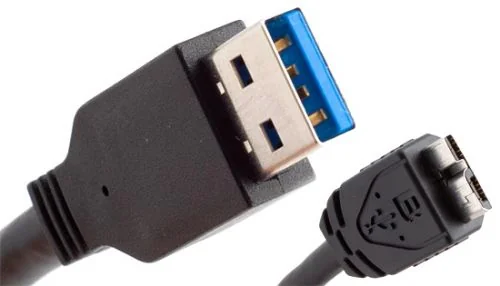

뜬금없이 NAS가 갖고 싶다고 이야기하는 것이 아니다.

NAS는 예전부터 갖고 싶어 했지만, 단지 '당장 필요한 것은 아니니까'라는 이유로 위시 리스트에 넣지 않았을 뿐이다.

&nbsp;

사실 NAS가 뜨기 전에는 다들 외장 하드디스크(이하 외장 HDD)를 사용했을 것이다. 나 또한 그러하고.

1TB HDD가 상당한 고용량으로 취급되던 때, 나 역시 1TB짜리 외장 HDD를 구매했다.

예전에 쓰던 외장 HDD가 있긴 했지만, 용량도 500GB 정도밖에 되지 않는 데다가, USB Type-B Micro 5 pin 단자를 쓰고 있었으며 그 속도도 USB 2.0 속도라서 사용하기 상당히 불편했었다.

사실 새로 구매한 외장 HDD도 그리 만족스러운 것은 아니었다.

USB 3.0을 채택해서 속도는 빨랐지만, 단자가 문제였다. USB Type-B Micro 10 pin 단자를 쓰고 있었는데, 대충 이렇게 생겼다.

딱 봐도 굉장히 헐겁게 생겼다. 실제로도 그랬고.

처음에는 그럭저럭 괜찮았지만, 점점 사용하다 보니 저 단자 부분이 헐거워졌다.

그래서 자료를 전송할 때 외장 HDD를 툭 건들기만 해도 연결이 순간 끊겼다가 다시 연결되면서 전송이 실패했다.

게다가 전송하던 수많은 파일 중, 어느 파일을 전송하다가 오류가 난 것인지 내가 알 턱이 없었기 때문에 그렇게 전송이 실패하면 지금까지 전송된 모든 파일을 전부 지우고 다시 전송해야 했다.

&nbsp;

결국 참지 못하고 새로운 외장 HDD 케이스를 구매했다. 이번엔 좀 더 튼튼한 USB Type-C를 단자로 사용하는 녀석으로. ipTIME이 싼 가격에 괜찮은 케이스를 팔길래 구매했다.

그래서 쓰던 외장 HDD의 HDD를 적출해 ipTIME제 케이스에 결합한 잡종 외장 HDD를 지금까지 쓰고 있다.

***

외장 HDD라는 것은 사용 패턴에 따라서 호불호가 갈린다고 생각한다.

애당초 외장이라는 것이 컴퓨터 내부에 HDD를 설치하지 않고 외부에서 USB 단자를 통해 연결하는 것을 의미하니 말이다.

&nbsp;

외장 HDD를 휴대용 저장장치로 사용하는 사람이 있을 것이다.

이 부분에 대해서는 USB 플래시 메모리나 외장 SSD라는 강력한 경쟁 상대가 존재한다.

HDD는 작동 중 충격을 주면 내부 데이터가 손상될 수 있지만, USB 플래시 메모리나 외장 SSD는 충격에 영향을 거의 받지 않는다.

물론, USB 플래시 메모리나 SSD 역시 강력한 자기장에 의해 내부 데이터가 손상될 수 있지만, 우리가 살면서 그런 자성에 노출될 일은 적을 것이다. 게다가 케이스를 금속으로 쓰면 그런 부분도 어느 정도 막을 수 있고.

여기에서 HDD의 강점은 가격 대비 많은 용량이 될 것이다.

&nbsp;

외장 HDD를 일종의 콜드 스토리지로 사용하는 사람이 있을 것이다. 여기에서 콜드 스토리지란, 암호 화폐에서 쓰이는 개념보다는 '잘 접근하지 않는 데이터 저장소'의 개념이다.

그런 경우에는 외장 HDD가 정말 탁월한 선택이다. 잘 사용하지 않으니, 안 쓸 때는 어디 한 구석에 처박아 놓고 필요할 때만 꺼내 쓸 것이다.

그렇기 때문에 외장 HDD를 휴대용 저장장치로 사용할 때 자주 발생하는 충격에도 안전하다. 가격 대비 용량도 높으므로, 저장할 수 있는 자료의 양도 많을 것이고.

&nbsp;

그리고 마지막으로 양쪽 사이의 어중간한 역할로 사용하는 사람이 있다. 바로 나 같은 경우다.

외장 HDD를 어디 다른 곳에 들고 다니지는 않지만, 필요할 때만 컴퓨터에 연결해서 쓰는 경우이다.

***

내 사용 예시를 들어보자.

나는 음악을 자주 듣기 때문에, 음악을 내장 HDD에 복사해 둔다.

그리고 컴퓨터를 완전 포맷 후 OS를 재설치할 때, 내장 HDD에 담아둔 음악을 외장 HDD에 복사하고 나서 컴퓨터를 포맷한다. OS 및 소프트웨어 설치가 모두 끝나면, 다시 외장 HDD에 담아둔 음악을 내장 HDD에 복사한다.

그냥 내장 HDD에 음악을 담아두고 HDD 포맷을 하지 않으면 되는 일 아니냐고 물을 수 있는데, 내장 HDD에도 소프트웨어 등을 설치하기 때문에 OS를 재설치할 때 내장 HDD도 포맷하지 않으면 안 된다.

이와 비슷하게, 포터블 소프트웨어나 동영상 등도 외장 HDD와 내장 HDD 사이를 오간다.

&nbsp;

보통은 컴퓨터를 포맷할 때나 외장 HDD를 연결한다. 아니면 비주기적으로 기존 자료를 외장 HDD에 복사하거나 할 때라던가, 내장 HDD에 복사하지 않은 자료를 사용해야 할 때 외장 HDD를 연결한다.

&nbsp;

그런데 문제는, 모든 상황이 매번 위처럼 흘러가지 않는다는 것이다.

&nbsp;

나는 내가 소지한 영상을 컴퓨터로 보지 않는다. 영상을 스마트폰에 옮겨 담아 보는 편이다.

그런데 영상의 전체 용량이 꽤 크다. 저번에 재어보니 500GB가 넘게 나오더라. 이걸 컴퓨터를 포맷할 때마다 옮기는 것도 일인지라, 평소에는 영상을 외장 HDD에만 저장해 두고 필요한 만큼만 컴퓨터로 복사 후, 스마트폰에 옮겨 담는다.

왜 컴퓨터에 한 번 복사하고 스마트폰에 전송하냐고? 이것 역시 USB Type-B Micro 10 pin 단자를 쓸 때부터 들인 버릇이다. 전송 도중 케이블을 살짝 건드린 것만으로도 전송이 실패할 수 있기 때문에 일단 안전한 내장 HDD에 복사한 후, 스마트폰에 영상 파일을 전송하는 것이다. 그리고 그 위험성은 아직도 작게나마 존재한다.

&nbsp;

아무튼, 그 많은 영상의 일부를 스마트폰에 옮겨 담았다. 그런데 막상 나중에 영상을 보려니까 구미가 당기는 영상이 없다. 아, 이 영상들 말고 다른 영상을 보고 싶은데.

그러면 정말 일이 귀찮아진다. 일단 스마트폰에 옮겨 담았던 영상의 일부를 삭제해 용량을 확보해야 하고, 새 영상을 컴퓨터를 거쳐 스마트폰에 옮겨 담아야 한다. 아무리 USB 3.0이라지만, 이건 시간이 적잖게 들어간다. 귀찮다.

&nbsp;

하지만 NAS가 있다면 어떨까. 스마트폰에 영상을 일일이 전송할 필요가 없다. 그냥 전용 앱을 켜서 영상을 보면 된다. NAS가 트랜스코딩도 알아서 해준다. 아예 NAS에 트랜스코딩 전용 칩셋을 박아 넣는 경우도 있다.

***

거기에 또 다른 이유가 붙는다.

&nbsp;

웹사이트를 하나 만들 필요성이 생겼다. 단순한 웹사이트라면 티스토리처럼 스킨을 통한 개조가 간편하거나, Oracle Cloud, Google Cloud Platform처럼 무료로 저장 공간을 제공해 주는 서비스를 사용하면 된다.

그런데 용량이 발목을 잡는다.

사이트의 콘텐츠 대부분을 게임 사진이 차지할 예정이다. 그런데 사진이라는 것은 문자에 비해 용량이 꽤 크다. 한 챕터 분량의 사진을 찍기만 했는데 그 용량이 1GB가 넘어가더라.

사진을 그대로 클라이언트에게 전송할 경우, 클라이언트가 지나치게 큰 용량의 사진 때문에 사이트의 내용을 제대로 표시하지 못하게 된다. 그래서 서버에 사진을 올리면 서버에서 원본 크기보다 작은 크기의 이미지 역시 만들게 된다.

즉, 1920x1080 크기의 사진을 서버에 올리면 그보다 작은 1280x720 크기의 이미지 역시 서버에서 만든 후, 그걸 클라이언트에게 보내다가 클라이언트가 원본 파일을 요청할 경우에만 1920x1080 크기의 사진을 보내는 것이다.

이렇게 여러 크기의 사진을 만들면 당연히 사진이 차지하는 용량 역시 커지게 된다.

&nbsp;

Oracle Cloud에서 테스트를 해보았다.

일단 기본 제공되는 40GB에 100GB의 용량을 추가할 수 있지만, 그 100GB 분량은 '항상 무료' 대상이 아니라고 한다. 즉, 언제 요금이 청구될지 모른다. 골치가 아프다. 그렇다고 기본 제공된 40GB 쪽에 자료를 저장할 수도 없다. 그 부분은 시스템 영역이라서.

***

그래서 NAS를 알아보았다. 요즘 NAS는 웹 호스팅이나 트랜스코딩 등은 기본으로 먹고 들어가더라.

사람들 입에 오르내리는 제조사는 크게 셋이다. ipTIME, 시놀로지(Synology), 큐냅(QNAP).

&nbsp;

ipTIME은 많은 사람이 'ipTIME 쓸 바에는 그냥 시놀로지 쓰세요'라고 말한다. 그래서 일단은 제쳐두었다.

남은 것은 시놀로지와 큐냅.

큐냅은 뭔가 비싸다. 그리고 국내에서 팔지 않는 것 같다. 가격 비교 목적으로 2베이 NAS를 검색해 보았는데, 시놀로지 제품은 국내에서 판매 중이지만 큐냅 제품은 해외 직구로 넘어가더라.

&nbsp;

그래서 시놀로지 제품 내에서 고민해 보기로 했다.

일단 내 눈에 들어온 제품은 세 가지이다.

DS220+, DS420+, DS920+.

&nbsp;

친절하게도 시놀로지에서 [비교표](https://www.synology.com/ko-kr/products/compare/DS220+/DS420+/DS920+)도 만들어 주더라.

일단 내가 중요하게 생각하는 것들만 따로 뽑아왔다.

  <table class="table table-bordered align-middle table-hover table-striped">
    <tr>
      <td style="width: 25%; text-align: center;">&nbsp;</td>
      <td style="width: 25%; text-align: center;">
        
      </td>
      <td style="width: 25%; text-align: center;">
        
      </td>
      <td style="width: 25%; text-align: center;">
        
      </td>
    </tr>
    <tr>
      <td style="width: 25%; text-align: center;">제품명</td>
      <td style="width: 25%; text-align: center;">DS220+</td>
      <td style="width: 25%; text-align: center;">DS420+</td>
      <td style="width: 25%; text-align: center;">DS920+</td>
    </tr>
    <tr>
      <td style="width: 25%; text-align: center;">출시일</td>
      <td style="width: 25%; text-align: center;">2020.05</td>
      <td style="width: 25%; text-align: center;">2020.05</td>
      <td style="width: 25%; text-align: center;">2020.05</td>
    </tr>
    <tr>
      <td style="width: 25%; text-align: center;">가격</td>
      <td style="width: 25%; text-align: center;">최저 478,000원  (22.07.03 기준) </td>
      <td style="width: 25%; text-align: center;">최저 716,000원  (22.07.03 기준) </td>
      <td style="width: 25%; text-align: center;">최저 796,000원  (22.07.03 기준) </td>
    </tr>
    <tr>
      <td style="width: 25%; text-align: center;">
        <b>CPU</b>
      </td>
      <td style="width: 75%; text-align: center;" colspan="3">&nbsp;</td>
    </tr>
    <tr>
      <td style="width: 25%; text-align: center;">CPU 모델</td>
      <td style="width: 25%; text-align: center;">인텔 셀러론 J4025  2 Core, 64bit </td>
      <td style="width: 25%; text-align: center;">인텔 셀러론 J4025  2 Core, 64bit </td>
      <td style="width: 25%; text-align: center;">인텔 셀러론 J4125  4 Core, 64bit </td>
    </tr>
    <tr>
      <td style="width: 25%; text-align: center;">CPU 주파수</td>
      <td style="width: 25%; text-align: center;">2.0 GHz (기본)  2.9 GHz(버스트) </td>
      <td style="width: 25%; text-align: center;">2.0 GHz (기본)  2.9 GHz(버스트) </td>
      <td style="width: 25%; text-align: center;">2.0 GHz (기본)  2.7 GHz (버스트) </td>
    </tr>
    <tr>
      <td style="width: 25%; text-align: center;">하드웨어 암호화 엔진  (AES-NI) </td>
      <td style="width: 25%; text-align: center;">O</td>
      <td style="width: 25%; text-align: center;">O</td>
      <td style="width: 25%; text-align: center;">O</td>
    </tr>
    <tr>
      <td style="width: 25%; text-align: center;">
        <b>메모리</b>
      </td>
      <td style="width: 75%; text-align: center;" colspan="3">&nbsp;</td>
    </tr>
    <tr>
      <td style="width: 25%; text-align: center;">시스템 메모리</td>
      <td style="width: 25%; text-align: center;">2GB DDR4 non-ECC</td>
      <td style="width: 25%; text-align: center;">2GB DDR4 non-ECC</td>
      <td style="width: 25%; text-align: center;">4GB DDR4 non-ECC</td>
    </tr>
    <tr>
      <td style="width: 25%; text-align: center;">총 메모리 슬롯</td>
      <td style="width: 25%; text-align: center;">1</td>
      <td style="width: 25%; text-align: center;">1</td>
      <td style="width: 25%; text-align: center;">1</td>
    </tr>
    <tr>
      <td style="width: 25%; text-align: center;">최대 메모리 용량</td>
      <td style="width: 25%; text-align: center;">6GB (2 + 4)[^1]</td>
      <td style="width: 25%; text-align: center;">6GB (2 + 4)</td>
      <td style="width: 25%; text-align: center;">8GB (4 + 4)</td>
    </tr>
    <tr>
      <td style="width: 25%; text-align: center;">
        <b>저장소</b>
      </td>
      <td style="width: 75%; text-align: center;" colspan="3">&nbsp;</td>
    </tr>
    <tr>
      <td style="width: 25%; text-align: center;">드라이브 베이</td>
      <td style="width: 25%; text-align: center;">2</td>
      <td style="width: 25%; text-align: center;">4</td>
      <td style="width: 25%; text-align: center;">4</td>
    </tr>
    <tr>
      <td style="width: 25%; text-align: center;">최대 드라이브 베이  (확장 유니트 사용) </td>
      <td style="width: 25%; text-align: center;">X</td>
      <td style="width: 25%; text-align: center;">X</td>
      <td style="width: 25%; text-align: center;">9  (DX517) </td>
    </tr>
    <tr>
      <td style="width: 25%; text-align: center;">M.2 드라이브 슬롯</td>
      <td style="width: 25%; text-align: center;">X</td>
      <td style="width: 25%; text-align: center;">2 (NVMe)</td>
      <td style="width: 25%; text-align: center;">2 (NVMe)</td>
    </tr>
    <tr style="height: 51px;">
      <td style="width: 25%; text-align: center;">호환 드라이브 유형</td>
      <td style="width: 25%; text-align: center;">3.5'' / 2.5'' SATA HDD  2.5'' SATA SSD </td>
      <td style="width: 25%; text-align: center;">3.5'' / 2.5'' SATA HDD  2.5'' SATA SSD  M.2 2280 NVMe SSD </td>
      <td style="width: 25%; text-align: center;">3.5'' / 2.5'' SATA HDD  2.5'' SATA SSD  M.2 2280 NVMe SSD </td>
    </tr>
    <tr>
      <td style="width: 25%; text-align: center;">핫 스왑 가능</td>
      <td style="width: 25%; text-align: center;">O</td>
      <td style="width: 25%; text-align: center;">O</td>
      <td style="width: 25%; text-align: center;">O</td>
    </tr>
    <tr>
      <td style="width: 25%; text-align: center;">
        <b>외부 포트</b>
      </td>
      <td style="width: 75%; text-align: center;" colspan="3">&nbsp;</td>
    </tr>
    <tr style="height: 57px;">
      <td style="width: 25%; text-align: center;">RJ-45 1Gbps LAN 포트</td>
      <td style="width: 25%; text-align: center;">2  (Link Aggregation / 대체 작동 지원) </td>
      <td style="width: 25%; text-align: center;">2  (Link Aggregation / 대체 작동 지원) </td>
      <td style="width: 25%; text-align: center;">2  (Link Aggregation / 대체 작동 지원) </td>
    </tr>
    <tr>
      <td style="width: 25%; text-align: center;">USB 3.2 Gen 1 포트  (USB 3.0 포트) </td>
      <td style="width: 25%; text-align: center;">2</td>
      <td style="width: 25%; text-align: center;">2</td>
      <td style="width: 25%; text-align: center;">2</td>
    </tr>
    <tr>
      <td style="width: 25%; text-align: center;">eSATA 포트</td>
      <td style="width: 25%; text-align: center;">X</td>
      <td style="width: 25%; text-align: center;">X</td>
      <td style="width: 25%; text-align: center;">1</td>
    </tr>
    <tr>
      <td style="width: 25%; text-align: center;">USB / SD Copy</td>
      <td style="width: 25%; text-align: center;">O</td>
      <td style="width: 25%; text-align: center;">X</td>
      <td style="width: 25%; text-align: center;">X</td>
    </tr>
    <tr>
      <td style="width: 25%; text-align: center;">
        <b>파일 시스템</b>
      </td>
      <td style="width: 75%; text-align: center;" colspan="3">&nbsp;</td>
    </tr>
    <tr>
      <td style="width: 25%; text-align: center;">내부 드라이브</td>
      <td style="width: 25%; text-align: center;">Btrfs  EXT4 </td>
      <td style="width: 25%; text-align: center;">Btrfs  EXT4 </td>
      <td style="width: 25%; text-align: center;">Btrfs  EXT4 </td>
    </tr>
    <tr>
      <td style="width: 25%; text-align: center;">외부 드라이브</td>
      <td style="width: 25%; text-align: center;">Btrfs  EXT4  EXT3  FAT  NTFS  HFS+  exFAT </td>
      <td style="width: 25%; text-align: center;">Btrfs  EXT4  EXT3  FAT  NTFS  HFS+  exFAT </td>
      <td style="width: 25%; text-align: center;">Btrfs  EXT4  EXT3  FAT  NTFS  HFS+  exFAT </td>
    </tr>
    <tr>
      <td style="width: 25%; text-align: center;">
        <b>모양</b>
      </td>
      <td style="width: 75%; text-align: center;" colspan="3">&nbsp;</td>
    </tr>
    <tr>
      <td style="width: 25%; text-align: center;">크기 (mm)  (높이 x 너비 x 깊이) </td>
      <td style="width: 25%; text-align: center;">165 x 108 x 232.2</td>
      <td style="width: 25%; text-align: center;">166 x 199 x 223</td>
      <td style="width: 25%; text-align: center;">166 x 199 x 223</td>
    </tr>
    <tr>
      <td style="width: 25%; text-align: center;">무게 (kg)</td>
      <td style="width: 25%; text-align: center;">1.30</td>
      <td style="width: 25%; text-align: center;">2.18</td>
      <td style="width: 25%; text-align: center;">2.24</td>
    </tr>
    <tr>
      <td style="width: 25%; text-align: center;">
        <b>기타</b>
      </td>
      <td style="width: 75%; text-align: center;" colspan="3">&nbsp;</td>
    </tr>
    <tr>
      <td style="width: 25%; text-align: center;">시스템 팬</td>
      <td style="width: 25%; text-align: center;">92mm x 92mm, 1 pcs</td>
      <td style="width: 25%; text-align: center;">92mm x 92mm, 2 pcs</td>
      <td style="width: 25%; text-align: center;">92mm x 92mm, 2 pcs</td>
    </tr>
    <tr>
      <td style="width: 25%; text-align: center;">팬 속도 모드</td>
      <td style="width: 25%; text-align: center;">최대 속도 모드  냉각 모드  무음 모드 </td>
      <td style="width: 25%; text-align: center;">최대 속도 모드  냉각 모드  무음 모드 </td>
      <td style="width: 25%; text-align: center;">최대 속도 모드  냉각 모드  무음 모드 </td>
    </tr>
    <tr>
      <td style="width: 25%; text-align: center;">소음 수준</td>
      <td style="width: 25%; text-align: center;">19.3 dB(A)</td>
      <td style="width: 25%; text-align: center;">19.8 dB(A)</td>
      <td style="width: 25%; text-align: center;">19.8 dB(A)</td>
    </tr>
    <tr>
      <td style="width: 25%; text-align: center;">예약 전원 켜기/끄기</td>
      <td style="width: 25%; text-align: center;">O</td>
      <td style="width: 25%; text-align: center;">O</td>
      <td style="width: 25%; text-align: center;">O</td>
    </tr>
    <tr>
      <td style="width: 25%; text-align: center;">LAN / WAN 깨우기</td>
      <td style="width: 25%; text-align: center;">O</td>
      <td style="width: 25%; text-align: center;">O</td>
      <td style="width: 25%; text-align: center;">O</td>
    </tr>
    <tr>
      <td style="width: 25%; text-align: center;">전원 공급 장치 / 어댑터</td>
      <td style="width: 25%; text-align: center;">60 W</td>
      <td style="width: 25%; text-align: center;">90 W</td>
      <td style="width: 25%; text-align: center;">100 W</td>
    </tr>
    <tr>
      <td style="width: 25%; text-align: center;">전원 소비</td>
      <td style="width: 25%; text-align: center;">14.69 W (액세스)  4.41 W (HDD 대기) </td>
      <td style="width: 25%; text-align: center;">28.30 W (액세스)  8.45 W (HDD 대기) </td>
      <td style="width: 25%; text-align: center;">32.17 W (액세스)  9.69 W (HDD 대기) </td>
    </tr>
    <tr>
      <td style="width: 25%; text-align: center;">
        <b>온도</b>
      </td>
      <td style="width: 75%; text-align: center;" colspan="3">&nbsp;</td>
    </tr>
    <tr>
      <td style="width: 25%; text-align: center;">작동 온도</td>
      <td style="width: 25%; text-align: center;">0&deg;C ~ 40&deg;C</td>
      <td style="width: 25%; text-align: center;">0&deg;C ~ 40&deg;C</td>
      <td style="width: 25%; text-align: center;">0&deg;C ~ 40&deg;C</td>
    </tr>
    <tr>
      <td style="width: 25%; text-align: center;">보관 온도</td>
      <td style="width: 25%; text-align: center;">-20&deg;C ~ 60&deg;C</td>
      <td style="width: 25%; text-align: center;">-20&deg;C ~ 60&deg;C</td>
      <td style="width: 25%; text-align: center;">-20&deg;C ~ 60&deg;C</td>
    </tr>
    <tr>
      <td style="width: 25%; text-align: center;">상대 습도</td>
      <td style="width: 25%; text-align: center;">5% ~ 95% RH</td>
      <td style="width: 25%; text-align: center;">5% ~ 95% RH</td>
      <td style="width: 25%; text-align: center;">5% ~ 95% RH</td>
    </tr>
    <tr>
      <td style="width: 25%; text-align: center;">
        <b>보증</b>
      </td>
      <td style="width: 75%; text-align: center;" colspan="3">&nbsp;</td>
    </tr>
    <tr>
      <td style="width: 25%; text-align: center;">보증 기간</td>
      <td style="width: 25%; text-align: center;">2년</td>
      <td style="width: 25%; text-align: center;">3년 (하드웨어 보증)  5년 (<a href="https://www.synology.com/ko-kr/products/Extended_Warranty" target="_blank" rel="noopener">연장 가능</a>) </td>
      <td style="width: 25%; text-align: center;">3년 (하드웨어 보증)  5년 (<a href="https://www.synology.com/ko-kr/products/Extended_Warranty">연장 가능</a>) </td>
    </tr>
    <tr>
      <td style="width: 25%; text-align: center;">
        <b>구성품</b>
      </td>
      <td style="width: 75%; text-align: center;" colspan="3">&nbsp;</td>
    </tr>
    <tr>
      <td style="width: 25%; text-align: center;">패키지 내용물</td>
      <td style="width: 25%; text-align: center;">메인 유니트 X 1  액세서리 팩 X 1  AC 전원 어댑터 X 1  AC 전원 코드 X 1  RJ-45 LAN 케이블 X 2  빠른 설치 가이드 X 1 </td>
      <td style="width: 25%; text-align: center;">메인 유니트 X 1  액세서리 팩 X 1  AC 전원 어댑터 X 1  AC 전원 코드 X 1  RJ-45 LAN 케이블 X 2  빠른 설치 가이드 X 1 </td>
      <td style="width: 25%; text-align: center;">메인 유니트 X 1  액세서리 팩 X 1  AC 전원 어댑터 X 1  AC 전원 코드 X 1  RJ-45 LAN 케이블 X 2  빠른 설치 가이드 X 1 </td>
    </tr>
    <tr>
      <td style="width: 25%; text-align: center;">옵션 액세서리  (일부 생략됨) </td>
      <td style="width: 25%; text-align: center;">DDR4 non-ECC SODIMM  
         3.5" SATA HDD  
         2.5" SATA SSD
      </td>
      <td style="width: 25%; text-align: center;">DDR4 non-ECC SODIMM  
         3.5" SATA HDD  
         2.5" SATA SSD  
         M.2 2280 NVMe SSD
      </td>
      <td style="width: 25%; text-align: center;">DDR4 non-ECC SODIMM  
         확장 유니트  
         3.5" SATA HDD  
         2.5" SATA SSD  
         M.2 2280 NVMe SSD
      </td>
    </tr>
    <tr>
      <td style="width: 100%; text-align: center;" colspan="4">
        <b>DSM 사양</b>
      </td>
    </tr>
    <tr>
      <td style="width: 25%; text-align: center;">지원 RAID 유형</td>
      <td style="width: 25%; text-align: center;">Synology Hybrid RAID  Basic  JBOD  RAID 0  RAID 1 </td>
      <td style="width: 25%; text-align: center;">Synology Hybrid RAID  Basic  JBOD  RAID 0  RAID 1  RAID 5  RAID 6  RAID 10 </td>
      <td style="width: 25%; text-align: center;">Synology Hybrid RAID  Basic  JBOD  RAID 0  RAID 1  RAID 5  RAID 6  RAID 10 </td>
    </tr>
    <tr>
      <td style="width: 25%; text-align: center;">RAID 마이그레이션</td>
      <td style="width: 25%; text-align: center;">Basic to RAID 1</td>
      <td style="width: 25%; text-align: center;">Basic to RAID 1  Basic to RAID 5  RAID 1 to RAID 5  RAID 5 to RAID 6 </td>
      <td style="width: 25%; text-align: center;">Basic to RAID 1  Basic to RAID 5  RAID 1 to RAID 5  RAID 5 to RAID 6 </td>
    </tr>
    <tr>
      <td style="width: 25%; text-align: center;">HDD 추가로 볼륨 확장</td>
      <td style="width: 25%; text-align: center;">Synology Hybrid RAID  RAID 1 </td>
      <td style="width: 25%; text-align: center;">Synology Hybrid RAID  JBOD  RAID 5 </td>
      <td style="width: 25%; text-align: center;">Synology Hybrid RAID  JBOD  RAID 5  RAID 6 (확장 유니트 포함) </td>
    </tr>
    <tr>
      <td style="width: 25%; text-align: center;">글로벌 Hot Spare 지원  RAID 유형 </td>
      <td style="width: 25%; text-align: center;">X</td>
      <td style="width: 25%; text-align: center;">Synology Hybrid RAID  RAID 1  RAID 5 </td>
      <td style="width: 25%; text-align: center;">Synology Hybrid RAID  RAID 1  RAID 5  RAID 6 (확장 유니트 포함)  RAID 10 (확장 유니트 포함) </td>
    </tr>
    <tr>
      <td style="width: 25%; text-align: center;">
        <b>파일 서비스</b>
      </td>
      <td style="width: 25%; text-align: center;">&nbsp;</td>
      <td style="width: 25%; text-align: center;">&nbsp;</td>
      <td style="width: 25%; text-align: center;">&nbsp;</td>
    </tr>
    <tr>
      <td style="width: 25%; text-align: center;">파일 프로토콜</td>
      <td style="width: 25%; text-align: center;">SMB/AFP/NFS/FTP/WebDAV</td>
      <td style="width: 25%; text-align: center;">SMB/AFP/NFS/FTP/WebDAV</td>
      <td style="width: 25%; text-align: center;">SMB/AFP/NFS/FTP/WebDAV</td>
    </tr>
    <tr>
      <td style="width: 25%; text-align: center;">
        <b>가상화</b>
      </td>
      <td style="width: 25%; text-align: center;">&nbsp;</td>
      <td style="width: 25%; text-align: center;">&nbsp;</td>
      <td style="width: 25%; text-align: center;">&nbsp;</td>
    </tr>
    <tr>
      <td style="width: 25%; text-align: center;">가상화 지원</td>
      <td style="width: 25%; text-align: center;">X</td>
      <td style="width: 25%; text-align: center;">VMware vSphere with VAAI  Windows Server 2016  Windows Server 2019  Citrix Ready  OpenStack </td>
      <td style="width: 25%; text-align: center;">VMware vSphere with VAAI  Windows Server 2016  Windows Server 2019  Citrix Ready  OpenStack </td>
    </tr>
    <tr>
      <td style="width: 25%; text-align: center;">
        <b>일반 사양</b>
      </td>
      <td style="width: 25%; text-align: center;">&nbsp;</td>
      <td style="width: 25%; text-align: center;">&nbsp;</td>
      <td style="width: 25%; text-align: center;">&nbsp;</td>
    </tr>
    <tr>
      <td style="width: 25%; text-align: center;">네트워크 프로토콜</td>
      <td style="width: 75%; text-align: center;" colspan="3">SMB1 (CIFS), SMB2, SMB3, NFSv3, NFSv4, NFSv4.1, NFS Kerberized sessions, iSCSI, HTTP, HTTPs, FTP, SNMP, LDAP, CalDAV</td>
    </tr>
    <tr>
      <td style="width: 25%; text-align: center;">지원 브라우저</td>
      <td style="width: 75%; text-align: center;" colspan="3">Google Chrome, Firefox, Microsoft Edge, Safari</td>
    </tr>
    <tr>
      <td style="width: 25%; text-align: center;">한국어 지원</td>
      <td style="width: 75%; text-align: center;" colspan="3">O</td>
    </tr>
    <tr>
      <td style="width: 100%; text-align: center;" colspan="4">
        <b>애드온 패키지</b>
      </td>
    </tr>
    <tr>
      <td style="width: 25%; text-align: center;">Document Viewer</td>
      <td style="width: 75%; text-align: center;" colspan="3">O</td>
    </tr>
    <tr>
      <td style="width: 25%; text-align: center;">Download Station  최대 동시 다운로드 작업 수 </td>
      <td style="width: 75%; text-align: center;" colspan="3">80</td>
    </tr>
    <tr>
      <td style="width: 25%; text-align: center;">Media Server  (+ DLNA 준수) </td>
      <td style="width: 75%; text-align: center;" colspan="3">O</td>
    </tr>
    <tr>
      <td style="width: 25%; text-align: center;">Snapshot Replication</td>
      <td style="width: 75%; text-align: center;" colspan="3">&nbsp;</td>
    </tr>
    <tr>
      <td style="width: 25%; text-align: center;">공유 폴더당 최대 스냅샷</td>
      <td style="width: 75%; text-align: center;" colspan="3">1,024</td>
    </tr>
    <tr>
      <td style="width: 25%; text-align: center;">최대 시스템 스냅샷 수</td>
      <td style="width: 75%; text-align: center;" colspan="3">65,536</td>
    </tr>
  </table>

그런데 위의 가격에서 한 가지 간과한 것이 있다. 바로 HDD의 가격이다. 위 가격은 전부 HDD 없이 계산한 가격이다.

&nbsp;

NAS용 HDD를 알아보았다.

* Seagate IronWolf Pro
  ST4000NE0025 (4TB, 7200 RPM, 128MB) : 최저 248,000원 (22.07.03 기준)
* Seagate IronWolf
  ST4000VN008 (4TB, 7200 RPM, 64MB) : 최저 157,000원 (22.07.03 기준)
* Western Digital Ultrastar DC HC310
  HUS726T4TALA6L4 (4TB, 7200 RPM, 256MB) : 최저 157,000원 (22.07.03 기준)
* TOSHIBA N300
  HDWQ140 (4TB, 7200RPM, 128MB) : 최저 127,000원 (22.07.03 기준)

HDD 하나에 15만 원이 든다고 대충 가정할 때, DS220+는 추가로 30만 원, DS420+이나 DS920+는 추가로 60만 원이 들어가는 셈이다.

그러니, DS220+는 약 80만 원, DS420+는 약 135만 원, DS920+는 약 145만 원이 된다.

굉장히 비싸다. 이게 내가 NAS를 구매하지 못하는 이유 중 하나이다.

SSD를 쓰면 되지 않느냐고? 더 비싸다. 삼성전자 860 EVO 4TB가 727,300원이다. SSD 하나가.

***

그래서 오늘도 그저 '아, NAS 갖고 싶다'로 소유욕을 애써 달래본다.
