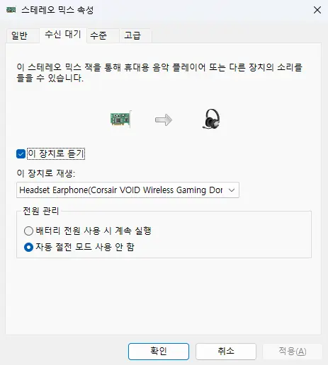
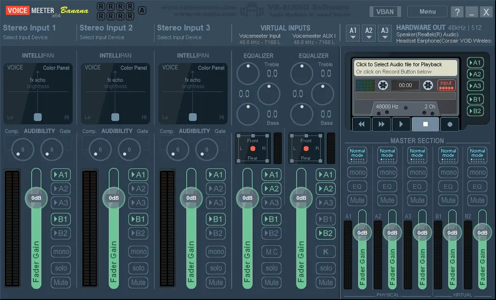
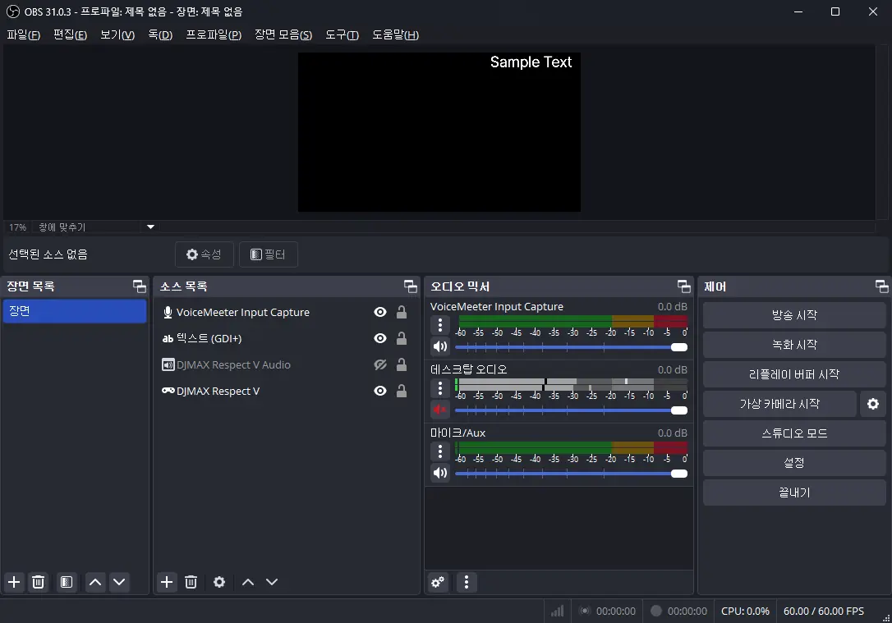
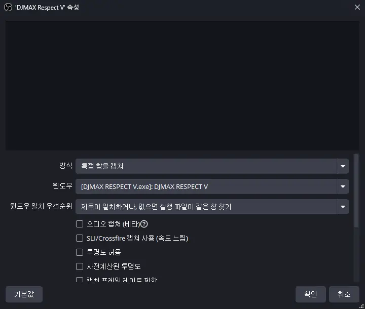
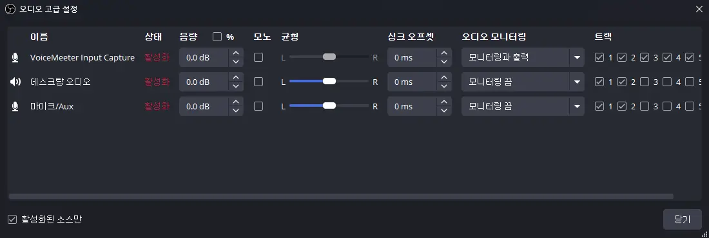
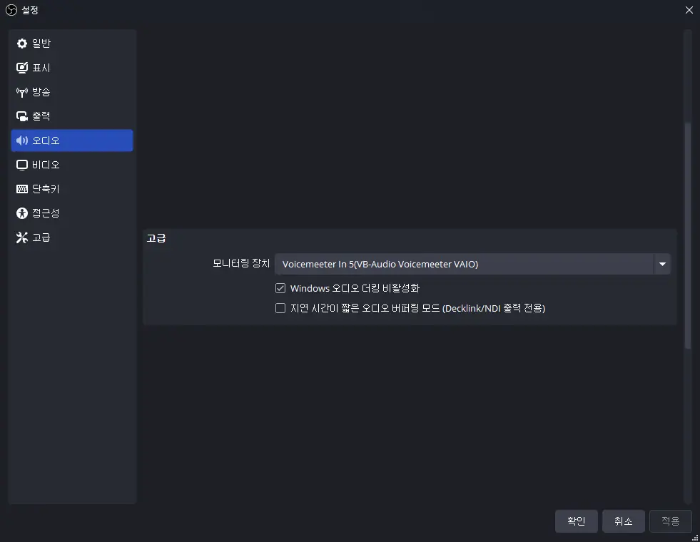
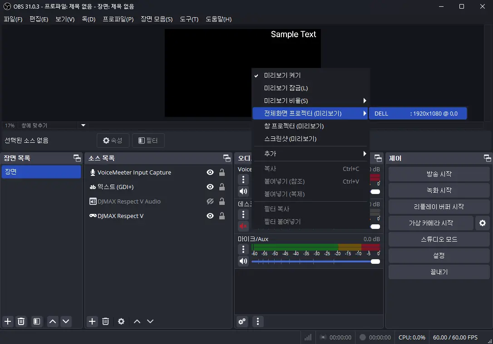

특수한 상황에는 특수한 해결책이 필요한 법이다.

한 컴퓨터에 여러 개의 오디오 재생 장치, 즉 스피커나 무선 헤드셋 등이 연결되어 있다면, 그중 하나만을 기본값으로 선택해 오디오를 출력하도록 하는 것이 일반적일 것이다.

하지만 나는 스피커와 무선 헤드셋 양쪽 모두에서 오디오가 나오도록 하고 싶었다.

이유는 간단했다.
무선 헤드셋이 정상적으로 오디오를 재생하기 위해선 PC에 연결된 전용 동글을 인식하고 동글과 연결해야 하는데, 무선 헤드셋의 동글 인식 속도가 매우 느렸기 때문이다. 무선 헤드셋 전원을 켠 지 30초가 지난 후에야 동글과 연결 된 적도 있으니, 답답하기 짝이 없다.

그런데 PC의 기본 오디오 재생 장치가 동글로 설정되어 있다면 무선 헤드셋이 동글을 인식하는 속도가 눈에 띌 정도로 빨라지는 것을 확인했다. 아무리 길어봐야 5초 정도면 무선 헤드셋에서 소리가 흘러나오기 시작한다.

그렇다면 어떤 장치가 기본 오디오 재생 장치로 설정되어 있든 간에 동글로 오디오 출력을 내보내면 스피커에서 무선 헤드셋으로 전환하는 속도가 빨라지지 않을까? 헤드셋을 쓸 때에는 스피커 볼륨 노브를 돌려 볼륨을 0으로 설정하면 되니까.

# 스테레오 믹스{id="stereo-mix"}

나는 이런 *작은* 목적을 위해 별도의 프로그램을 설치하는 것을 선호하지 않는다. 아무리 작은 프로그램이라도 그 하나하나가 CPU 사이클을 잡아먹고, 컴퓨터 성능을 떨어트린다고 생각하기 때문이다.

애당초 내가 하려는 건 스피커로 전송되는 오디오 출력을 무선 헤드셋 동글에도 동시에 전송하는 것뿐이다. 이런 간단한 기능을 OS나 드라이버 소프트웨어에서 기본적으로 제공하지 않을 리 없다.

그리고 내 기대는 적중했다. 리얼텍 사운드 칩셋 드라이버가 제공하는 '스테레오 믹스' 녹음 장치를 활용하면 내가 원하는 걸 정확히 구현할 수 있었다.



1. 기본 오디오 재생 장치를 스피커로 설정한다. (기본 장치 + 기본 통신 장치)
2. 스테레오 믹스를 활성화한다.
3. \[수신 대기\] 탭을 위와 같이 설정한다.
4. \[수준\] 탭에서 '스테레오 믹스' 볼륨을 100으로 설정한다.
5. 기본 오디오 녹음 장치를 스테레오 믹스로 설정한다. (기본 장치)
6. 끝.

이 얼마나 간단한 일인가!

다만 스피커와 무선 헤드셋에서 출력되는 오디오의 소리 크기가 조금 줄어든 것 같다는 생각이 든다.
뭐, 그건 각 프로그램의 볼륨을 조절하면 되는 일이니, 문제 될 것은 없다.

***

그렇게 스테레오 믹스를 통해 내가 원하던 환경을 구축하여 쓰던 중이었다.

갑자기 디스코드 방송에 OBS를 활용하고 싶어졌다.
다른 사람이 디스코드 게임 방송 화면에 텍스트나 이미지, 웹캠 화면 등을 오버레이로 보여주는 게 조금 탐이 났다.

OBS를 써본 적이 몇 번 있었기에, 호기롭게 OBS를 다운로드하여 설정에 들어갔다.
내가 읽은 글에서는 OBS가 자체적으로 제공하는 'OBS Virtual Camera'를 이용하면 손쉽게 디스코드 방송을 할 수 있다고 말했기에, 가상 웹캠을 이용하기로 했다.

그런데 문제가 생겼다.

1. 디스코드 설정에서 확인한 웹캠 미리 보기가 좌우로 뒤집혀 있다.
   실제로 웹캠 방송을 켜면 다른 사람 화면에는 정상적으로 보이니 큰 문제는 아니지만, 불편한 건 불편한 거다.
2. 소리가 두 번 들린다.
   내 마이크 소리는 원래 듣지 못하니 확인할 수 없지만, 컴퓨터에서 나오는 소리가 두 번 겹쳐 들리는 것이 내 귀에도 들린다.
   방송에서 소리가 제대로 나오는 건지는 확인하지도 못했다.

그때 느꼈다. 아, 이건 스테레오 믹스로도 해결할 수 없는 문제구나. VoiceMeeter를 써야겠구나.

&nbsp;

이럴 바에는 처음부터 VoiceMeeter를 썼으면 좋았겠지만, 내가 VoiceMeeter 설치를 꺼린 데에는 다른 이유가 있다.



VoiceMeeter를 설치하면 가상 오디오 장치가 시스템에 재생에 8개, 녹음에 8개, 총 16개가 시스템에 추가된다.

**재생 장치**
1. Voicemeeter AUX Input
2. Voicemeeter In 1
3. Voicemeeter In 2
4. Voicemeeter In 3
5. Voicemeeter In 4
6. Voicemeeter In 5
7. Voicemeeter Input
8. Voicemeeter VAIO3 Input

**녹음 장치**
1. Voicemeeter Out A1
2. Voicemeeter Out A2
3. Voicemeeter Out A3
4. Voicemeeter Out A4
5. Voicemeeter Out A5
6. Voicemeeter Out B1
7. Voicemeeter Out B2
8. Voicemeeter Out B3

난 이 각각의 장치들이 정확히 무슨 역할을 하는 건지 이해할 수 없다.
녹음 장치 쪽은 그래도 알아보기 쉬운데, 재생 장치는 왜 이름이 저런 것인지 도저히 모르겠다.

게다가 VoiceMeeter의 설정창 역시 난잡하기 그지없다.



난 이 화면을 보고 어떤 버튼이 정확히 어떤 역할을 하는 건지 도저히 이해할 수 없다.



그래서 VoiceMeeter 설정은 다른 사람의 도움을 받기로 했다. 난 정말 모르겠어...

현재 목표는 두 가지이다.

1. 스피커와 무선 헤드셋 양쪽 모두에 오디오 출력
2. 게임, 디스코드 등의 소리를 분리

# VoiceMeeter

VoiceMeeter에는 여러 에디션이 있다.

* VoiceMeeter Potato
* VoiceMeeter Banana
* VoiceMeeter Standard

아래에서 위로 갈수록 설정할 수 있는 가상 입출력 장치의 개수가 늘어난다.
상위 에디션에 하위 에디션이 포함되어 있는 구조이기 때문에, 극한의 미니멀리즘을 추구하거나 스튜디오 수준의 복잡한 설정을 하려는 게 아니라면 적당한 수준의 에디션인 Banana를 설치하는 편이다.



내가 원하는 설정을 Standard만으로 구현할 수 있을까 잠깐 살펴봤는데, 불가능할 것 같더라고...

## VoiceMeeter 설정{id="configure-voicemeeter"}


일단 우측 상단의 HARDWARE OUT의 A1과 A2를 각각 스피커와 무선 헤드셋으로 설정했다.
가장 많이 쓰는 오디오 출력 장치가 스피커이기 때문에 스피커를 우선으로 둔 것이다.

그다음 VIRTUAL INPUTS의 좌측 Voicemeeter Input은 B1만 활성화하고, 우측 Voicemeeter AUX Input은 B2만 활성화했다.

우측 상단의 Menu를 눌러 System Tray와 Run on Windows Startup을 체크했다.
시스템 오디오 장치가 Voicemeeter의 것으로 설정되어 있기 때문에, Voicemeeter 오디오 엔진이 실행되어 있지 않다면 오디오가 전혀 나오지 않게 된다.
그래서 Voicemeeter를 Windows 시작 프로그램에 등록하고 Voicemeeter의 닫기 버튼을 눌러도 Voicemeeter가 종료되는 대신 시스템 트레이에 최소화되도록 설정한 것이다.



혹시 몰라 설정 XML 파일을 별도로 저장해 두긴 했다. 만약 내가 뭔가 빠트렸다고 하더라도, 이 설정 파일을 불러오면 되는 것이다.

```xml
<?xml version="1.0" encoding="utf-8"?>
<VBAudioVoicemeeterSettings>
  <VoiceMeeterDeviceConfiguration>
    <InputDev index='1' name="-" />
    <InputDev index='2' name="-" />
    <InputDev index='3' name="-" />
    <MIDIDevIn index='1' name="-" />
    <MIDIDevIn index='2' name="-" />
    <MIDIDevOut index='1' name="-" />
    <OptionDev mme='1024' wdm='512' ks='512' asio='0' srasio='0' msA1='0.00' msA2='0.00' msA3='0.00' />
    <OutputDev index='1' type='4' name="Speaker(Realtek(R) Audio)" />
    <OutputDev index='2' type='4' name="Headset Earphone(Corsair VOID Wireless Gaming Dongle)" />
    <OutputDev index='3' name="-" pOut1='0' pOut2='0' pOut3='0' pOut4='0' pOut5='0' pOut6='0' pOut7='0' pOut8='0' />
  </VoiceMeeterDeviceConfiguration>
  <VoiceMeeterParameters>
    <Bus index='1' mute='0' vaio='0' mono='0' cross='0' BusMode='0' EQon='0' SEL='0' monitor='1' dblevel='0.00' />
    <Bus index='2' mute='0' vaio='0' mono='0' cross='0' BusMode='0' EQon='0' SEL='0' monitor='0' dblevel='0.00' />
    <Bus index='3' mute='0' vaio='0' mono='0' cross='0' BusMode='0' EQon='0' SEL='0' monitor='0' dblevel='0.00' />
    <Bus index='4' mute='0' vaio='0' mono='0' cross='0' BusMode='0' EQon='0' SEL='0' monitor='0' dblevel='0.00' />
    <Bus index='5' mute='0' vaio='0' mono='0' cross='0' BusMode='0' EQon='0' SEL='0' monitor='0' dblevel='0.00' />
    <K7BUSRoute busa='1' busa2='1' busa3='1' busb='1' busb2='1' dblevel='0.00' />
    <LabelVirtualStrip1>기본 출력</LabelVirtualStrip1>
    <LabelVirtualStrip2>방송 출력</LabelVirtualStrip2>
    <PatchComposite c1='0' c2='0' c3='1' c4='3' c5='5' c6='7' c7='15' c8='16' mode='0' />
    <PatchInsert c1='0' c2='0' c3='0' c4='0' c5='0' c6='0' c7='0' c8='0' c9='0' c10='0' c11='0' c12='0' c13='0' c14='0' c15='0' c16='0' c17='0' c18='0' c19='0' c20='0' c21='0' c22='0' mode='0' />
    <Strip index='1' mute='0' vaio='0' solo='0' mono='0' muc='0' prg_c='0' prg_g='0' busa='1' busa2='0' busa3='0' busb='1' busb2='0' karaoke='0' dblevel='0.00' dblimit='12.00' />
    <Strip index='2' mute='0' vaio='0' solo='0' mono='0' muc='0' prg_c='0' prg_g='0' busa='1' busa2='0' busa3='0' busb='1' busb2='0' karaoke='0' dblevel='0.00' dblimit='12.00' />
    <Strip index='3' mute='0' vaio='0' solo='0' mono='0' muc='0' prg_c='0' prg_g='0' busa='1' busa2='0' busa3='0' busb='1' busb2='0' karaoke='0' dblevel='0.00' dblimit='12.00' />
    <Strip index='4' mute='0' vaio='0' solo='0' mono='0' muc='0' prg_c='0' prg_g='0' busa='1' busa2='1' busa3='0' busb='1' busb2='0' karaoke='0' dblevel='0.00' dblimit='12.00' />
    <Strip index='5' mute='0' vaio='0' solo='0' mono='0' muc='0' prg_c='0' prg_g='0' busa='1' busa2='1' busa3='0' busb='0' busb2='1' karaoke='0' dblevel='0.00' dblimit='12.00' />
    <VMOptions MonitorOnSEL='0' SliderRelative='0' />
  </VoiceMeeterParameters>
</VBAudioVoicemeeterSettings>
```



현재까지 내가 이해한 건 다음과 같다. 잘못 이해한 거라면 어쩔 수 없는 것이겠지만...

> 다양한 응용 프로그램이 오디오 출력을 B1/B2로 보낸다.
> VoiceMeeter가 이를 A1/A2로 분배하여 실제로 재생한다.
{.bq}

## Windows 설정{id="configure-windows"}

재생 장치는 다음을 제외한 나머지를 모두 '사용 안 함'으로 설정했다.

* 스피커 ^(A1)^
* 무선 헤드셋 ^(A2)^
* Voicemeeter AUX Input ^(B2)^
* Voicemeeter In 5
  이 녀석은 나중을 위해 더미로 남겨둔 것이다.
* Voicemeeter Input ^(B1)^: 기본 장치 + 기본 통신 장치
  \[고급-기본 형식\]: 24비트, 48000Hz

녹음 장치는 다음을 제외한 나머지를 모두 '사용 안 함'으로 설정했다.

* 무선 헤드셋 마이크: 기본 장치 + 기본 통신 장치
  \[고급-기본 형식\]: 2 채널, 24비트, 48000Hz
* Voicemeeter Out B1
* Voicemeeter Out B2

듣자 하니, 재생 장치의 재생 비트 수준이 48000Hz를 넘어갈 경우, 일부 게임에서 소리가 나오지 않을 수도 있다고 하더라.
일단 원게임루프가 그런 경우에 해당한다는 걸 확인한 적이 있다.

## 게임 설정{id="configure-game"}

설정 가능한 경우, 재생 장치를 Voicemeeter Input <sup>(B1)</sup>이 아닌 Voicemeeter AUX Input <sup>(B2)</sup>로 설정한다.
이렇게 해야 게임 소리가 디스코드 등 다른 응용 프로그램으로 재생되지 않는다.

## OBS 설정{id="configure-obs"}

알고 보니 디스코드 방송에 OBS 웹캠을 사용하는 것이 아니었다. 전체화면 프로젝터로 미리 보기 창을 연 후, 해당 창을 디스코드에서 화면 공유로 방송하는 방식이었다.
아니, 그런 방법이.

다만 이 방법은 <kbd>Alt</kbd>+<kbd>Tab</kbd> 목록에 전체화면 프로젝터 창이 하나 추가된다는 단점이 있다.
게임 화면과 거의 동일한 모습이기 때문에, 자칫하다간 게임 창으로 전환한다는 것이 프로젝터 창으로 전환하는 사고가 생길 수 있다.



<h3 id="game-capture">게임 캡쳐</h3>



다음과 같이 설정한다.

* [ ] 오디오 캡쳐 (베타)
* [x] 안티-치트 기술 문제로 호환성 방식 사용
* [x] 서드-파티 오버레이 (스팀과 같은) 캡쳐

게임 오디오는 다른 방식으로 캡쳐할 예정이다.

RGB10A2 색 공간은 그냥 sRGB로 했다. 별 이유는 없고, 어차피 내가 보는 색 공간이 그것이기 때문이다.

<h3 id="audio-input-capture">오디오 입력 캡쳐</h3>

Voicemeeter Out B2로 설정한다.

<h3 id="advanced-audio-setting">오디오 고급 설정</h3>

\[오디오 믹서\] 하단의 설정 버튼을 누르면 오디오 고급 설정 창을 열 수 있다.



오디오 입력 캡쳐의 '오디오 모니터링'을 '모니터링과 출력'으로 변경한다.

> [!NOTE] 방송에서 게임 오디오가 나오지 않을 때
> 오디오 입력 캡쳐의 '오디오 모니터링'을 '모니터링 끔'으로 전환한 후, 다시 '모니터링과 출력'으로 변경한다.

<h3 id="audio-setting">오디오 설정</h3>



\[설정-오디오\]에서 모니터링 장치를 Voicemeeter In 5로 설정한다.
바로 이것 때문에 Voicemeeter In 5를 더미로 살려둔 것이다.

## 디스코드 방송 설정{id="configure-discord"}

\[음성 및 비디오\]의 녹음 장치와 출력 장치를 다음과 같이 설정한다.

* 녹음 장치: 기본(무선 헤드셋 마이크)
* 출력 장치: 기본(Voicemeeter Input ^(B1)^)



OBS 메인 창의 미리 보기를 우클릭하면 '전체화면 프로젝터 (미리보기)'가 있고, 그 옆에 현재 사용 중인 모니터가 나온다.
이를 클릭하면 방송 미리 보기가 전체화면으로 나오는데, 디스코드에서 이 창을 잡아 방송하면 된다.

***

이건... Dirty Deeds Done Dirt Cheap(더없이 손쉽게 자행되는 더러운 짓거리)이 아니라 Easy Deeds Done Dirt Hard(더없이 힘들게 자행되는 쉬운 짓거리)가 아닐까.

뭐가 이렇게 복잡하고 어려운 건지...
