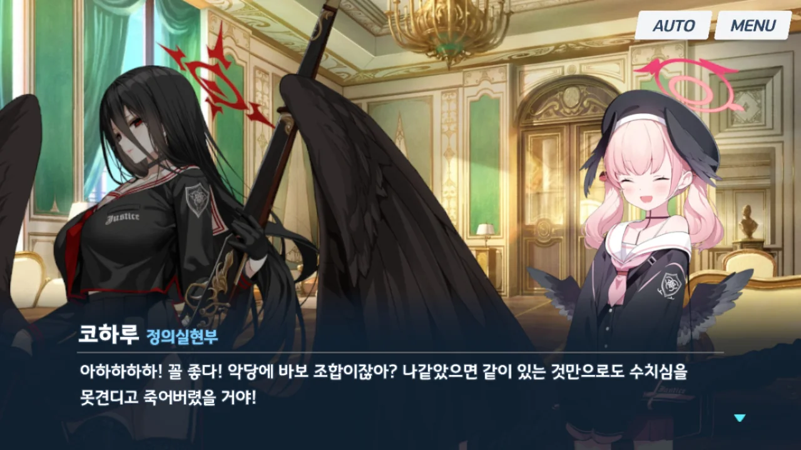
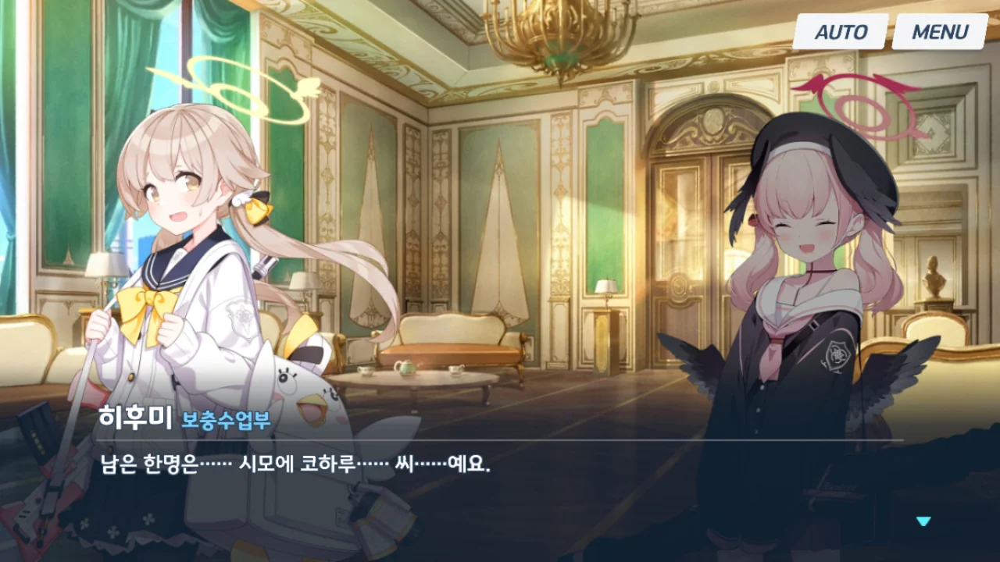
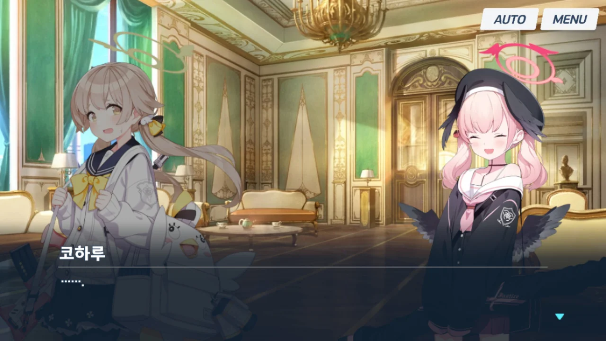
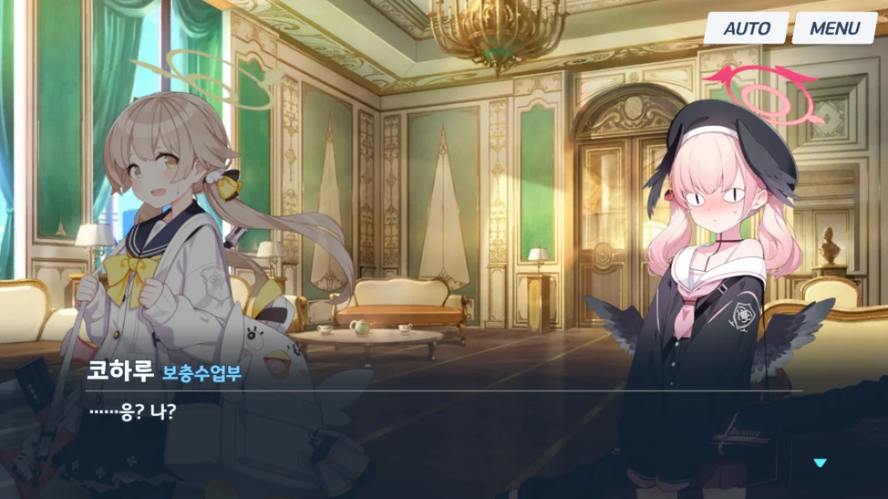
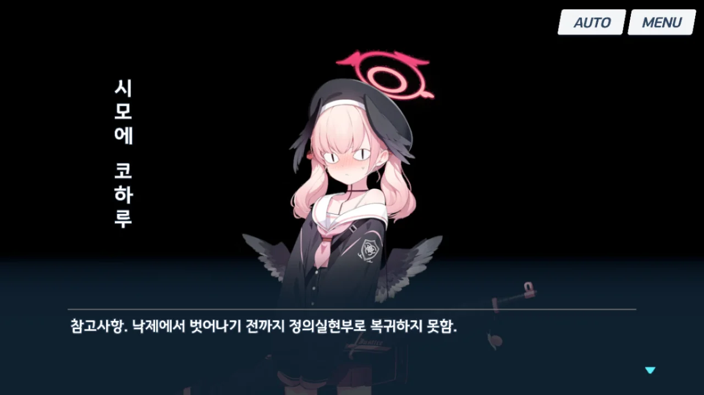
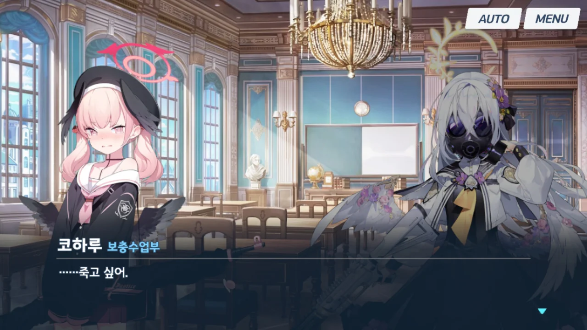

ㅋㅋㅋㅋㅋㅋㅋㅋㅋㅋㅋㅋㅋㅋㅋㅋㅋㅋㅋㅋㅋㅋㅋㅋㅋㅋㅋㅋㅋㅋㅋㅋㅋㅋㅋㅋㅋㅋㅋㅋㅋ

관람 포인트

1. 보충수업부를 '악당에 바보 조합'이라며 놀리다가 정작 본인이 그 보충수업부에 들어가 된 코하루.  
  본인 말 그대로 '수치심을 못 견디고' 죽고 싶어 하는 모습이 아주 꼬시다.
2. 코하루 이름 옆의 소속이 '정의실현부'에서 빈칸이 되었다가, '보충수업부'로 바뀌는 모습.
3. 다른 부원들은 그래도 낙제점을 받은 핑계라도 있었지만, 코하루 본인만 순수한 성적 문제로 낙제를 받음.

블루아카가 번역이니 뭐니, 말은 많지만, 그래도 이런 스토리 내의 연출은 정말 마음에 든다.
