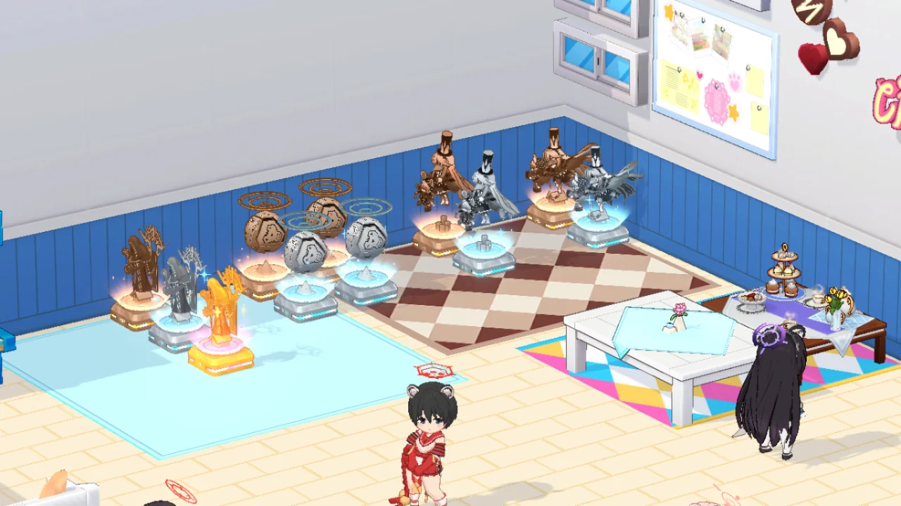

지금까지는 뭘 해도 은색 트로피까지밖에 못 먹었는데, 예로니무스 와서 처음으로 금색 트로피를 먹어보았다.

&nbsp;

하지만 여전히 하드코어 클리어는 택도 없어 보인다.

특히나 이번 예로니무스는 스페셜에 힐러를 둘이나 데려가도 패턴 끊기가 매우 힘들었다.

딜 찬스를 벌어주기 위해서 꾸준히 초록색 등불을 회복시켜 줘야 하는데, 그 와중에 들어오는 예로니무스의 평타 딜이 매우 아파서 딜러들 회복도 끊임없이 시켜줘야 한다.

또 그러다 보면 빨간색 등불을 회복시켜서 보스의 패턴도 끊어야 하는데 그게 잘 안된다.

&nbsp;

어떻게든 꾸역꾸역 해보려다가 빨간색 등불을 못 켜서 전멸기를 맞고 제대가 증발하는 걸 보고 그냥 거기서 그 모의전을 포기했다.

&nbsp;

하드코어는 65레벨 이상 되고 나서 해보는 것으로...
