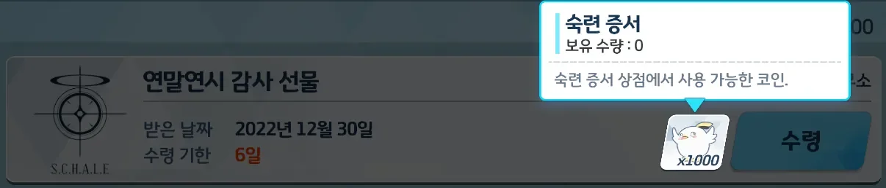

우편함을 보니 이런 게 들어와 있다.

내가 알기로, 저 페로로 아이콘은 게임이 아이템 이미지를 찾지 못했을 때 대신 쓰는 '자리 표시자'이다.

아이템 설명 문구는 숙련 증서의 것과 일치한다.
하지만 내부적으로 숙련 증서와는 다른 아이템으로 취급하는 것인지, 갖고 있는 숙련 증서를 다 썼음에도 저 1,000개의 '숙련 증서'는 여전히 인벤토리에 남아있다.

공지를 찾아보니, 이 아이템은 나중에 일괄적으로 회수할 예정이라고 한다.
조금 아깝네. 일종의 기념품으로 남겨두고 싶었는데.
