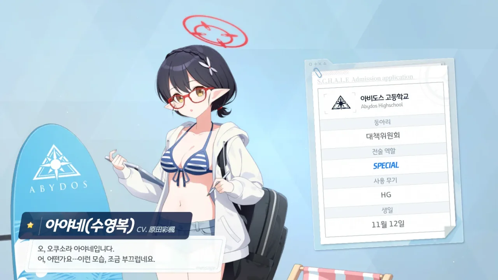

이번에 열린 아비도스 리조트 이벤트에서 수영복 아야네를 무료로 받았다.

블로그에 올리는 블루 아카이브 글은 대개 그 목적이 가챠 성적을 기록하는 것이지만, 수영복 아야네가 너무 귀엽기 때문에 블로그에 글을 올리기로 했다.

이벤트 퀘스트 보상을 최대한 얻기 위해선 수영복 아야네를 편성한 채 퀘스트를 클리어해야 한다.
수영복 아야네는 스페셜 캐릭터라, 적에게 직접 공격받지 않는다. 그래서 스킬이나 장비, 레벨을 업그레이드하지 않은 상태 그대로 써도 아무런 상관이 없다.

일단 첫인상 중 하나는 EX 스킬 코스트가 고작 4밖에 되지 않는다는 것이다.
같은 T.S. 캐릭터인 수영복 히후미는 EX 스킬 코스트가 무려 10이나 되고, 이로하는 EX 스킬을 5 레벨로 올려야 겨우 코스트가 6으로 줄어든다.
그런데 수영복 아야네는 EX 스킬 코스트가 기본 4라니...

수영복 아야네의 공격은 적의 방어력을 무시하는 대미지라는데, 이게 괜찮은 건지 아닌지 잘 모르겠다.
수영복 아야네에게 아직 아무런 투자를 하지 않아, 적에게 유의미한 대미지를 줄 수 없어서일 거다.

어쩌면, 수영복 아야네를 충분히 육성하면 제법 강력한 패가 될 수 있을지도 모른다.
그러니 이번 이벤트 때 최대한 수영복 아야네 엘레프를 모아봐야겠다.
