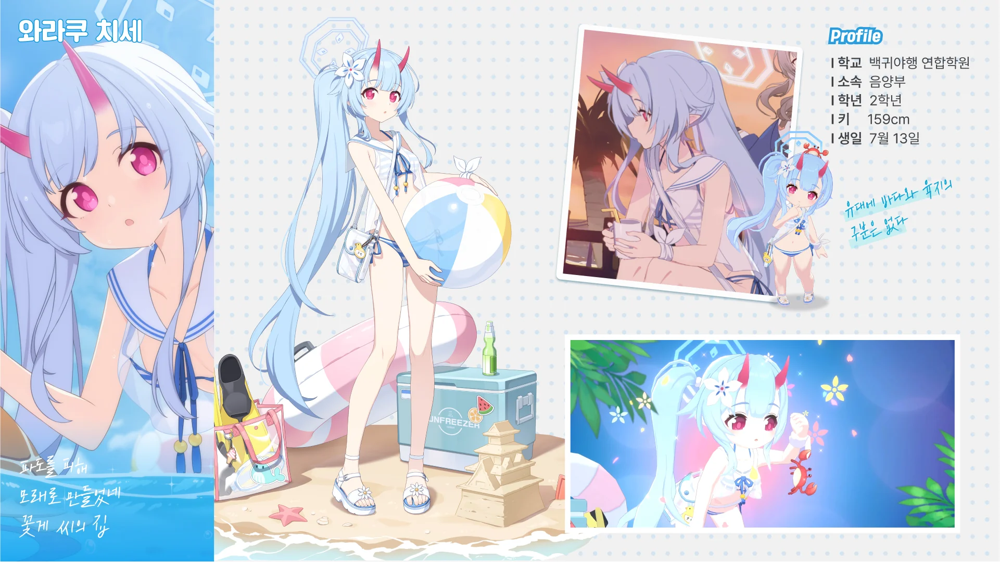
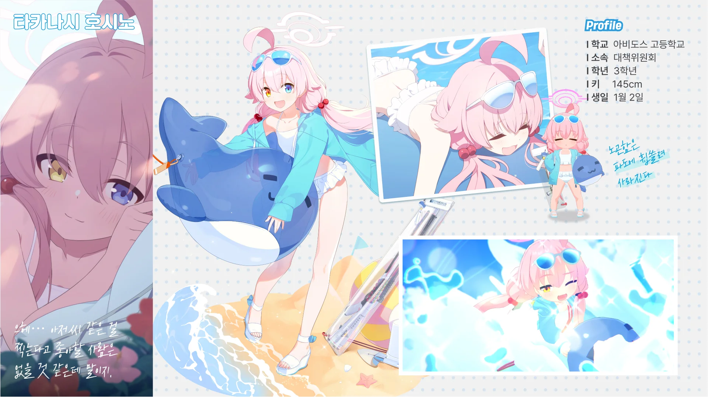
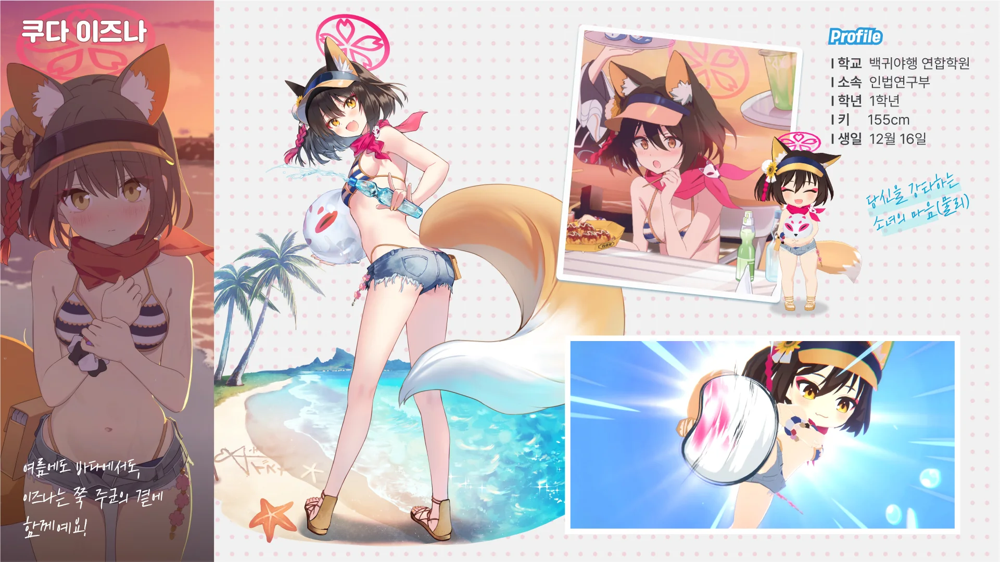
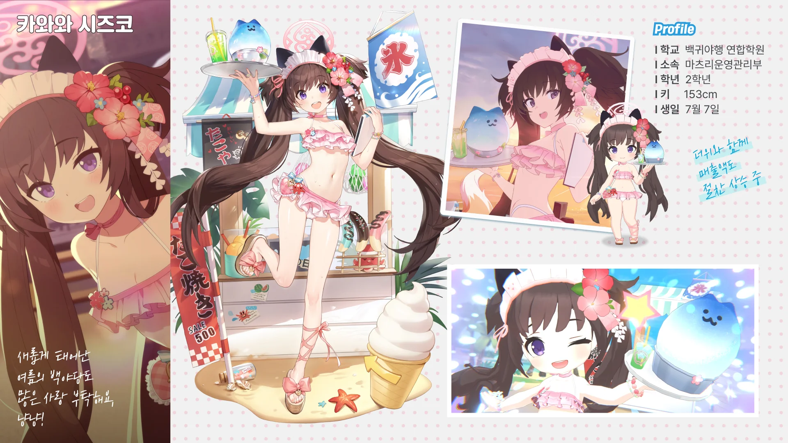

「출장! 백야당 바다의 집 프랜차이즈 계획」 이벤트 사전 예약 페이지가 생겼기에, 냉큼 사전 예약을 하고 왔다.

사전 예약 페이지 맨 밑에는 백야당 바다의 집에서 판매할 메뉴를 조합하는, 자그마한 미니 게임이 있었는데, 그걸 하고 나니 아래 이미지 중 하나를 내려받을 수 있는 링크를 준다.

아, 이건 참을 수 없지. 곧바로 실행할 수 있는 모든 조합을 구성해 미니 게임에서 주는 모든 이미지를 긁어모았다.

수영복 치세는 승리 포즈를 가만히 보다 보면 꽃게의 집게발을 따라 하는 동작이 있다고 하던데...



찾았다.

수영복 호시노에 얽힌 재미있는 이야기가 하나 있다.

수영복 호시노가 처음 등장한 건 바로 직전의 이벤트인 「아비도스 리조트 복구 대책위원회」였다.
수영복 호시노가 매우 귀엽게 나왔기 때문에, 사람들은 수영복 노노미와 수영복 와카모 픽업은 있는데 왜 수영복 호시노 픽업은 없는 거냐며 불만을 표했다.

그런데 연이은 이벤트인 「출장! 백야당 바다의 집 프랜차이즈 계획」에서 수영복 호시노 픽업이 무려 페스 픽업으로 나왔다.
페스 픽업은 3성 등장 확률이 일반 픽업의 2배이기 때문에, 페스 픽업에 청휘석을 쓰는 게 무조건 이득이다.
하지만 이전 픽업인 수영복 노노미와 수영복 와카모 픽업에 청휘석을 탕진한 사람들은 페스에 쓸 청휘석이 부족해, 대성통곡을 할 수밖에 없었다고 하더라.

또 다른 페스 캐릭터인 와카모처럼, 수영복 호시노 역시 총력전에서 반드시 쓰이는 캐릭터가 되었다.

이즈나! 이즈나는 정말 귀엽다.

블루 아카이브에서 제일 처음 나온 이벤트, 「벚꽃만발, 축제대소동」 이 이즈나를 밀어주는 이벤트였다는 걸 고려해도, 이즈나는 쓰담쓰담해주고 싶은 귀여운 녀석이다.

수영복 시즈코 역시 위 셋에 밀려서 그렇지, 나름 화제를 몰고 온 캐릭터였던 것으로 기억한다.

하기야, "앍! 센세!"라며 만날 때마다 좋아해 주는 캐릭터를 누가 싫어하겠냐만.
