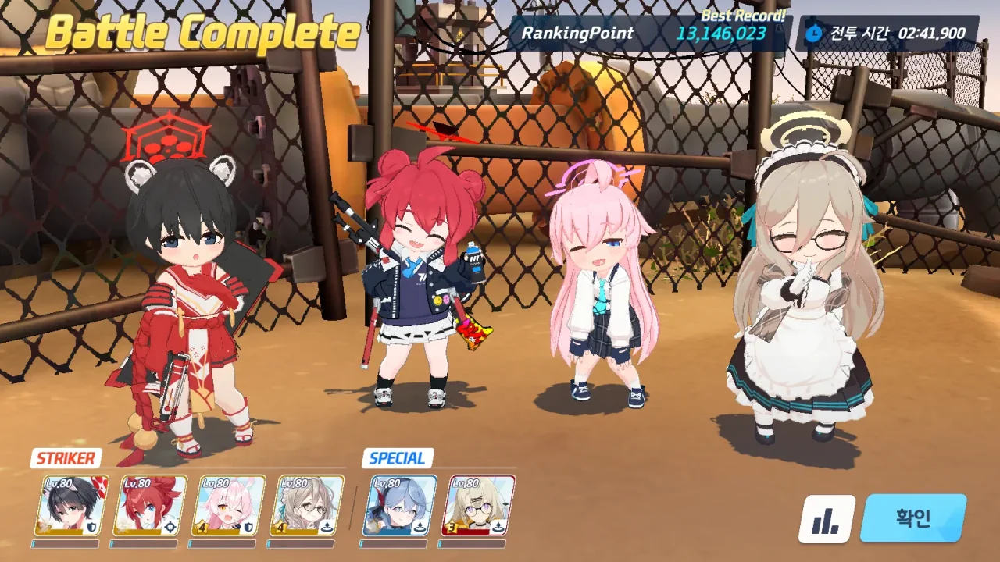
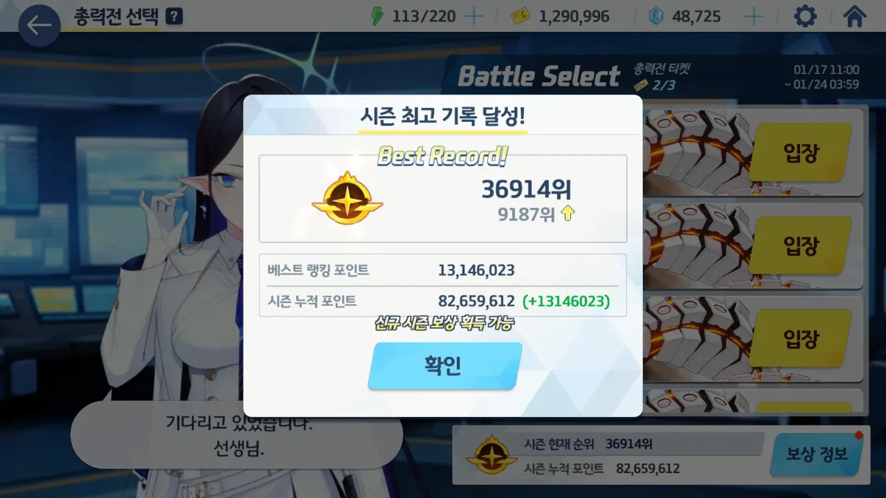

지금까지 했던 모든 총력전은 모두 하드코어 난이도까지만 도전했다.

한 개의 파티로도 충분히 클리어 가능한 하드코어 난이도와 달리, 익스트림 난이도부터는 총력전 보스의 공격이 꽤 아프게 들어오는데다, 대미지가 부족해 파티를 두 개 이상 꾸려야 했기 때문이다.

학생 풀이 부족한 상황에서 이는 상당한 부담감으로 찾아왔고, 그래서 하드코어 난이도에 안주했다.

&nbsp;

그런데 이번 야전 비나부터는 그게 안될 것 같더라.

평소라면 하드코어를 클리어하면 점수는 725대에 걸쳐 있고, 등수 역시 50,000등보다는 한참 위인, 안정적으로 골드 메달을 따갈 수 있는 그런 상황이었을 텐데, 이번에는 점수는 700대에 걸치질 않나, 등수 역시 조금만 미끄러지면 50,000등 밑으로 떨어질 것 같은 상황이 되어 있었다.

결국 공략글을 보고 적당히 비나 피를 깎아 줄 2 파티, 메인 딜 역할인 1 파티 둘을 꾸려서 첫 익스트림에 도전했다.

그리고 깼다.

공략글에서는 '스펙만 충분하다면 1 파티로도 충분히 클리어 가능한 것이 야전 비나 익스트림'이라고 하던데, 나는 아직 그 정도까지는 아닌 것 같다. 보스 피 3줄을 깎아줄 설거지 파티가 필요했다.

아무튼, 안정적인 골드 영역으로 재진입했다. 내일은 인세인 난이도를 한번 맛봐야겠다. 아마 택도 없을 공산이 크지만...
