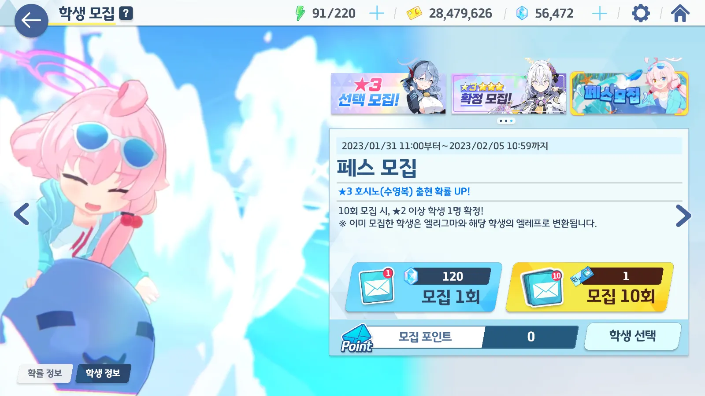
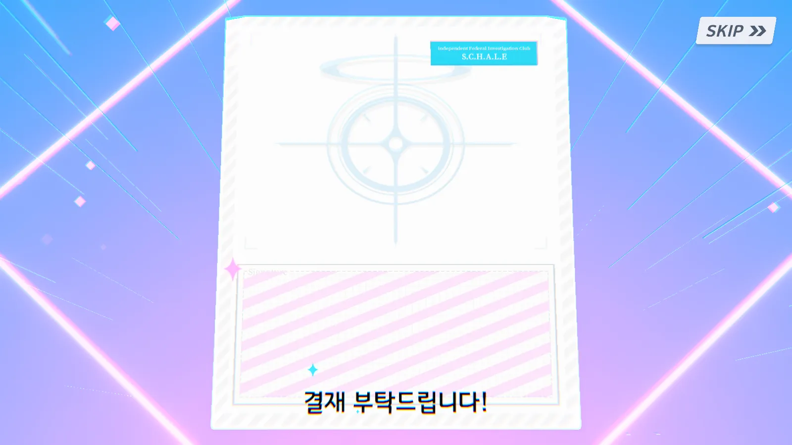
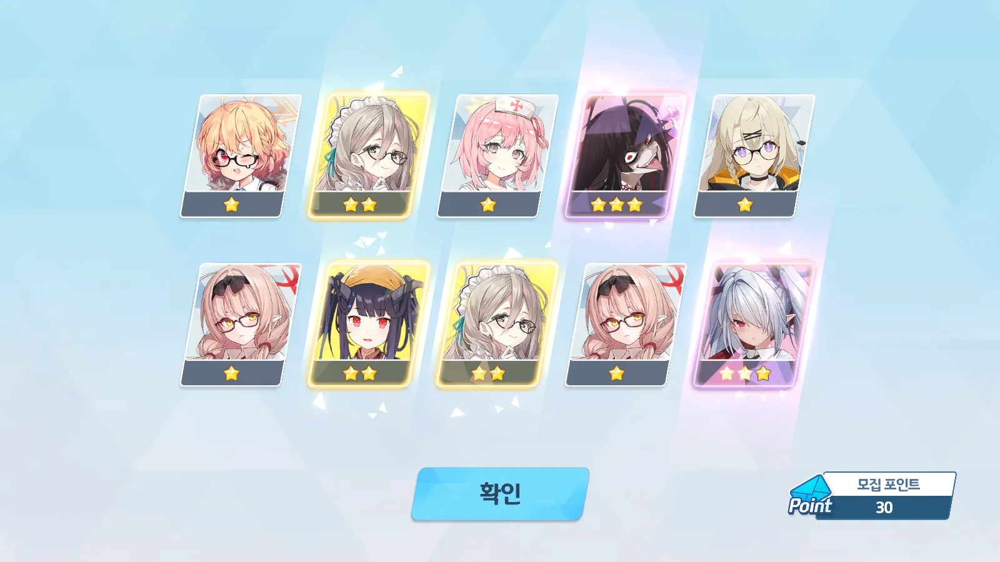
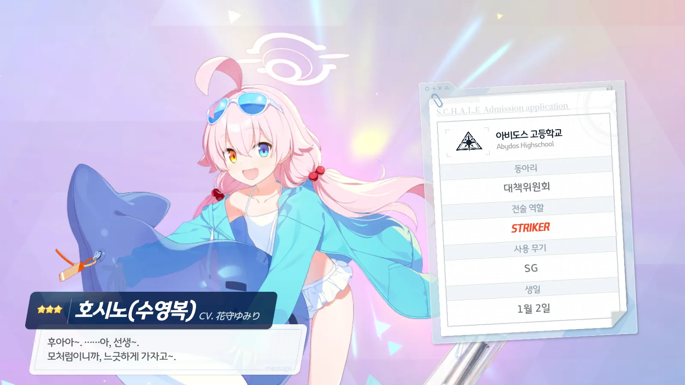

마지막으로 블루 아카이브 가챠를 돌린 것이 언제였더라...? 아마 이로하가 마지막 가챠였던 것 같은데...

아무튼, 그 이후 수시노와 수즈나, 카즈사를 위해 청휘석을 아끼고 아껴왔다.

여태껏 모아 왔던 청휘석 56,472개! 이 중 수시노 가챠에 쓸 청휘석은 오직 24,000개!

수시노 나왔냐!

&nbsp;

&nbsp;

&nbsp;

&nbsp;

...? 어?

30 연차에서 3성이 두 개 나오길래 두근두근하면서 까보았는데 츠루기와 이오리가 나왔다. 어... 좋긴 좋은데... 수시노는 언제 나오니?



바로 직후인 40 연차에는 아츠코가 나왔다.

대항전에서 아츠코를 볼 때마다 '이 녀석, 엄청나게 잘 안 죽네!'라고 생각했는데... 일단 키워두면 잘 쓸 수 있을 것이다. 아츠코가 총력전에서도 쓴다는 이야길 들어본 것 같은데...







이후 수없이 가챠를 돌렸지만... 나오는 것은 전부 중복뿐이었다.

싫은 것은 아닌데! 기왕 천장 찍을 거라면 수시노 한번 나오고 모집 포인트 200개 써서 엘레프 먹는 게 낫잖아!

&nbsp;

&nbsp;

&nbsp;

&nbsp;



... 결국 안 나왔다.

수시노... 얻었다...

그런데 왜 이렇게 눈시울이 붉어질까?

&nbsp;

&nbsp;

&nbsp;

&nbsp;

PS.



수시노 전무를 2성까지 찍어주라던데, 일단 1성만 찍어두었다.
