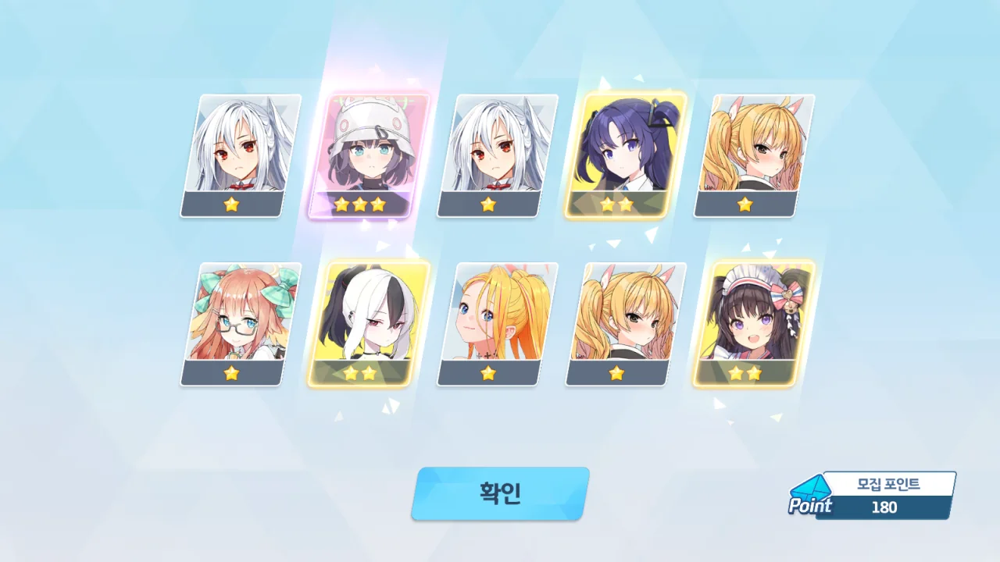
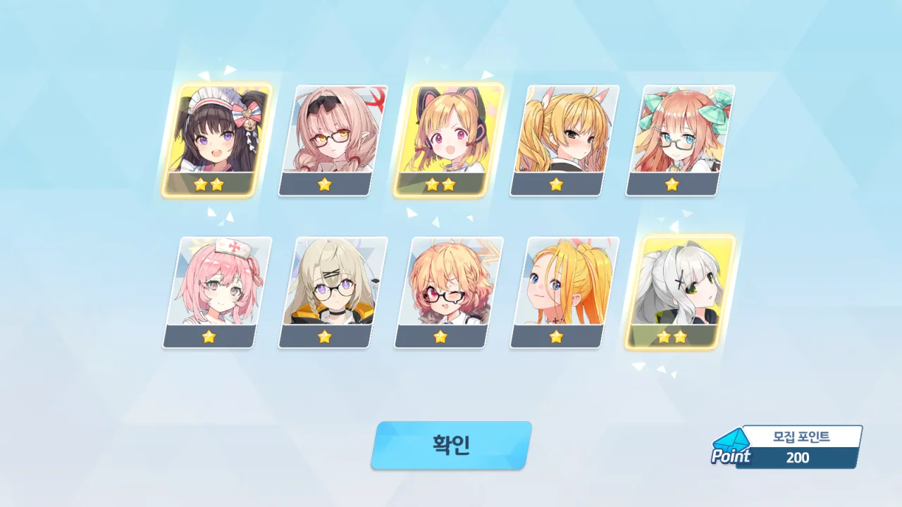
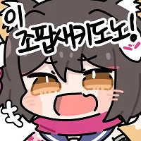

수영복 호시노의 짧은 픽업 기간이 끝나고, 수영복 이즈나의 픽업 기간이 찾아왔다.

&nbsp;

수시노 페스 때 가챠를 열심히 돌렸지만 돌아온 것은 천장뿐이었지... 정말 피눈물이 나왔다.

그 쓰라린 가슴을 후벼 파는 것은 최근 블루아카를 시작한 지인의 염장질이었다. 본인이 원하는 것은 아루인데, 나오라는 아루는 안 나오고 수시노만 세 번 나왔다며 투덜대더라. 크아아악!

&nbsp;

그래도 이번 픽업은 다를 것이다. 분명 다를 것이다. 솔직히 말해, 두 번 연속으로 천장을 칠 확률은 굉장히 낮지 않은가. 상식적으로 그럴 리 없다.

다만 그 지인이 이번엔 30 연차만에 수즈나를 얻었다는 이야기를 해 또다시 내 가슴을 후벼 팠다. 이번에도 나만 천장 치는 건 아니겠지?

&nbsp;

승리를 위해서는 전략적으로 가챠를 돌려야 한다.

이번에 무료로 지급되는 가챠는 총 100회이다. 9일에 걸쳐 총 100회의 무료 가챠를 뿌리는데, 하루에 10회씩 뿌리다가 마지막 날에 20회를 뿌리는 식이다.

하지만 이 무료로 지급되는 100 연차 안에 수즈나가 나오리라는 보장은 없다. 가챠를 할 때에는 천장을 친다는 최악의 상황을 고려하고 해야 한다. 따라서 미리 100 연차를 돌려야 한다.



...? 분명 나는 수즈나 가챠를 돌렸을 터인데? 100 연차만에 수치세가 나왔다.

물론 그 이전에는 3성이 하나도 나오지 않았거나, 3성이 나와도 이미 있는 3성이 나왔다.

&nbsp;

이후 매일매일 지급되는 무료 연차만을 사용해 가챠를 돌리기 시작했다.



120 연차 때에는 온나츠가 나왔다.

온천 이벤트 때 굉장히 뽑고 싶었지만, 얼마 후 있을 뉴츠키 픽업을 위해 눈물을 삼키며 떠나보냈었던 온나츠였는데...



130 연차 때에는 사키가 나왔다.

래빗 소대의 성능이 그리 좋지 않다는 이야기를 듣고 그냥 흘려보냈던 픽업이었다.

그리고 어째서인지 180 연차 때 사키가 한번 더 나왔다.

기왕 나올 거면 미유나 다른 래빗 소대원이 나오는 게 더 낫지 않니? 그... 세계의 균형이라던가 그런 것 말이야.

그리고 대망의 200 연차.

&nbsp;

안 나왔다.

&nbsp;

&nbsp;

&nbsp;

&nbsp;

...



...

