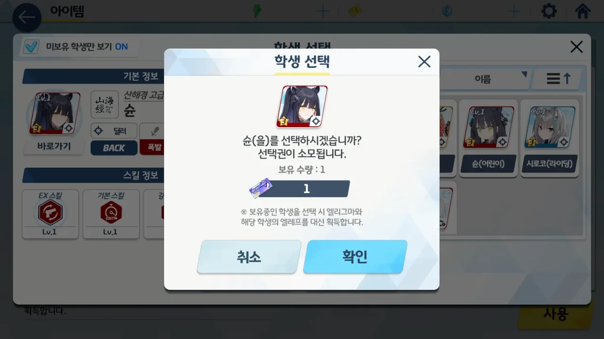
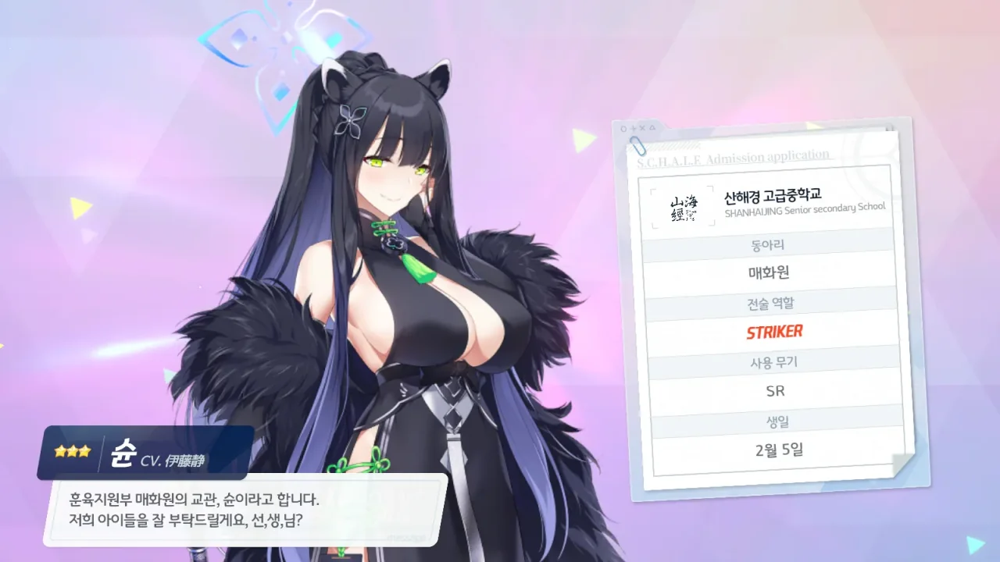

블루 아카이브를 처음 시작했을 때 들은 이야기가 있다.

> 블루 아카이브를 할 거라면 이 세 학생은 꼭 챙겨라. 이오리, 히비키, 슌.
> 하지만 만약 전술대항전을 전혀 할 생각이 없다면 슌은 챙길 필요가 없다.
{.bq}

PVP는 질색이기에, 슌은 버리고 이오리와 히비키만 챙기고 블루 아카이브를 시작했다.

다른 사람들은 이히슌을 들고 시작하기 위해 게스트 계정으로 리세마라를 돌린다고 하지만, 나는 초반에 주는 청휘석을 전부 가챠에 쏟아부었더니 이오리와 히비키가 나온, 정말 운이 좋은 케이스였다.

&nbsp;

그런데 슌이 없으니까 상당히 꼽더라.

슌을 잘 키워두면 전투를 시작할 때 코스트가 미리 차있기도 하고, 전술대항전에서의 슌은 상대 학생 중 공격력이 제일 높은 학생을 우선 타격하는 AI로 되어 있어서 더더욱 그랬다.

기껏 공격력 센 학생들을 딜러로 세워놓아도, 적의 슌이 그걸 귀신같이 끊어먹더라고.

PVP가 싫다고 하지 않았냐고? 청휘석과 대항전 코인 때문에 하지 않을 수가 없었다.

&nbsp;

그런데 마침 이번에 3성 선택권을 판다. 그것도 없는 학생 중 원하는 학생을 뽑아갈 수 있는 29,000원짜리 3성 선택권.

... 그래서 질렀습니다. 내 의지로.

웃긴 것은, 정작 이렇게 슌을 얻어놓았는데, 경험치 책은 물론이요, 크레딧이나 성장 재화, 오파츠 등이 전부 모자라서 슌을 80 레벨까지 올려주지 못한다는 것이다.

아, 이런 젠장맞을.
