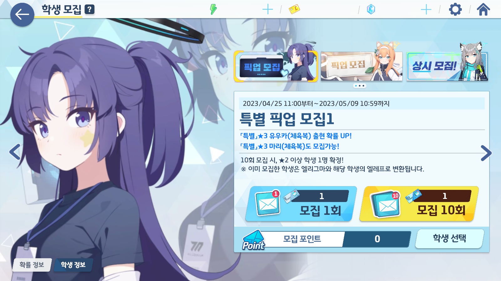

황륜대제 이벤트가 열리면서, 새로운 한정 픽업도 열렸다.

이번에는 체육복 유우카와 체육복 마리, 이 두 캐릭터가 한정 픽업으로 들어왔다.

&nbsp;

아아, 내가 이 날을 위해 얼마나 청휘석을 악착같이 모아 왔는가...

청휘석을 더 모으기 위해, 블루 아카이브를 시작할 때부터 다짐해 왔던, 게임에 돈을 지르지 않겠다는 맹세조차 갖다 버리고 월정액을 질러왔었다.

하, 이렇게 적으니까 갑자기 현자 타임이 오는데.

아무튼, 시작해 볼까.



첫 시작부터 예감이 좋다. 20 연차만에 라이딩 시로코와 어린이 슌이 떴다.

사실, 산해경 마크가 나왔을 때, '드디어 코코나가 나오는 건가?!'라며 잔뜩 기대했었는데, 어린이 슌이 나오더라.

어... 둘 다 어린이긴 한데... 기왕이면 코코나가 나왔으면 참 좋았을 텐데...



그리고 30 연차만에 체육복 유우카가 나왔다. 이거 실화냐? 실화다! 나는 승리했다!

체육복 유우카가 나왔으니, 나머지 가챠는 체육복 마리에서 진행하기로 했다.



응원단 우타하가 나오긴 했는데, 응원단 우타하를 쓰려면 전무 3성은 기본으로 깔고 가야 한다고 하더라.

일단 있는 것만으로 만족하기로 했다.



그리고 150 연차에서 체육복 마리가 떴다. 이게 바로 승리지!

하지만 이다음에는 히마리, 새해 후우카, 미카 픽업이 기다리고 있다. 이젠 정말 존버뿐이야...

&nbsp;

150 연차 이후에는 그냥 그대로 천장을 찍는 것이 이득이기에, 그대로 천장까지 달리기로 했다.



내 운은 여기 까지라는 듯, 이후에는 평범하게 기존 보유하고 있던 3성만이 뜰뿐이었다.

특히 이로하는 위 사진 외에도 한 번 더 떴었는데, 실수로 사진을 찍지 않고 클릭해 넘겨버렸다.

문제는, 내 이로하는 이미 전무 3성이라는 거지...



천장을 칠 때까지, 그토록 원하던 코코나는 나오지 않았고, 난 천장을 친 모집 포인트를 체육복 마리에 쏟아부었다.

헤헤... 마리 귀엽다... 헤헤...
