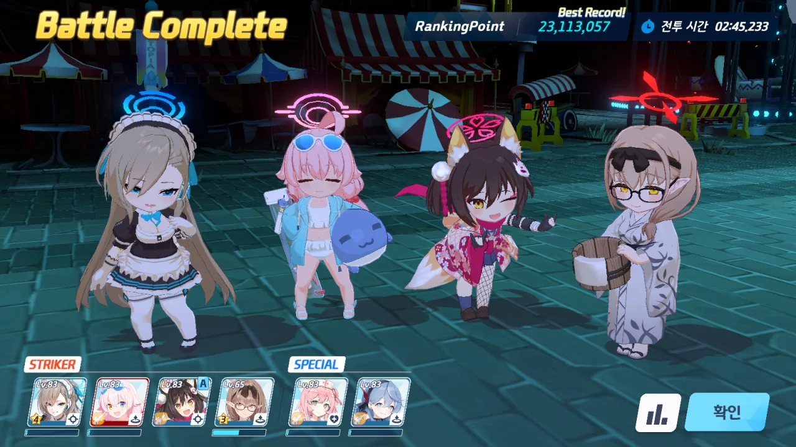

블루 아카이브를 시작한 지 어언 일 년 하고도 반이 되어가는 시점. 드디어 처음으로 인세인을 클리어했다!

&nbsp;

불과 몇 달 전만 해도, 총력전 하드코어만 클리어해도 무난하게 골드 트로피를 얻을 수 있었다. 하지만 이런저런 고성능 캐릭터가 출시됨에 따라 골드 등급을 유지하는데 필요한 점수가 점점 높아지기 시작했고, 급기야는 하드코어를 클리어해도 실버 등급으로 떨어지는 경우가 생겼다.

그래서 손을 댄 것이 익스트림 난이도. 하드코어 바로 다음 단계이어도, 보스의 체력이 워낙 많은 터라 옛날에는 손을 댈 엄두조차 내지 못했었다.

하지만 골드 등급을 사수하려면 어쩔 수 없는 일.

&nbsp;

그런데 하필이면 그 당시 진행 중인 총력전이 한국 서버에는 처음 나오는 고즈였다.

일본 서버에서 고즈의 패턴 등에 대해 다양한 연구가 나오긴 했었지만, 그 글들을 전부 본 내 소감은 이러했다.

> 대놓고 플레이어 엿같으라고 만든 총력전 보스
{.block-quote}

물론 대부분의 연구 글들이 인세인 난이도에서의 고즈 패턴을 분석한 글이었지만, 그렇다고 그 정보들이 익스트림에서 아예 적용이 되지 않는 것은 또 아니었다.

&nbsp;

열차에 이리저리 드리블을 당하며 기껏 1 페이즈를 넘겨도 2 페이즈에서 고즈가 우측에서 나오지 않으면 한치의 망설임도 없이 리트라이 버튼을 눌러야 했다.

2 페이즈가 되면 고즈가 환영을 둘 소환하는데, 나타난 세 고즈 중 어떤 고즈가 진짜 고즈인지 확인하기 위해서는 세 고즈 중 하나에 수영복 이즈나의 EX 스킬을 맞춰서, 화면 상단의 고즈 체력이 떨어지는지 아닌지 확인하는 수밖에 없었다. 진짜 고즈라면 체력이 떨어지지만, 가짜 고즈라면 체력이 변하지 않기 때문이었다.

그런데 하필이면 수영복 이즈나의 EX 스킬에 집중공격 효과가 달려 있어, 내가 때린 고즈가 가짜임이 확인되어도 캐릭터들이 가짜 고즈만 쏘게 된다.

일분일초가 중요한 총력전이니, 내가 때린 고즈가 가짜임이 확인되면 단 한 치의 망설임도 없이 리트라이 버튼을 눌러야 했다.

&nbsp;

그다음에는 시로 & 쿠로가 나왔다. 익스트림만으로 충분할 줄 알았는데, 시로 & 쿠로는 점수에 따른 등수 변동폭이 크다고 이야기를 들었다. 기껏 35,000등을 만들어 놓아도 언제 50,000등 밑으로 떨어질지 모르는 일.

골드 등급을 사수하기 위해 어쩔 수 없이 인세인에도 손을 대게 되었다.

&nbsp;

그리고 수없이 고통받은 끝에... 시로 & 쿠로 인세인을 처음으로 클리어하게 되었다.

모의전이긴 했지만, 시로에서만 50분 동안 1 페이즈를 도전한 적도 있었고, 2 페이즈에서 이즈나와 수영복 호시노만 남아 쿠로를 때리던 적도 있었다. 그 밖에도 패턴 순서를 순간 착각해 시즈코를 써야 하는데 코타마를 쓴 적도 수없이 있었고...

&nbsp;

정말 인세인 난이도는 다시 하기 싫다. 그런데 어쩌겠나. 골드 등급을 사수하려면 이제부터는 인세인 난이도를 해야 하는데.
