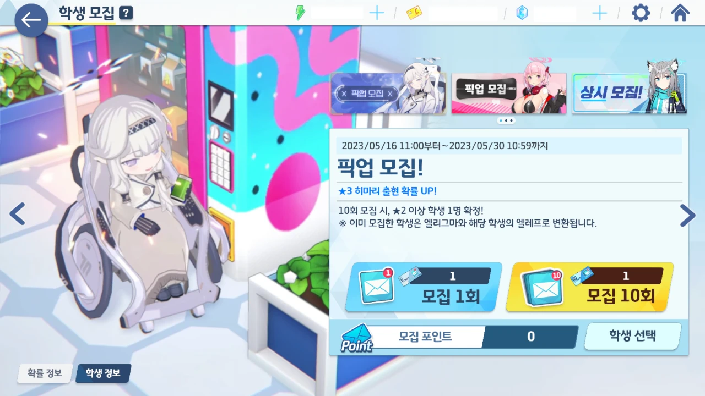
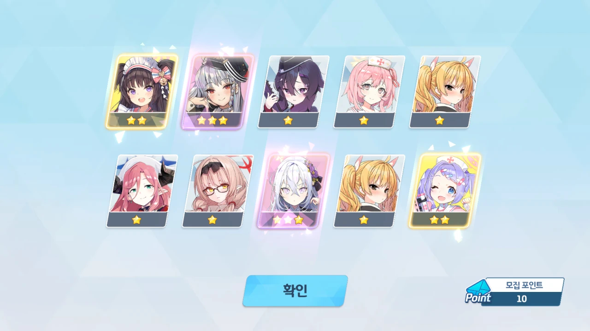
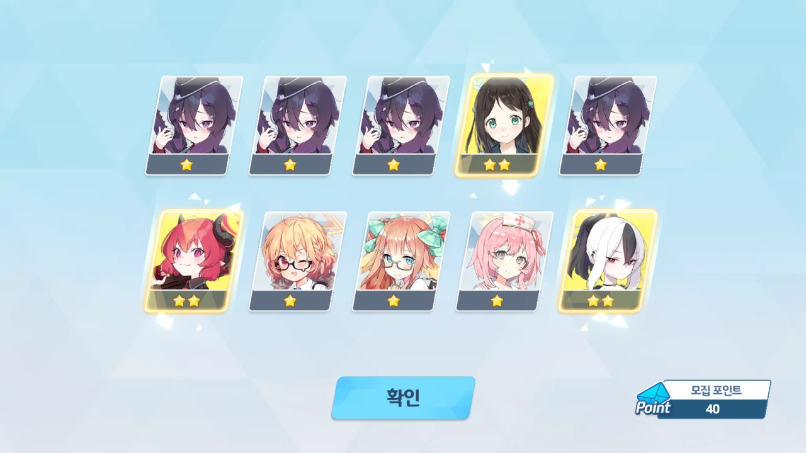
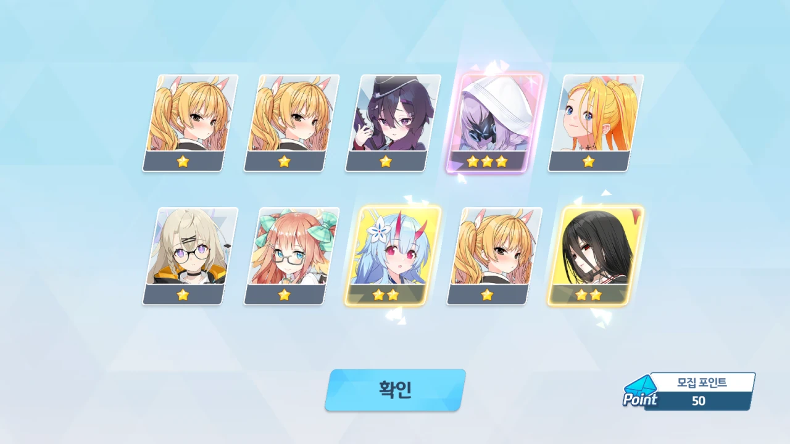
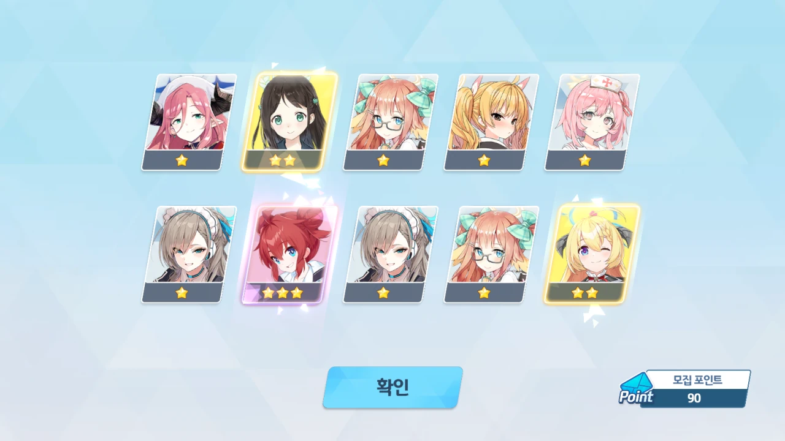
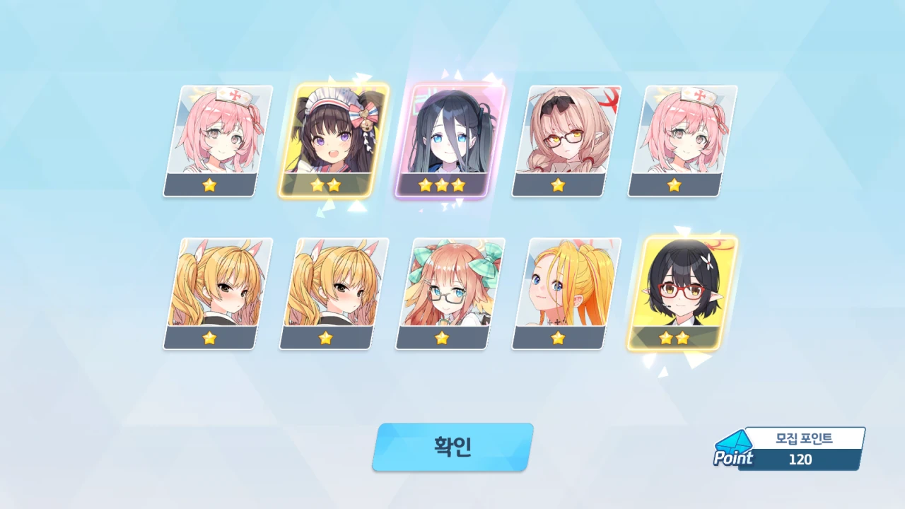
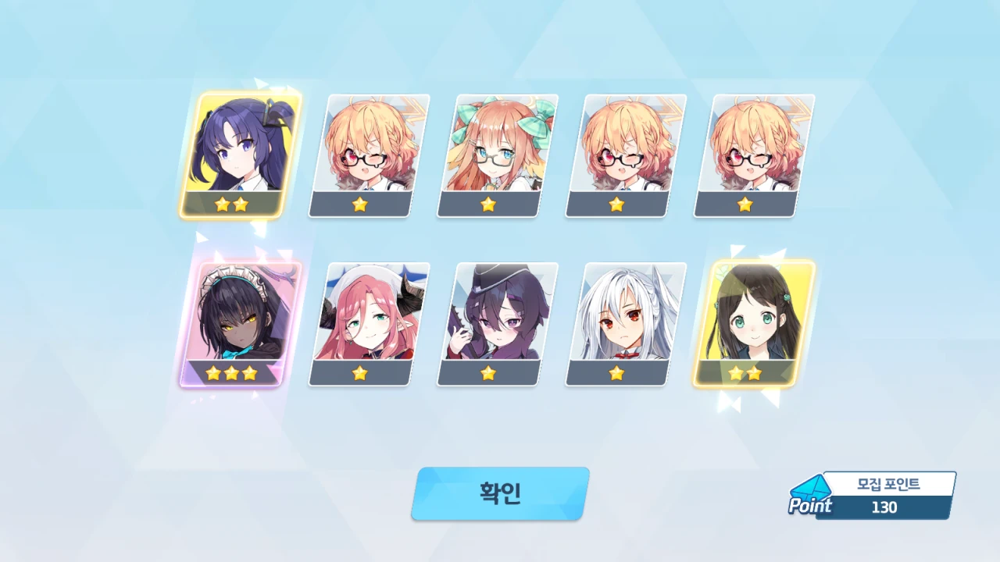
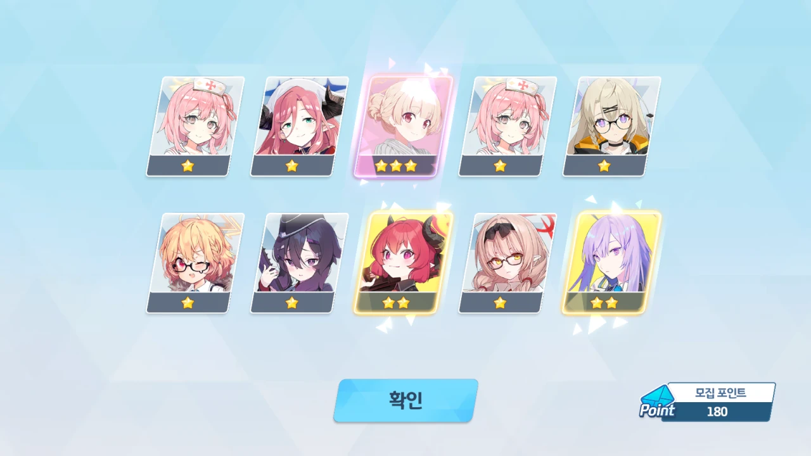
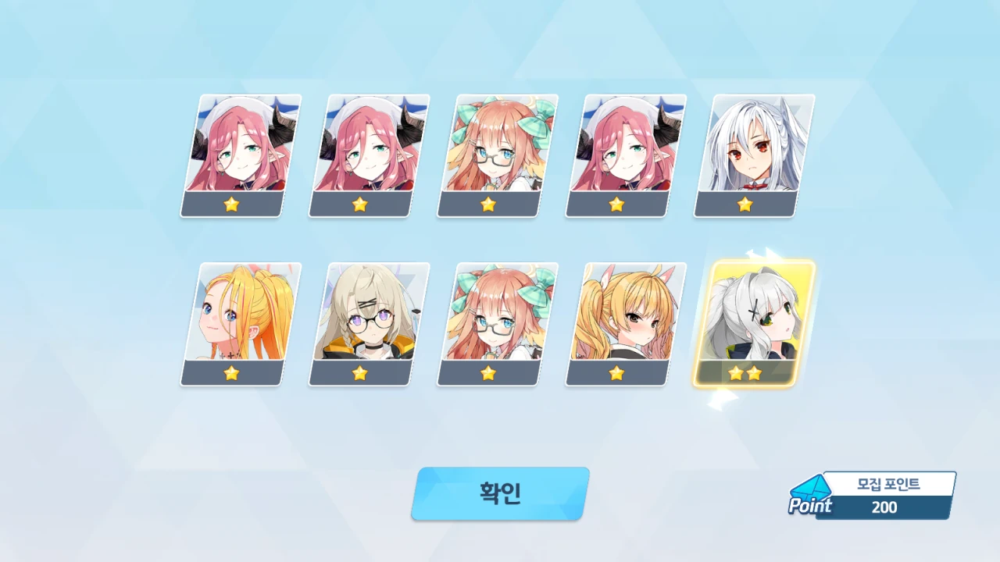

또 터졌다! 내 가챠가!

&nbsp;

이번 픽업은 히마리 픽업이다.

저번 픽업 때 체육복 유우카와 체육복 마리를 뽑느라 상당한 양의 청휘석을 소모했기 때문에, 이번 픽업부터는 매 픽업마다 비틱을 하지 않으면 미카를 뽑지 못하게 될 수도 있다.

당장 앞으로 반드시 뽑아야 할 캐릭터에 정월 후우카, 미카가 있다. 그리고 그 이후에 나올 나기사도 뽑아야 한다는 말이 있더라고.

&nbsp;

용하야, 이게 맞니?

아무튼, 가챠를 하기 앞서, 몸과 마음을 단정히 하고 가챠 버튼을 누른다.

첫 10 연차.

처음부터 3성이 두 개 나오길래 '10 연차 비틱 가냐?!'라고 속으로 잔뜩 기대했었는데, 정작 나온 것은 하루나와 아즈사였다.

하루카하루카하루카하루카

아쉽게도 하루카로 오목을 두지는 못했다. 아이리 대신 하루카가 나왔으면 하루카로 오목을 둘 수 있었을 텐데...

50 연차에는 아츠코가 나왔다.

나보다 먼저 가챠를 돌린 사람은 60 연차만에 히마리를 뽑았다고 하더라. 50 연차에서 히마리가 나오지 않았으니, 그보다 더한 비틱을 하는 데에는 실패했다.

90 연차. 마키가 나왔다.

내 마키... 이미 전무 3성인데... 지금 나와도 의미가 없지 않니?



100 연차. 미사키가 나왔다.

아리우스 스쿼드도 언제 한 번 모으긴 해야 하는데 말이다. 이제 절반 정도 모였나?

120 연차. 아리스가 나왔다.

아리스 역시 좋아하는 캐릭터니까 좋긴 좋은데... 대체 히마리는 언제 나오는 거니?

130 연차. 카린이 나왔다.

이때부터 나는 마음을 놓았다. 아, 나는 천장을 찍을 운명인가 보다.

미카는... 아마 보지 못하겠지? 하아... 꼬접 각이 보이는 것만 같다.

180 연차. 온천 노도카가 나왔다.

이미 늦었어. 다음 10 연차에 나온다고 하더라도, 무조건 천장을 찍어야 모집 포인트 손해가 없다.



190 연차. 수영복 노노미가 나왔다.

미카를 뽑기 위해선 청휘석을 아껴야 했기 때문에, 수영복 노노미 픽업을 씁쓸하게 떠나보낼 수밖에 없었는데, 여기서 수영복 노노미가 나왔다.

수영복 노노미가 나온 건 정말 행복한 일인데... 왜 이제 나왔니...

그리고 대망의 200 연차.

그래도 아로나에게 양심이 있다면 내게 3성을 줄 것이라 생각했지만, 이놈의 똥아로나는 내게 1성 9개와 2성 1개가 든 파란 봉투만을 던져줄 뿐이었다.



으히히히히히히히
으헤헤헤헤헤헤헤
