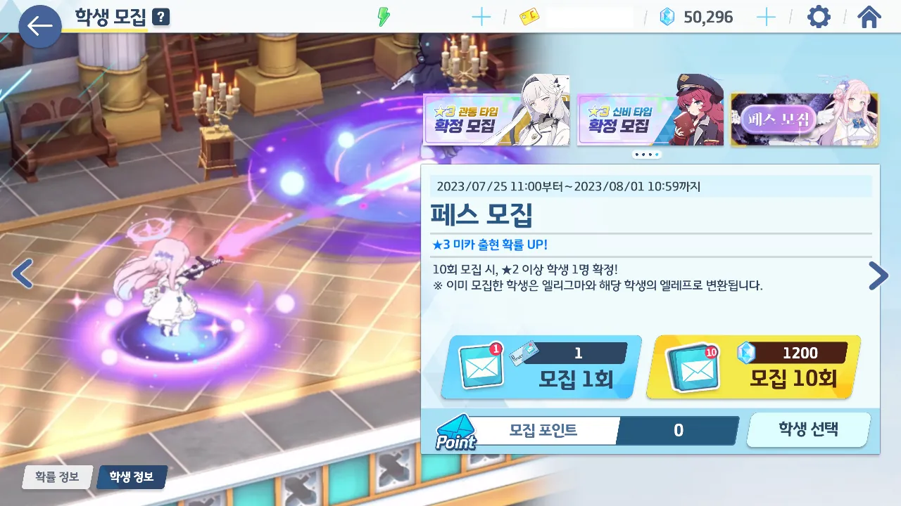
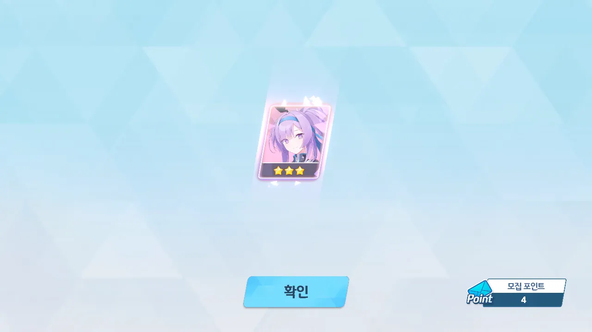
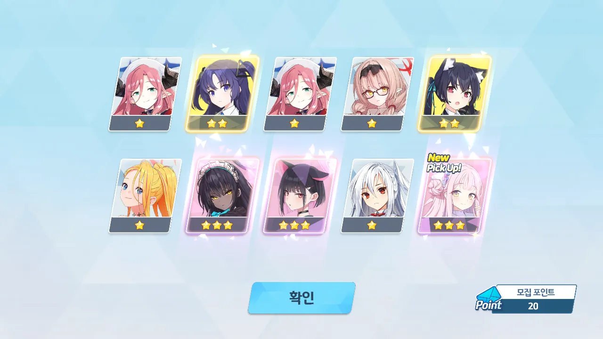
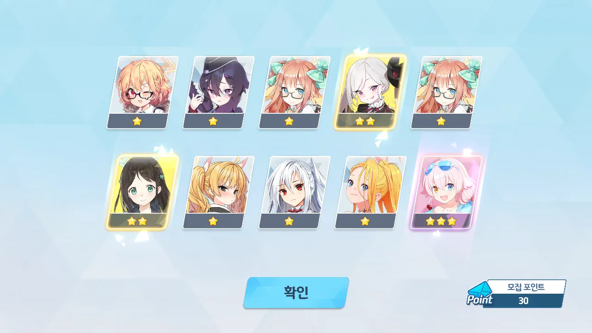
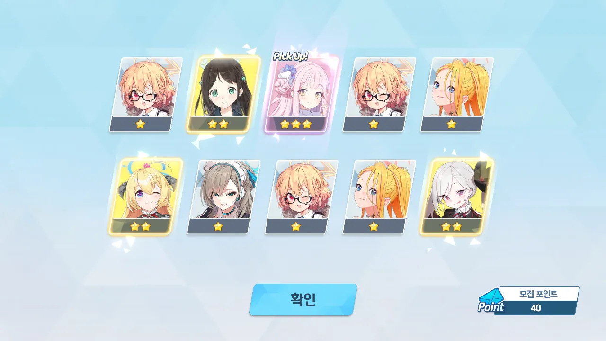
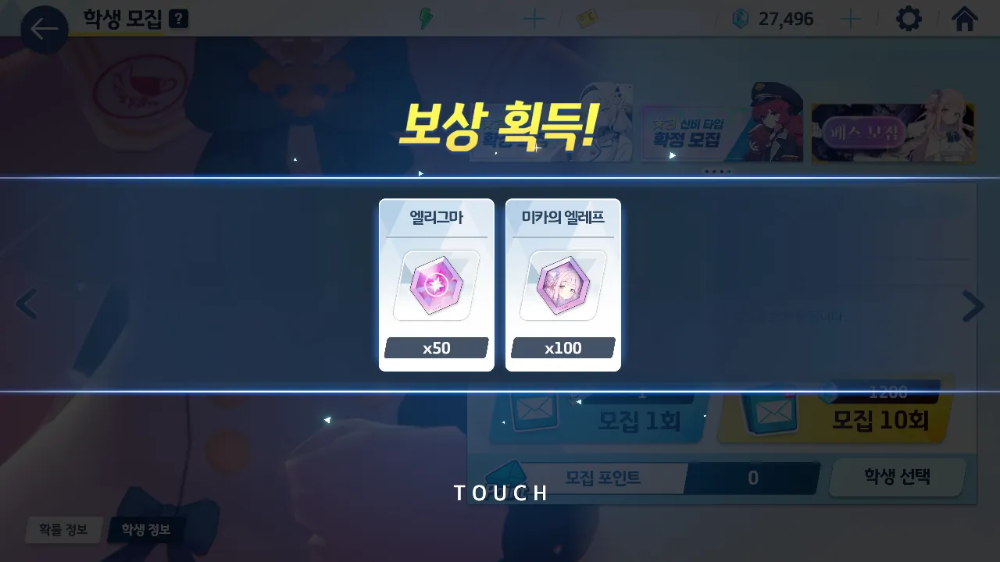
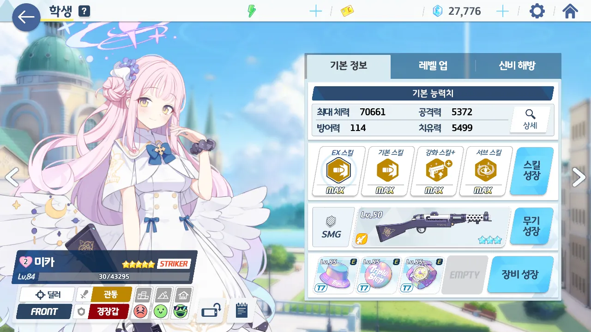

이번 픽업은 페스 픽업이다. 그 말인즉슨, 3%였던 3성 등장 확률이 2배인 6%가 되었다는 소리다.

내가 이 날을 위해 청휘석을 얼마나 악착같이 모아 왔는가...

청휘석 50,000개로 페스 가챠 가즈아!

일단 픽업 1회 티겟이 13개가 있길래 10개만 썼다.

4회 만에 응원단 우타하가 나왔다.

20 연차. 곧바로 미카가 나왔다. 동시에 카린과 카즈사도 나왔다.

암, 이게 바로 페스지! 암, 그렇고 말고!

30 연차. 수영복 호시노가 나왔다.

수영복 호시노가 나온 건 좋지만, 지금 수영복 호시노를 일부러 전무 1성에서 올리지 않고 있는 상황이라 약간 애매하다.

40 연차. 미카 한번 더!



50 연차에는 바니걸 아카네가 나왔다.



60 연차에는 아츠코와 미야코가 나왔다. 좋아, 이렇게 하나하나 RABBIT 소대를 모아가는 거야... 미유는 언제 나올까, 그런데?

70 연차에서는 게임이 튕겨서 그 결과를 확인하지 못했다.



80 연차에는 미도리가 나왔다. 90 연차에는 네루가 나왔다.



이제 슬슬 약발이 떨어져 가는 걸까, 이제 3성이 잘 안 나오기 시작한다.

120 연차에서 아리스가 나왔다. 130 연차에서 아츠코가 나왔다.



방금 한 말 취소. 여전히 3성은 잘 나온다.

150 연차에서 아츠코와 정월 세리카가 나왔고, 170 연차에서 아루가 나왔다.



190 연차에는 사야와 치히로가 나왔다.

마지막 200 연차에서 나츠가 나왔다.

으... 페로로질라 인권 캐릭터가... 왜 이제야 나온 거야! 끄어억...

물론 모집 포인트는 미카를 뽑는 데에 썼다.

있는 재화 없는 재화 탈탈 털어 미카를 퍼펙트로 만들어주었다.

***

미카 페스 결산 (총 200뽑)

* 나츠 [NEW]: 1회
* 네루: 1회
* 미도리: 1회
* 미야코 [NEW]: 1회
* 미카 [NEW]: 2(+1)회
* 사야: 1회
* 세리카 (정월): 1회
* 스미레: 1회
* 아루: 1회
* 아리스: 1회
* 아츠코: 3회
* 아카네 (바니걸) [NEW]: 1회
* 우타하 (응원단): 1회
* 치히로: 1회
* 카린: 1회
* 카즈사: 1회
* 호시노 (수영복): 1회

아니, 이번 페스가 미카 페스가 아니라 아츠코 페스였던 거야?
