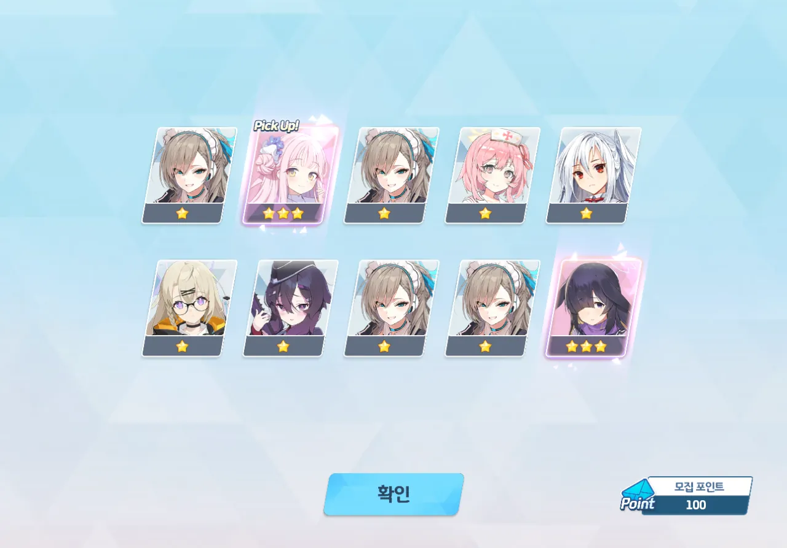

코코나가 없다. 코코나가 없다. 같이 블루 아카이브를 하는 사람 중, 나만 코코나가 없다.

그래서 미친 척 딱 한 번만 하기로 하고 100 연차를 돌리기로 했다. 마침 미카 페스니까 3성이 뜰 확률이 6% 이지 않은가. 코코나가 뜰 확률도 높겠지.



10 연차. 히요리가 나왔다. 이제 사오리만 나오면 아리우스 스쿼드를 완성할 수 있다.+



30 연차. 정월 세리카가 나왔다.

50 연차. 코하루가 나왔다.



80 연차. 크리스마스 세리나가 나왔다.

듣기로는 실내 시로쿠로 총력전에서 아코나 정월 후우카 대신 쓴다고는 들었는데, 자세히는 모르겠다.

마지막 100 연차. 미카와 츠쿠요가 나왔다.

&nbsp;

아쉬운 마음을 이기지 못하고 3만 원이라는 거금을 들여 3성 속성 선택권을 사서 코코나의 공격 속성인 관통을 선택해 보았지만, 마키가 나왔다. 내 마키, 이미 전무 3성인데 말이다.

&nbsp;

오늘의 교훈: 욕심은 패가망신의 지름길이다. 통언뜬은 거짓말이다.
