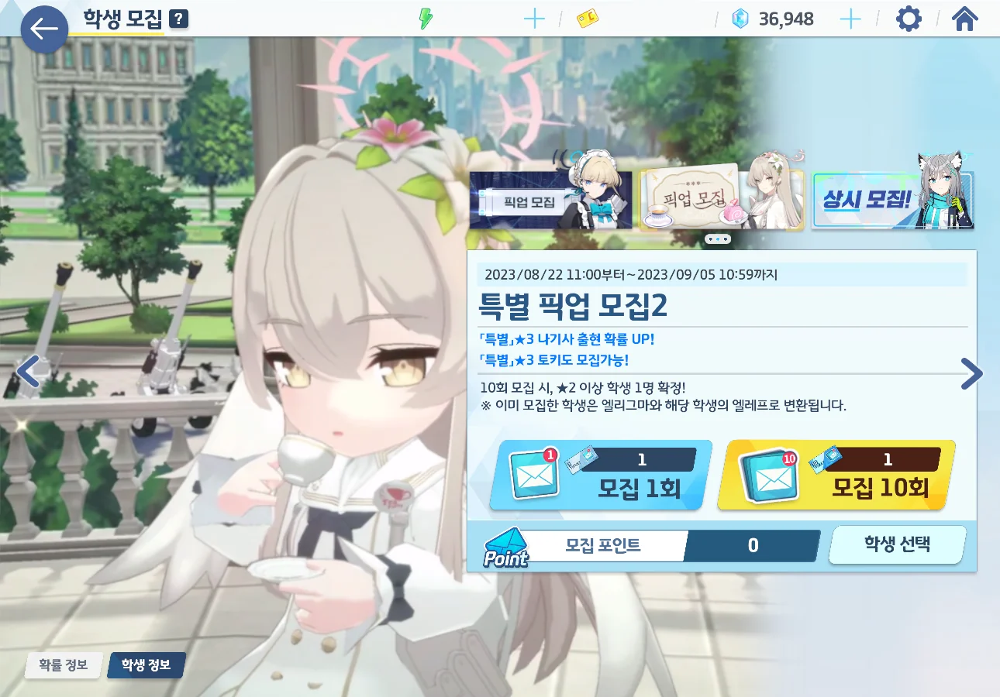
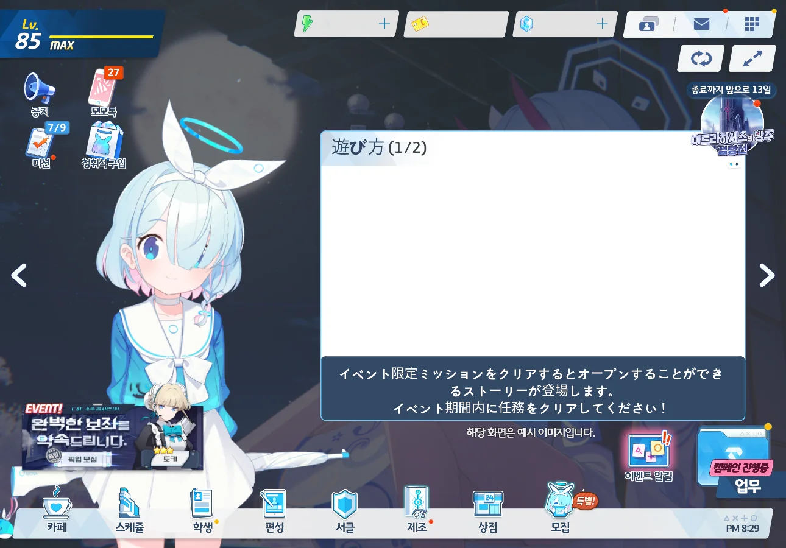

새로운 픽업이 열렸다. 이번 픽업은 토키와 나기사이다.

청휘석이 24,000개 이상이 있으니 이번 픽업에서 나기사를 뽑는 데에는 전혀 문제가 없을 것이다. 하지만 [저번]()에 말했다시피, 앞으로 뽑아야 할 캐릭터는 많은데 청휘석을 수급할 방법은 줄어들 예정이다. 그래서일까, 이번 픽업이 그리 달갑지는 않았다.

이벤트를 통해 얻은 10회 모집권을 먼저 쓸 생각이다.

1회 모집권은 나중에 정말 남은 청휘석이 없을 때를 대비해 아껴두는 중이지만, 그래봤자 겨우 열 장이 채 되지 않을 것이다.



10 연차. 아츠코가 나왔다.

20 연차. 우이가 나왔다.



30 연차. 히후미가 나왔다.

40 연차. 치히로가 나왔다.

50 연차. 마시로가 나왔다.

&nbsp;

3성이 잘 나오는 건 좋은데, 죄다 중복이다.



그리고 80 연차만에 나기사가 나와주었다.

&nbsp;

80 연차만에 원하는 캐릭터가 나왔으니, 분명 좋은 일이다.

하지만, 나오길 내심 바랐던 모에와 코코나가 코빼기도 나오지 않아서일까, 앞으로 닥쳐올 가챠 지옥이라는 피할 수 없는 미래 때문인 걸까, 전혀 기쁘지 않았다.

***

그나저나 대체 이건 무슨 오류냐? 한국 클라이언트에 일본어 데이터가 있었어? 왜?
