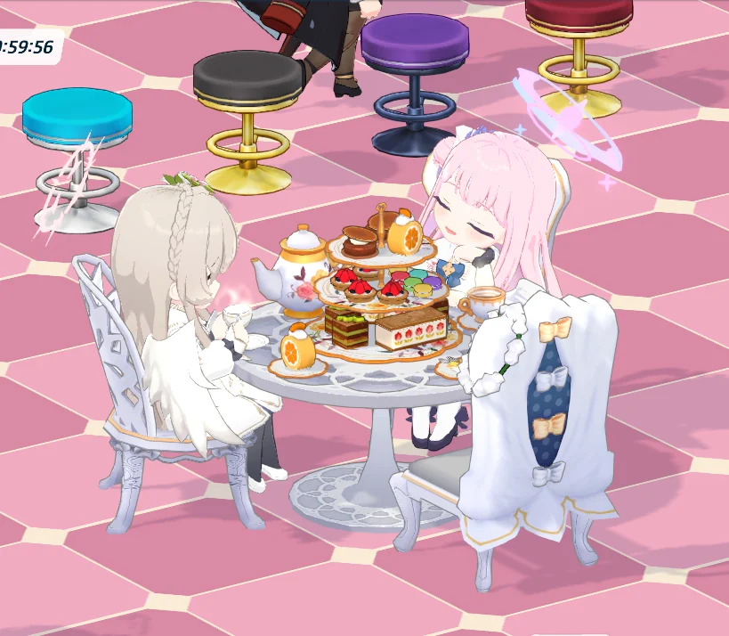

오늘의 AP를 회수하기 위해 별생각 없이 카페에 들어갔더니, 카페에 나기사와 미카가 방문해 있었다.

티파티 집합이라면서 정작 세이아가 없다고? 세이아는 아직 실장 되지 않은 학생이잖아. 세이아는 대충 겉옷으로 대체한다.



미카를 잠시 관찰해 보았다. 대체 홍차에 무엇을 탔기에 홍차에서 반짝반짝 빛이 나는 거냐...?



나기사는 별말 없이 그저 홍차를 홀짝일 뿐이었다.



미카가 나기사에게 손을 내미는 것인지, 손바닥을 내미는 것인지 잘 모르겠다. 무슨 의미가 있는 건가?

&nbsp;

그러고 보니, 카페 정리도 조만간 날을 잡아 한번 해야 한다. 최대한 많은 학생들의 가구 상호작용 모션을 보려면 효율적으로 가구를 배치해야 하기 때문이다.

가구를 잘못 배치하면 학생이 어디에 있는지 한참 찾아야 한다. 그 일례로, 츠쿠요가 상호작용하는 화분을 카페 구석에 배치했더니, 이 화분이 나무로 변장한 츠쿠요인지, 그냥 나무인지 분간하기가 너무 힘들더라고.
