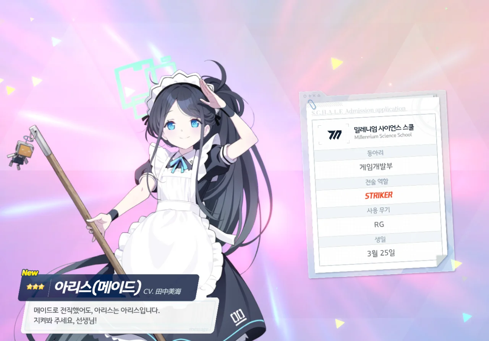
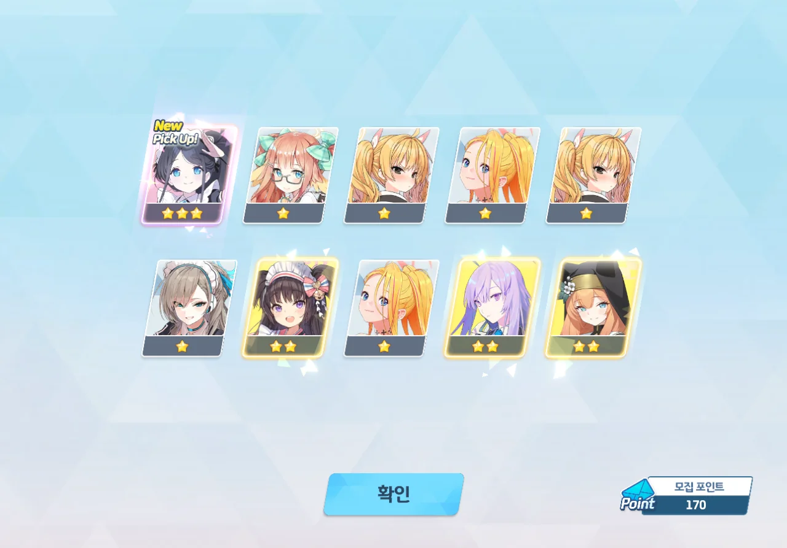
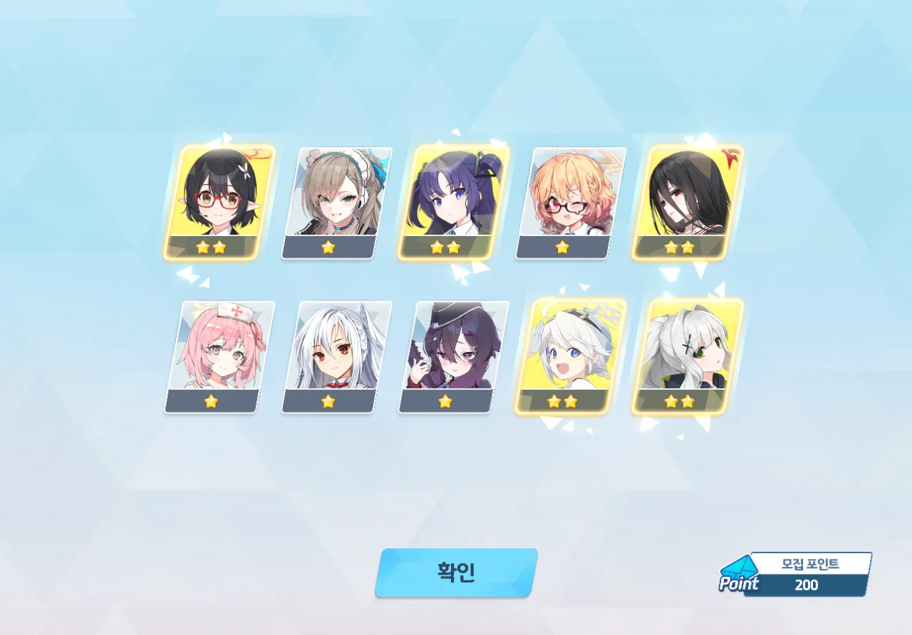
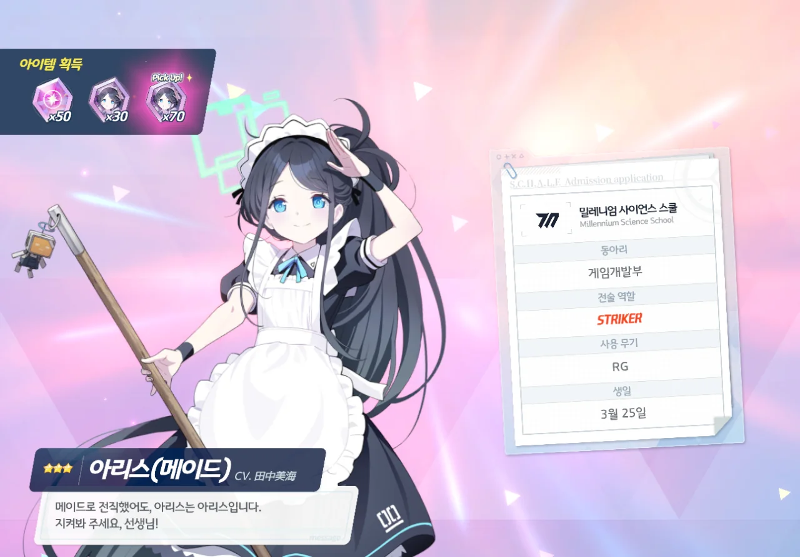
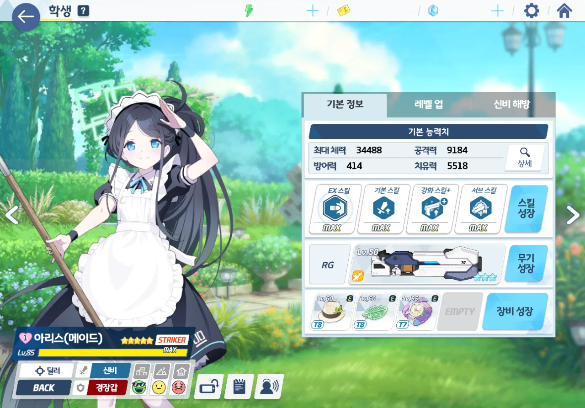

오늘 픽업은 아리스(메이드)와 토키(바니걸)이다.

일단 메리스를 먼저 뽑고, 여유가 된다면 바토키를 뽑기로 했다.

둘 다 특정 총력전 원툴이라는 말이 있지만, 이번 픽업엔 아리스가 나온다. 아리스를 거른다고? 그런 건 내게 있을 수 없어.



첫 10 연차. 뉴요코가 나왔다.

시작부터 3성이 나오다니, 오늘은 운이 좋은 게 틀림없다.



20 연차째에는 바카네가 나왔다. 진짜 뭐지?

&nbsp;

그 후, 내 행운은 거기까지라는 듯이, 줄곧 1성 혹은 2성만 나왔다.



70 연차. 아루와 이즈나가 나왔다. 3성이 둘이나 나온 건 좋지만, 코코나는 과연 언제쯤 얻을 수 있을까?

&nbsp;

그리고 조금 전의 건 약과였다는 듯이, 100 연차를 돌릴 동안 3성이 전혀 나오지 않았다.

아리스 등장! 뽜밤뽜밤!

그런데 왜 170 연차에 나오니...?

마지막 희망을 담아 200 연차까지 달려보았지만, 메리스 이후 3성은 단 하나도 나오지 않았다.

그래서 그냥 천장으로 메리스를 한 번 더 뽑았다. 어차피 메리스를 쓰려면 전무 3성까지는 만들어 줘야 하거든...

그래서 만들어 줬다. 이게 내가 할 수 있는 최대다.
