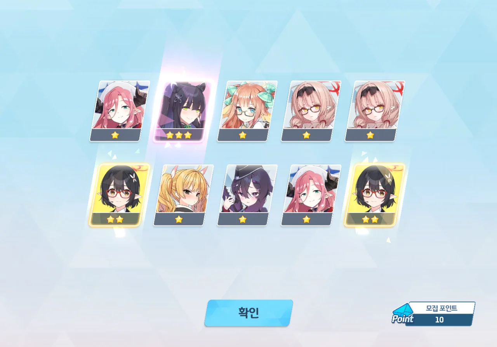
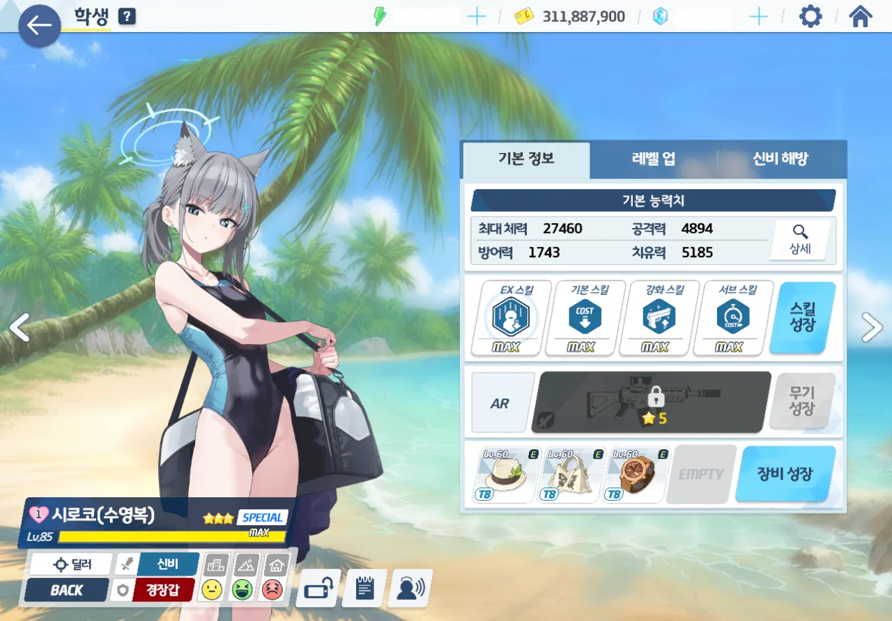

오늘은 수영복 시로코 픽업이 열리는 날이다.

&nbsp;

이다음 있을 가챠 일정이 상당히 빡빡하기 때문에, 코코나가 바로 직전 픽업이었음에도 불구하고 통언뜬을 염불처럼 외우며 코코나 픽업을 떠나보내야 했다.

다음 주에는 수영복 우이, 수영복 히나타 픽업이다.
미래시에서 두 캐릭터의 평가가 조금 미묘했던지라, 수영복 우이를 넘길 생각이었지만, 뽑는 게 좋을 것 같다는 주변 사람의 말에 일단 시도는 해보기로 했다. 그 사람 왈, 수영복 우이는 미카 발사대라고...

다다음주에는 수영복 하나코 가챠 페스가 시작되는데, 여기서 최소 24,000개의 청휘석이 소모될 예정이다. 무조건 천장은 쳐야 하니까.

* 수영복 하나코가 두 번 이상 뜰 경우:
  매우 이득이다. 천장으로 한 번 더 뽑을 수 있기 때문에, 전용 무기를 달아줄 수 있으리라 기대된다.
* 수영복 하나코가 단 한 번만 뜰 경우:
  조금 아쉽긴 하지만, 천장으로 한 번 더 뽑을 수 있으며, 여태 뽑지 못한 통상 3성을 얻을 확률도 이번 페스로 인해 올라갔기 때문에 이득이다.
* 수영복 하나코가 단 한 번도 뜨지 않을 경우:
  이건 조금 속이 아프긴 할 것이다. 하지만 위에서 말했듯이, 통상 3성이 뜰 확률이 페스로 인해 올라갔으므로 손해를 약간이나마 벌충할 수 있다.

만약 여기서 코코나가 나오지 않았다면, 3성 선택권으로 코코나를 뽑을 생각이다. 뼈아픈 지출이긴 하겠지만, 통언뜬을 언제고 기다릴 수는 없지 않은가.

&nbsp;

이번 3성 선택권은 10 연차 티켓을 같이 판다고 한다.

만약 해당 10 연차 티켓으로 모집 포인트를 얻을 수 있다면, 190 스택까지만 내 청휘석으로 지르고, 나머지 10 스택은 10 연차 티켓으로 올릴 생각이다.

안 되면 어쩔 수 없이 200 스택 모두 내 청휘석으로 올려야지.

***

첫 10 연차에는 슌이 나왔다. 슌? 나쁘지 않아... 좋은 시작이다.



그리고 거짓말처럼 40 연차에 수영복 시로코가 나왔다.

기존에 갖고 있던 10 연차 티켓 3장을 썼으니, 실질적으로는 10 연차만에 나왔다고 해도 좋은 것이다.

끼요오오오오!

곧바로 모든 스킬과 장비를 최대치까지 올려주었다.

성급을 올리는 건 조금 보류하기로 했다. 당장은 3성으로도 충분하다고 하니까.

이제 다음 주 수영복 우이에서도 이런 식으로 운이 좋으면 금상첨화일 텐데...
