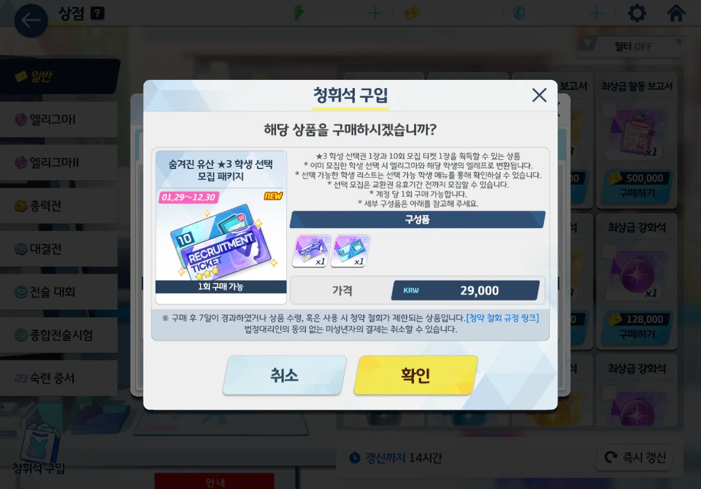
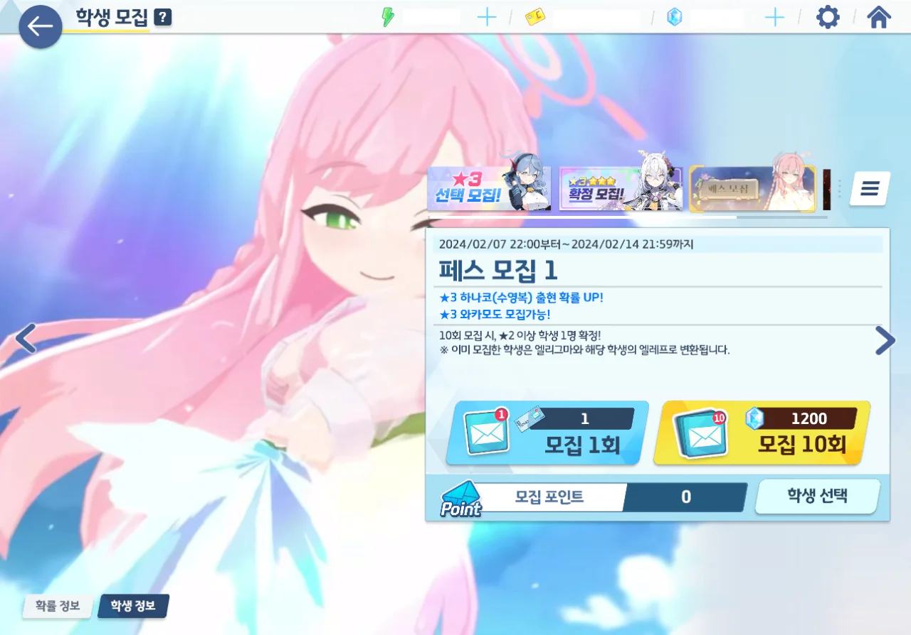
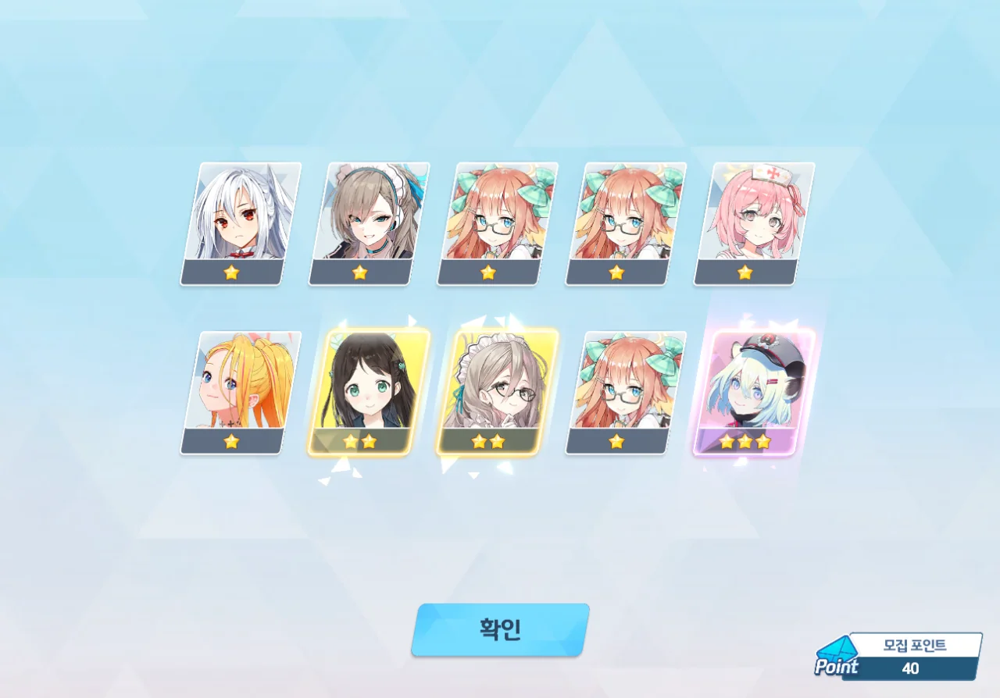
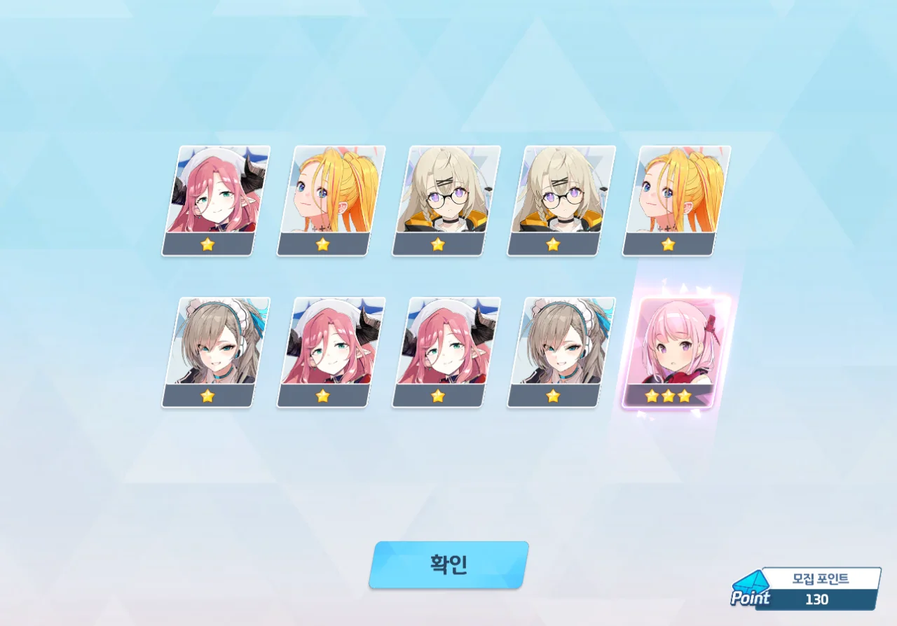
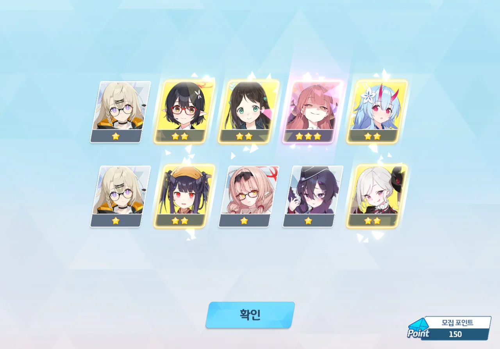
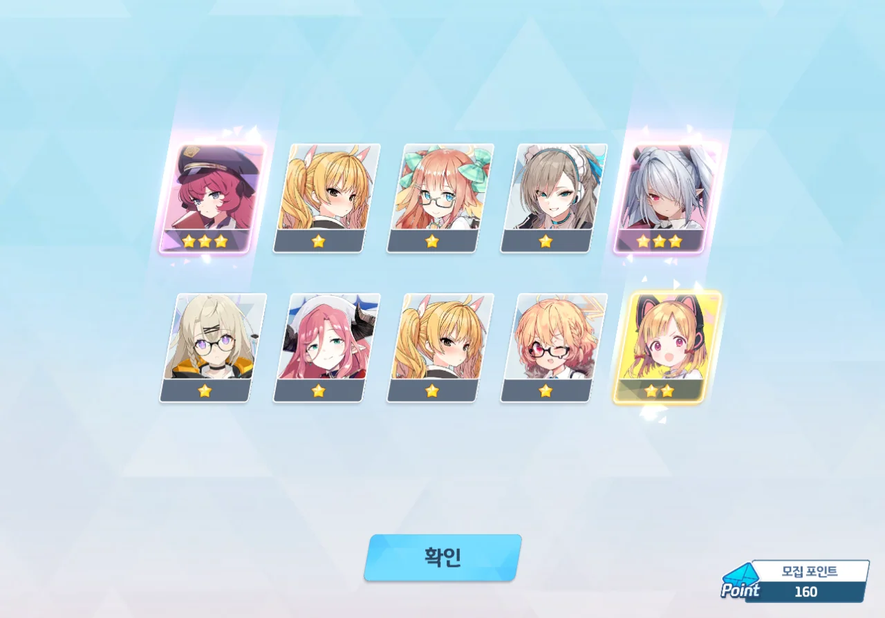
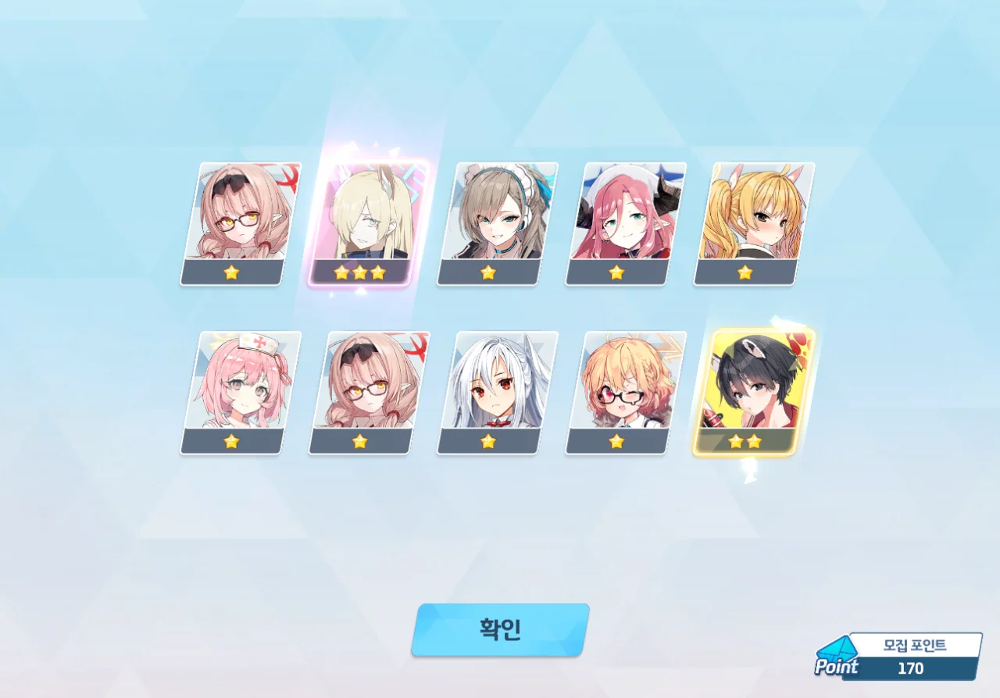
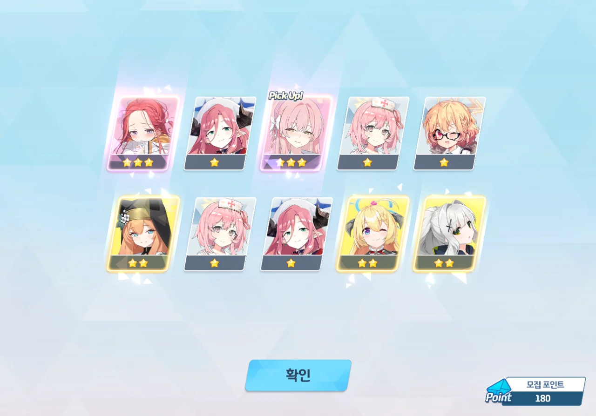
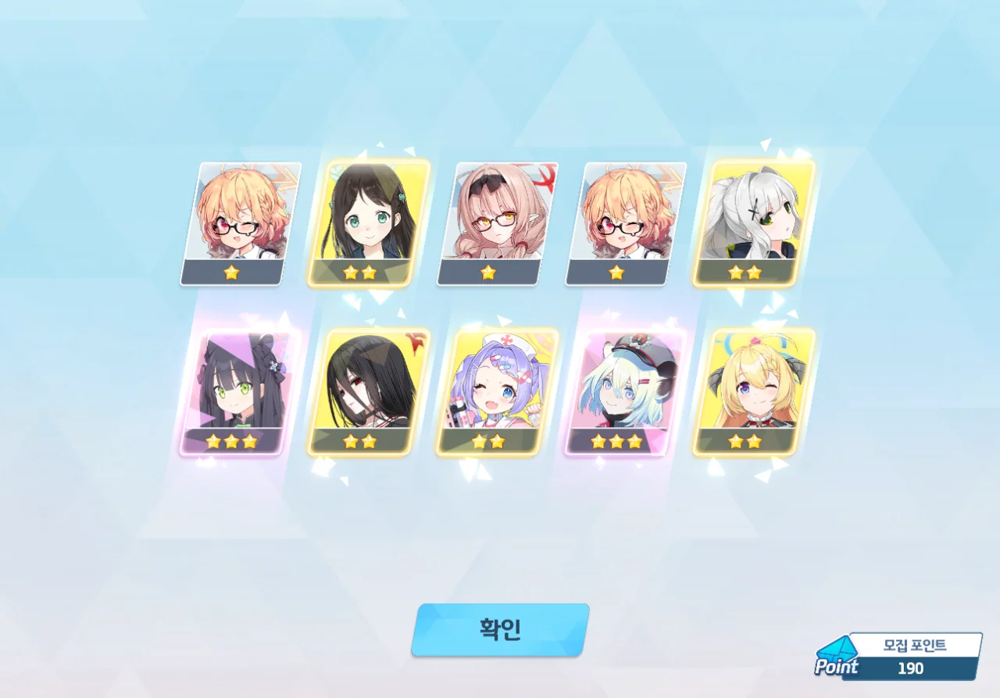
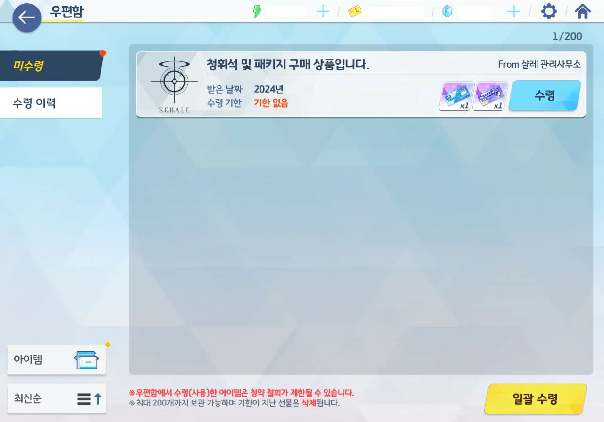

드디어 수영복 하나코 페스가 시작되었다.

이번에 눈여겨봐야 할 건 바로 이 3성 선택권 패키지의 내용이다. 1,200개의 청휘석을 같이 주던 저번과 달리, 이번엔 유효 기간이 있는 10 연차 티켓을 같이 준다.

따라서 만약 코코나가 190 연차 내에 나오지 않는다면, 190 연차까지만 청휘석을 쓰고, 나머지 10 연차는 이 티켓을 통해 돌릴 생각이다.

내가 이걸 살 날이 오지 않기를.

하... 진짜 이번만큼 가슴이 떨리는 페스도 없을 거야, 정말...

그럼 가볼까.

서른 번이나 뽑기를 했는데도 3성은커녕 2성조차 잘 나오지 않는 모습을 보며 '이상하다, 내가 지금 수영복 하나코 페스를 돌리고 있는 게 맞긴 한가?'라고 생각했다.

그리고 40 연차에 시구레가 나왔다.

앞으로 계속 3성이 이런 빈도로 나온다면 이번 페스는 페스가 아니라 일반 가챠에 불과하게 될 거다. 3성이 너무 안 나오잖아!



여전히 나오지 않는 3성을 보며 초조함이 더해질 즈음, 70 연차에서 미모리가 나왔다.

미모리... 참 애매한 녀석이지.



그리고 바로 그다음에 나온 건 히나타.

끼얏호우! 바로 이런 걸 원했어! 내가 여태 히나타가 없어서 얼마나 꼬웠는데! 야외 신비 총력전은 앞으로 히나타가 맡는다!

잘만 키우면 지금 진행 중인 야외 고즈 총력전도 잘할 수 있겠는데?



그리고 한동안 3성이 코빼기도 보이지 않더니, 110 연차에서 수영복 하나코가 나왔다.

수영복 하나코를 보고 순간 뇌가 멈출 뻔했다니까? 페스임에도 잘 나오지 않는 3성을 보며 '아, 이번 페스는 천장을 칠 운명인가'라고 생각하고 있었는데, 보란 듯이 수영복 하나코가 나왔으니 말이다.

130 연차에는 에이미가 나왔다.

&nbsp;

이거 봐라, 이건 좀 너무한 거 아니냐? 어떻게 에이미를 제외하면 죄다 1성이야?

🟦 🟦 🟦 🟦 🟦  
🟦 🟦 🟦 🟦 🟪

에이미도 그리 잘 쓰이는 캐릭터가 아니라, 조금 짜증이 났다.



이어진 140 연차에는 또 수영복 하나코가 나왔다. 그것도 첫 3성으로.

150 연차. 아루가 나왔다.

이제 뭔가 3성이 잘 나오기 시작하니, 내가 페스 가챠를 돌리고 있음이 실감이 된다.

솔직히 110 연차까지 3성이 잘 안 나온 건 너무 심했어...

160 연차. 이로하와 이오리가 나왔다.

내 이오리가 지금 전무 몇 성이었지?

170 연차. 칸나가 나왔다.

180 연차. 첫 3성에 유즈가 나오길래 '이번에도 중복 3성인가' 하고 실망했는데, 다시 보니 수영복 하나코도 슬그머니 끼여 있었다.

190 연차. 유녀 슌과 시구레가 나왔다. 시구레가 유달리 잘 나오는 느낌인데, 이거.

아무튼, 190 연차까지 뽑기를 돌렸음에도 코코나가 나오지 않았기에, 피눈물을 흘리며 3성 선택권 패키지를 살 수밖에 없었다.

그래, 이렇게 나오겠단 거지?



그래도 마지막 200 연차에 코코나가 나온다면 희망은 있다.

하지만 그 희망은 노아에 의해 산산조각 났다.

&nbsp;

🟦 🟦 🟦 🟦 🟦  
🟦 🟦 🟦 🟦 🟪

그리고 이번에도 3성을 제외한 나머지가 전부 1성이다.



노아도 뽑고 싶었던 녀석이니, 나쁘진 않다. 코코나가 나오지 않은 게 화날 뿐이지.



200 모집 포인트는 당연히 수영복 하나코에 투자했다.

와카모? 내 와카모는 이미 전무 2성이라고. 아니, 3성이던가? 잘 모르겠다.



저는 모에도 없고 바니걸 아스나도 없고 수영복 와카모도 없고 코코나도 없습니다.

이거, 맞아? 맞냐고! 전부 통상 아니었어?





... 히히, 넌 못 벗어나!

매화원에서 결코 나오지 않겠다는 코코나의 멱살을 붙잡고 끌고 나왔다.



수영복 하나코, 코코나, 히나타에 최대한 투자했다.

호감도는 어쩔 수 없고, 히나타의 애장품 또한 어쩔 수 없다. 오늘 카페 초대는 이미 다른 캐릭터로 해버렸거든.

그리고 저 막대한 양의 투자의 결과, 내 크레딧이 전멸했다. 이제 크레딧을 어디서 모으지?

***

이번 수영복 하나코 페스 결산:
* 노아 [NEW]: 1회
* 미모리 [NEW]: 1회
* 슌(유녀): 1회
* 시구레: 2회
* 아루: 1회
* 에이미: 1회
* 유즈: 1회
* 이로하: 1회
* 이오리: 1회
* 칸나: 1회
* 하나코(수영복) [NEW]: 3회
* 히나타 [NEW]: 1회

시구레가 자주 보인다 했는데, 이번 페스 캐릭터인 수영복 하나코 바로 다음으로 자주 나온 게 시구레였다.

200 연차에서 3성이 총 15번 나왔으니, 7.5%의 확률로 3성을 얻었다 할 수 있다. 이번 페스의 3성 등장 확률이 6%이므로, 나는 운이 좋았다고 할 수 있겠네.

코코나? 코코나는 29,000원짜리 3성 선택권으로 뽑은 거니까 당연히 제외다!

수영복 하나코 외에도, 평소 뽑고 싶었으나 뽑지 못했던 캐릭터 여럿을 얻었으니, 이번 페스의 만족도는 상당히 높다.
