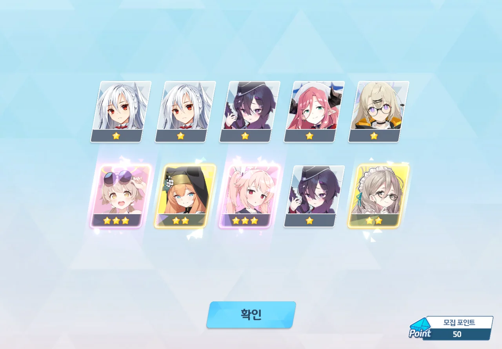
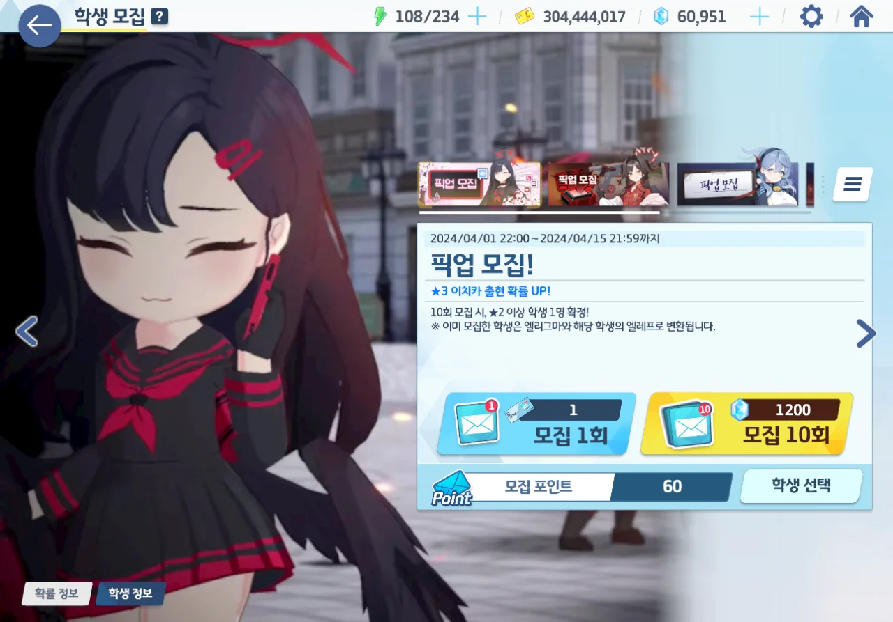
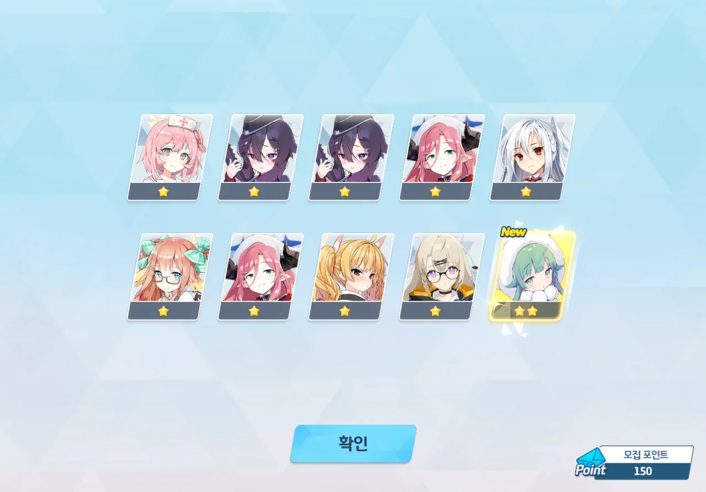
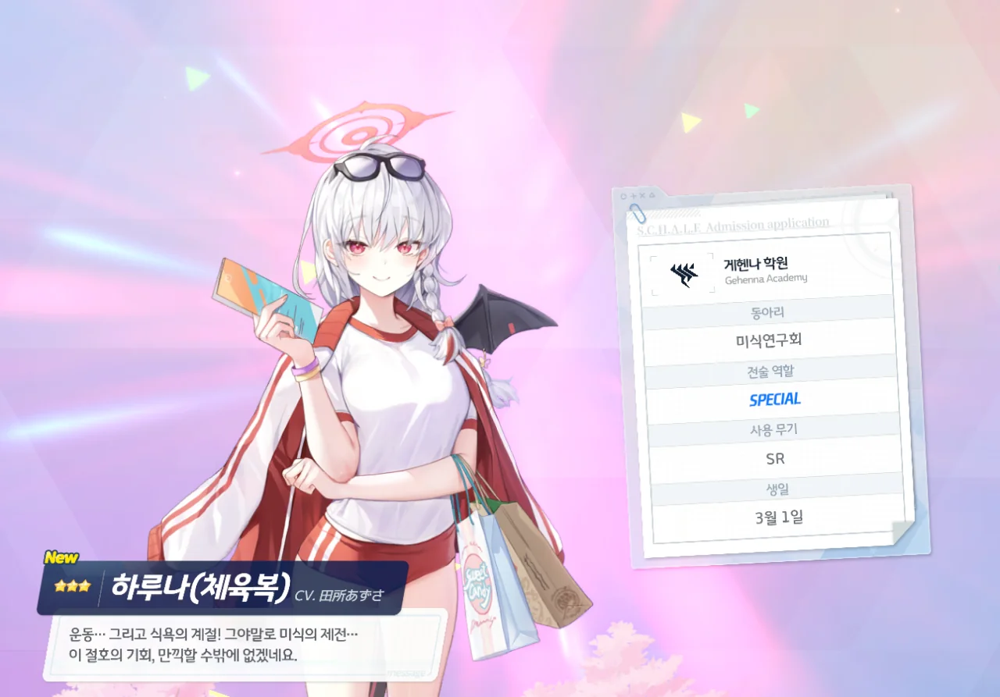
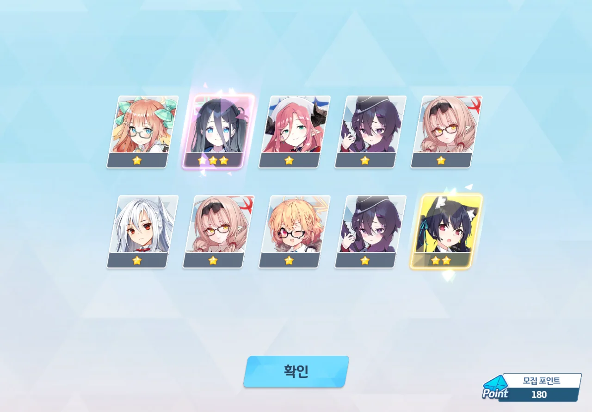
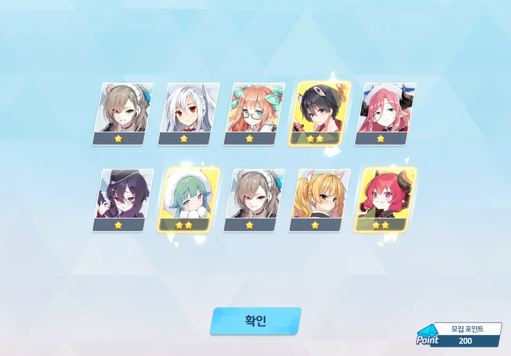
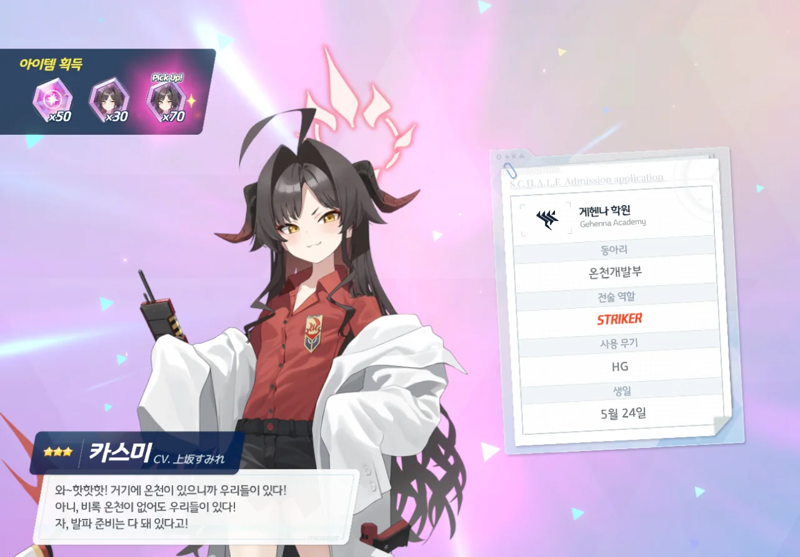



이번 픽업은 이치카와 카스미이다.

둘 다 뽑을 가치가 높은 캐릭터들은 아니지만, 카스미 쪽이 좀 더 가치가 높다고 평가되고 있다. 카스미는 방깎 요원으로도 쓸 수 있거든.

그래서 카스미를 우선해서 뽑되, 이치카가 중간에 나오면 땡큐인 걸로 하기로 했다.

청휘석이 64,000개나 있는 데다가, 10 연차 티켓도 3장이 있다. 이 정도면 크게 무리는 아닐 것이다.

50 연차. 수영복 히후미와 나츠가 나왔다.



60 연차만에 카스미가 나왔다.

하... 여기서 멈췄어야 했는데...

뭔가 느낌이 좋아서, 이치카에 도전해 보기로 했다. 이 운이라면 분명 천장 전에 이치카가 나올 거야!





80 연차에서 수영복 와카모가 튀어나왔다.

예전 수영복 와카모와 수영복 노노미 픽업 때, 둘 다 뽑고 싶었음에도 못 뽑아서 많이 아쉬워했던지라, 기분이 나쁘지만은 않다.

하지만... 이게 이치카였으면 더 좋았을 것 같다는 생각이 도저히 머릿속에서 떠나질 않더라...

150 연차에서 모미지가 나왔다. 2성이지만, 아무튼 새로 얻은 캐릭터이니까.

그리고 갑자기 튀어나온 체육복 하루나.

요 녀석, 통상이었구나... 너무 놀란 나머지, 몇 연차만에 나온 것인지 찍는 걸 깜빡했다. 뭐, 대충 160이나 170 때였겠지.

180 연차. 아리스가 나왔다.

내 머릿속은 이미 하얘진 지 오래이다. 적당히 먹고 빠졌어야 할 통상 픽업에서 120 연차 이상을 쓴 이상, 가챠를 진행할수록 청휘석을 손해 본다는 사실을 이제야 깨달았기 때문이다.

하지만 여기서 가챠를 멈추는 것 또한 청휘석을 손해 보는 일이다. 천장을 치기 전, 이치카가 나오길 기도하는 수밖에...

200 연차. 이치카는 끝까지 나오지 않았다.

누군가 이치카와 카스미를 평가하면서, 이치카에 대해 이렇게 쓴 사람이 있다.

> 이치카에 천장 박느니, 차라리 카스미에 박겠다.
{.bq}

그래서 카스미에 모집 포인트를 썼다. 이치카, 안녕... 다른 픽업에서 언젠간 나올 거라고 믿을게...

&nbsp;

그런데 지금 글을 쓰며 생각해 보니, 이럴 바에는 그냥 모집 포인트로 이치카를 뽑는 게 더 낫지 않았을까 싶다. 어차피 둘 다 통상이라서 나중에라도 나올 수 있잖아.
