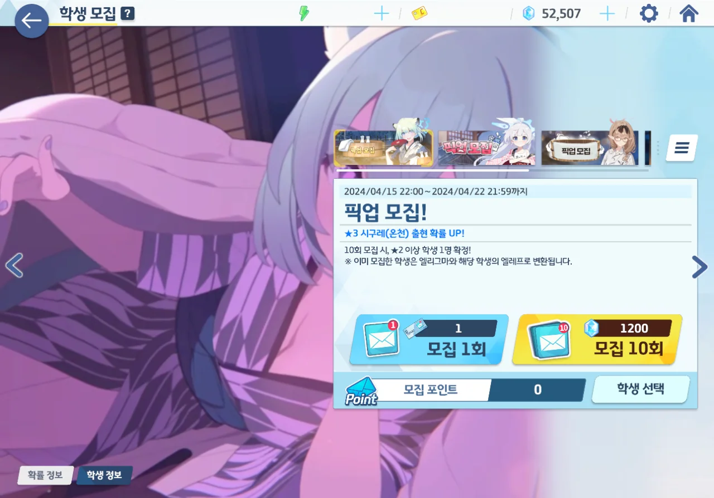

저번 픽업에서 쓴 맛을 본 후, 약간 마음이 조급해졌다. 앞으로 뽑아야 할 캐릭터는 넘쳐나는데, 상시인 캐릭터를 뽑겠다고 청휘석을 너무 많이 써버렸으니 말이다.

그래도 시구레(온천)은 뽑고 싶었다. 온구레가 없으면 하나코를 쓰면 된다고는 하지만, 시구레는 귀엽잖아.

그래서 돌렸다. 120 연차 안에 온구레가 나오길 빌면서 말이다. 120 연차가 넘으면 진짜 위험해 진다고...



20 연차에서 하나에(크리스마스)가 찾아왔다. 으... 으음?

수카모는 저번에 나온 이후, 자주 나오는 것 같다.



40 연차만에 온구레를 얻을 수 있었다.

여기서 천장을 보거나 청휘석을 더 쓰는 건 위험하니, 곧바로 여기서 끊었다.
