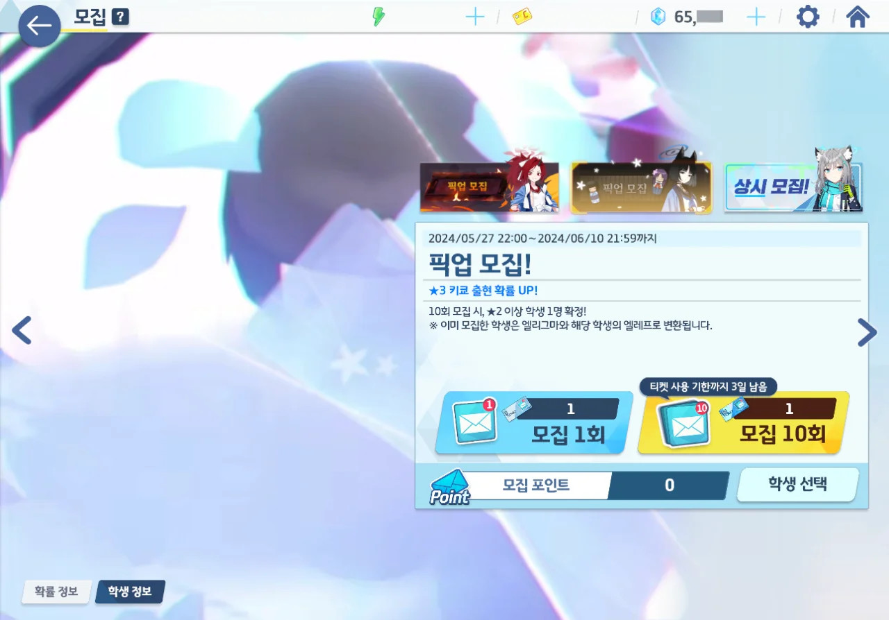

10 연차권의 사용기한이 3일 남았다는 말에 가챠 화면에 들어가 보았다.

아, 이번 픽업은 키쿄였구나. 키쿄, 뽑으려고 했었는데.

워낙 할 일이 많아, 픽업이 바뀌었단 것조차 까맣게 잊고 있었다.



80 연차까지 3성이 단 하나도 나오지 않다, 카호가 나왔다.

벌써부터 느낌이 싸하다. 이러다가 천장을 칠지도 모르겠다.



다행스럽게도 천장은 아니었다. 140 연차에 나왔으니까.

평소라면 7,200개의 청휘석을 마저 써, 천장을 쳤겠지만, 지금은 아니다.

* 6월 25일 - 하레(캠핑), 코타마(캠핑)
* 7월 23일 - 아코(드레스), 마코토
  이때에는 무료 100 연차를 준다
* 7월 30일 - 히나(드레스)
  페스이므로, 24,000개의 청휘석은 무조건 확보하고 있어야 한다
* 8월 13일 - 미네
  이건 2.5주년 선택권으로 뽑을 수도 있긴 하다
* 8월 20일 - 아루(드레스)
* 9월 3일 - 아카리(새해)

지금 남은 청휘석이 약 54,000개 정도 되는데, 이러면 앞으로의 일정이 조금 위태로워진다.

어쩔 수 없지. 여기서 컷.

오늘 3성 실적은 정말 최악에 가까운데, 명조에서 운을 다 써서 그런가 보다.
