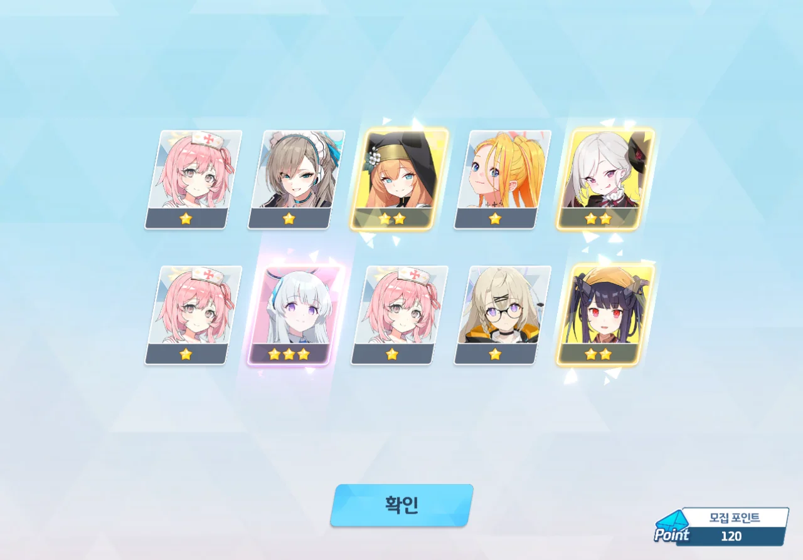
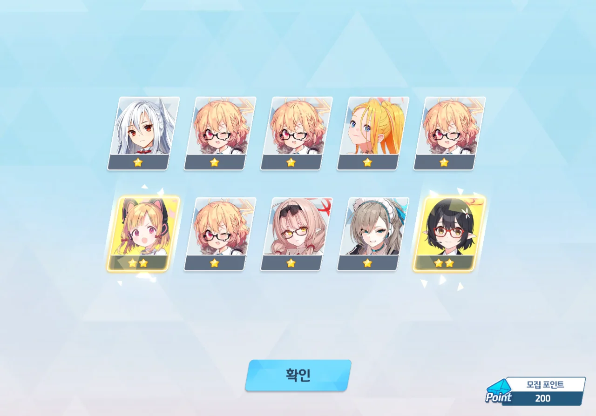

새 픽업이 열렸다. 이번 픽업은 하레(캠핑)와 코타마(캠핑)이다.

둘 다 있으면 좋지만, 최우선 순위는 캠하레라는 말에 캠하레에 먼저 도전했다.



뭣?

10 연차 티켓에서 곧바로 캠하레가 나왔다. 이건 정말 역대급 비틱인데?



일단 레벨, 장비, 스킬, 인연 랭크를 올릴 수 있는 데까지 올렸다.

그렇다면 캠타마 역시 도전해 보는 게 좋지 않을까? 마침 대결전 보상으로 10 연차 티켓이 하나 더 들어왔는데 말이다.

20 연차. 아즈사가 나왔다.

120 연차. 한동안 3성이 코빼기도 안 보이다가, 노아가 나왔다.

Noa, Nooooooooo!

그리고 200 연차. 캠타마는 끝까지 나오지 않았다. 폭사!



ㅋㅋㅋㅋㅋㅋㅋㅋㅋㅋㅋㅋ

그리고 내 미래 가챠 계획 역시 폭사했다.

앞으로 남은 픽업은 다음과 같다.

* 7월 23일 - 아코(드레스), 마코토
* 7월 30일 - 히나(드레스)

드아코 때 무료 100 연차를 주니, 모든 픽업에서 천장을 친다 가정하면 청휘석을 60,000개 확보하고 있어야 한다. 드히나 때에는 페스라서 무조건 천장을 쳐야 하고.

그런데 지금 내 청휘석은 고작 42,000개밖에 되지 않는다. 오차가 18,000개나 되는데, 이걸 고작 한 달 만에 채울 수 있을 것 같지 않다.

... 이러면 드아코를 포기해야 하나...?
