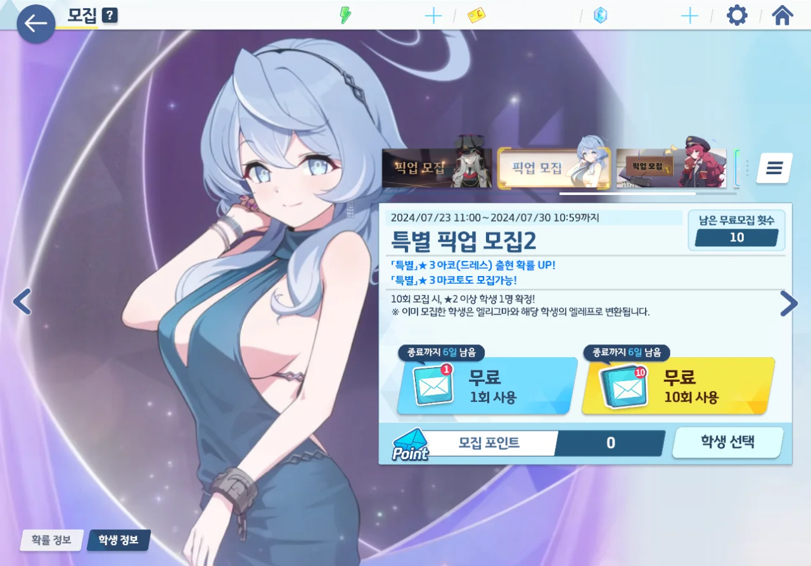
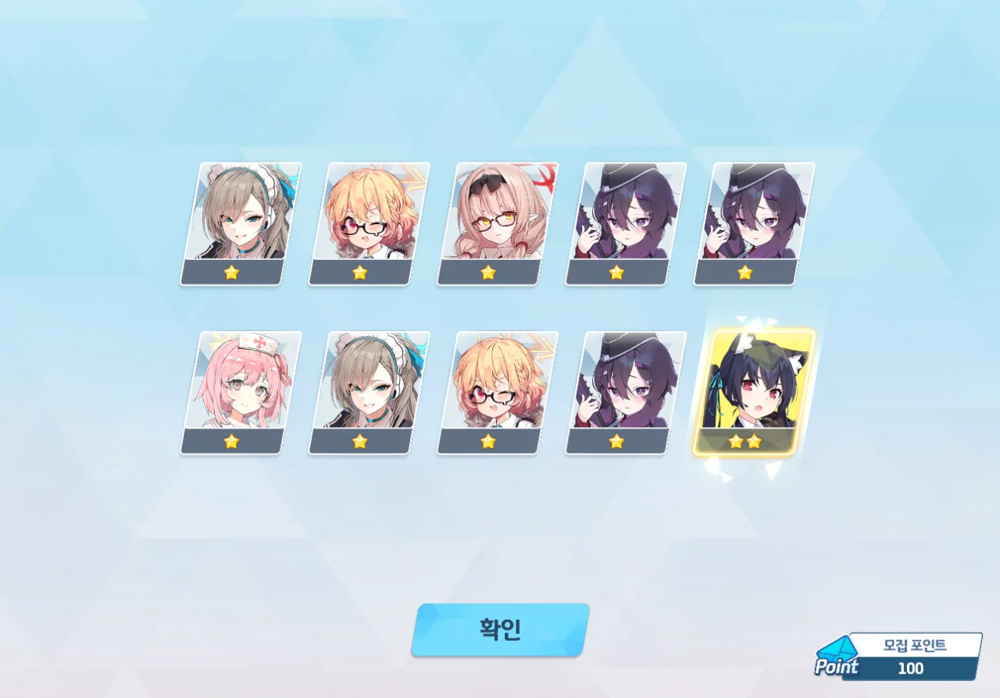
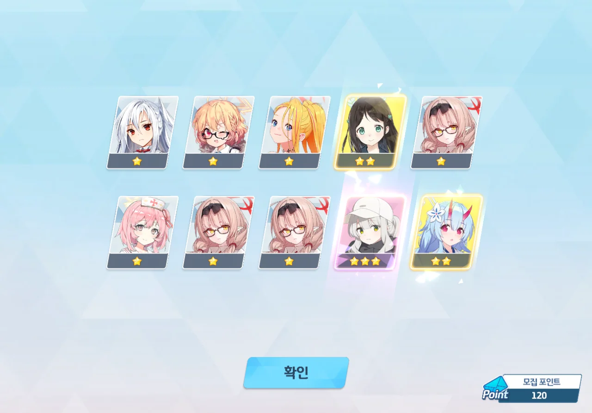
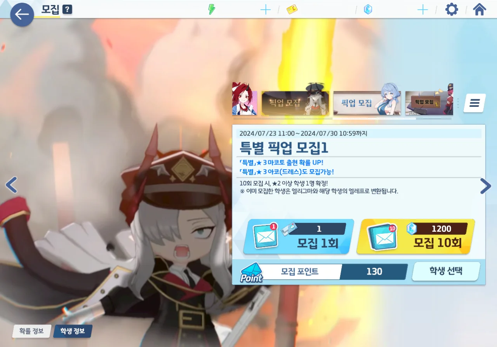
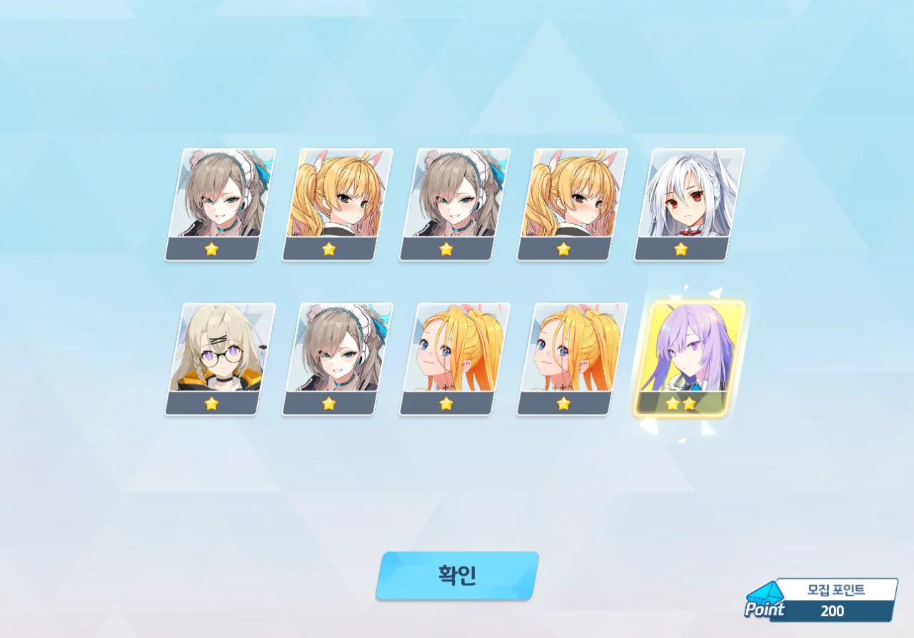

블루아카는 페스 직전 픽업에서 무료 100 연차를 뿌린다. 이는 고사기에 쓰여있다. 하지만 이것은 함정이니, 여기에 혹해 청휘석을 탕진했다간 곧바로 닥쳐올 확률 2배 페스에 쓸 청휘석이 없어 피눈물을 흘리며 페스 캐릭터 픽업을 지나쳐야만 한다.

저번 픽업인 캠하레 캠타마 픽업에서 청휘석을 지나치게 많이 쓴 터라, 이번 무료 100 연차에서 드아코나 마코토를 뽑을 수 있기를 간절히 기도했다.



일단 귀여운 이부키 먼저.

비록 이부키가 이로하 부품 취급을 당할 예정이라지만, 이부키는 귀엽잖아? 키우지 않을 수 없잖아? 이벤트에서 열심히 이부키 엘레프를 모아 3성을 만들었다. 5성을 넘어 전무까지 달아주면 참 좋겠지만, 일단 이벤트에서 엘레프를 최대한 모아본 후, 엘리그마를 추가로 소모해 성급을 올릴지 말지 결정할 생각이다.

이부키 귀여워!

미래시에서도 헤세드에 쓰이는 게 고작인 마코토에 비해, 드아코는 여러 곳에서 쓸 수 있기 때문에 이번 픽업은 드아코에 먼저 투자해야 한다.

그런데 무료 100 연차를 다 쓸 동안, 3성이 단 한 개도 안 나오더라. 이게 게임이냐?

드아코는 반드시 확보해야 하기 때문에, 미래를 위해 아껴둔 무료 10 연차 티켓을 여기에 전부 꼬라박았다.

120 연차. 캠하레 등장. 네가 드아코였으면 참 좋았을 것 같은데...



마지막 10 연차 티켓에서 드디어 드아코가 나왔다. 130 연차...

드히나 페스에 필요한 청휘석은 24,000개. 현재 보유 중인 청휘석은 그보다 훨씬 더 많으니, 70 연차 정도는 더 부어도 아마 괜찮을 것이다.

게다가 내게는 무료 1 연차 티켓이 8개나 있다고? 그러니 실질적으로 소모되는 청휘석은 7,440개밖에 안된다.



먼저 무료 1 연차 티켓을 썼는데, 마지막인 138 연차에서야 카에데가 나왔다.

음... 이러면 무조건 청휘석을 써야 한다는 거잖아.

그리고 거짓말처럼 200 연차가 될 때까지 마코토는커녕 3성이 단 하나도 나오지 않았다. 이거 진짜 게임 아니라니까?



결국 청휘석을 끝까지 써서 마코토를 데려올 수밖에 없었다.

***

이부키는 귀여우니까 이부키 사진을 찍었다.





헤헤... 이부키 귀엽다... 헤헤...



이번 이벤트에서 히나 역시 귀여웠다. 고양이를 쓰다듬는 히나 사진 세 장.



그리고 책장에 있는 책을 꺼내려 날개를 파닥이며 까치발을 드는 히나 사진 한 장.
