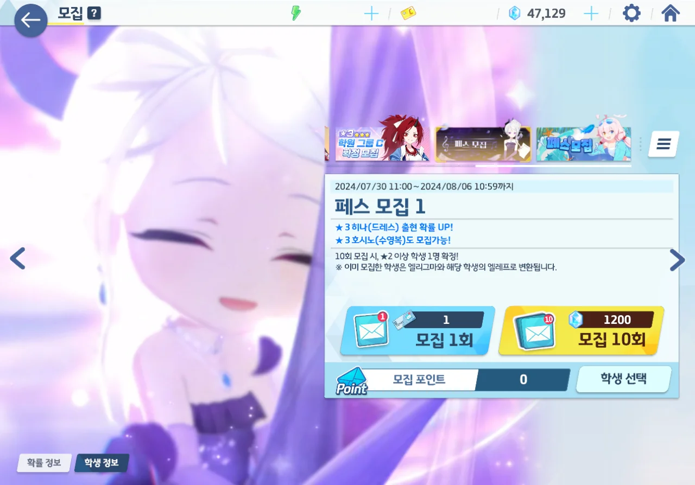
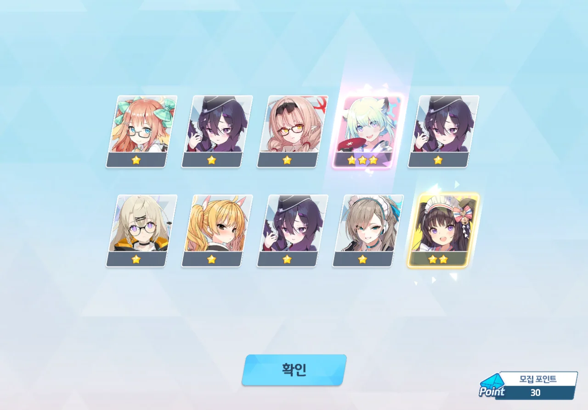
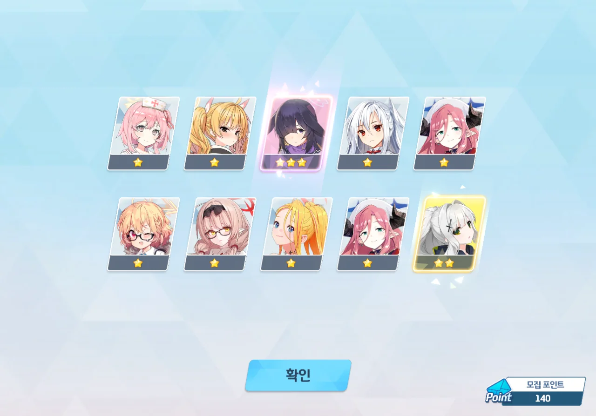
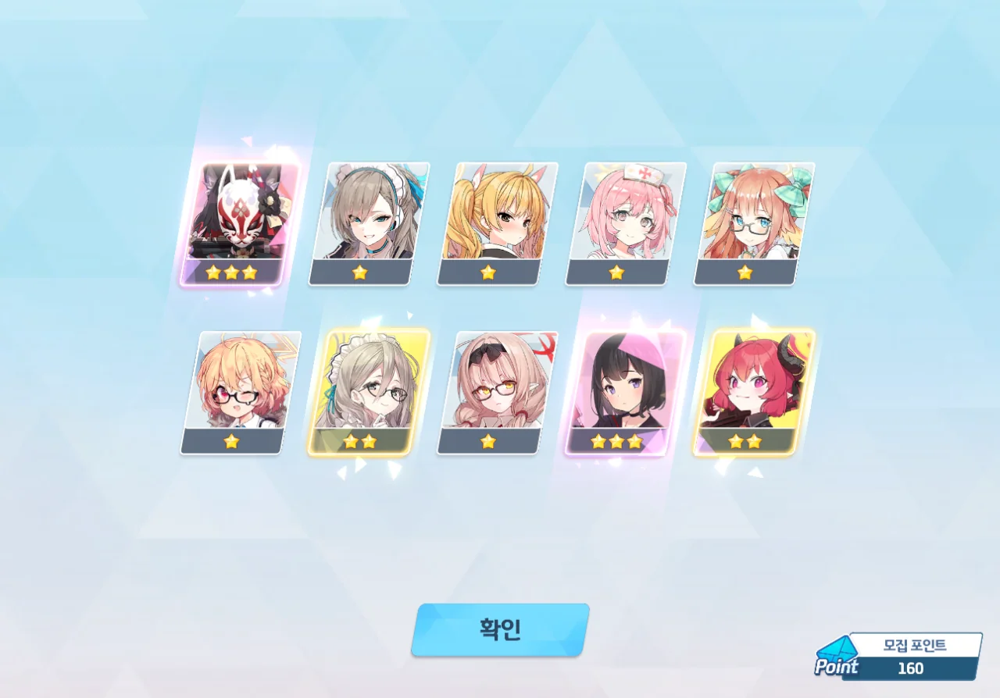
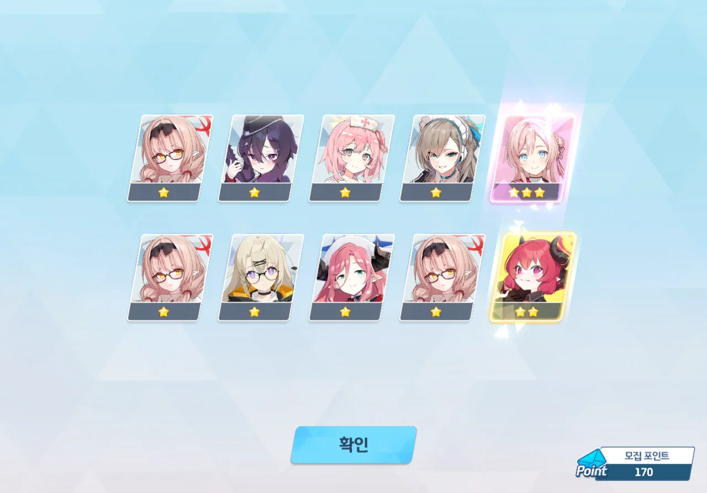
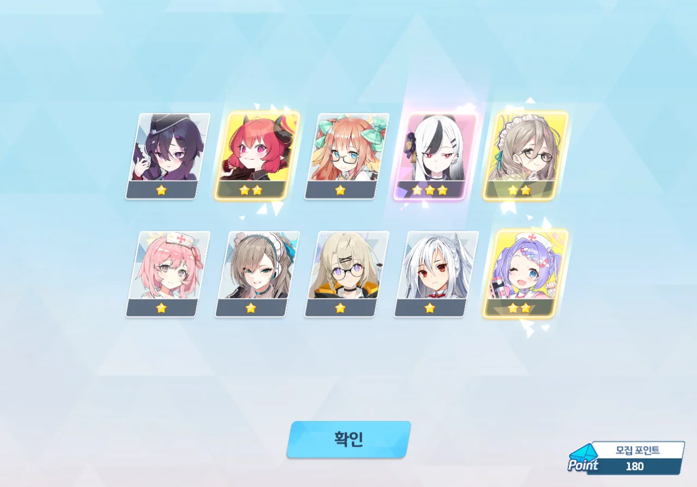
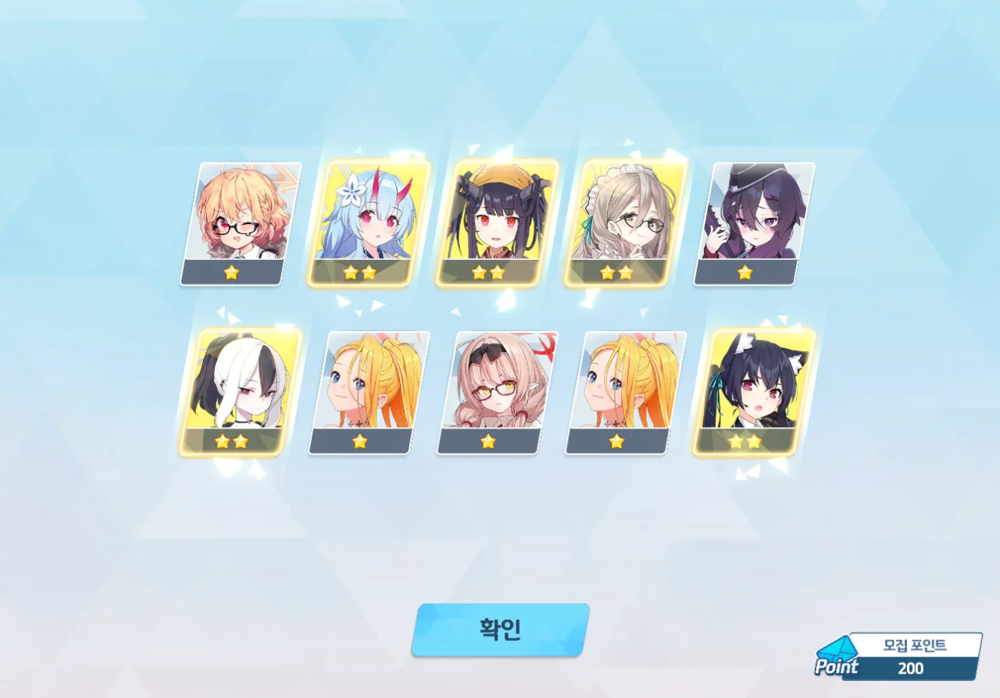

이 날이 오기만을 기다렸다. 일본 서버에서 '폭발 총력전을 파괴했다'라고 평가받는 드히나 페스다.

지금 보유 중인 청휘석의 개수는 47,129개. 페스 천장을 치기 위해 필요한 24,000개보다 훨씬 많으니, 이번 픽업은 안전하다.

하지만 청휘석은 아무리 많아도 부족하다. 지금은 청휘석의 개수가 안전하다고 할 수 있지만, 다음 픽업에서도 그런 말을 할 수 있을까? 다음 픽업에서 천장을 치면 남은 청휘석의 개수가 0과 다름이 없을 텐데?

아무리 생각해도 한 달 전 픽업에서 천장을 쳤을 때 들어온 대미지가 크다. 이걸 만회하려면 이번에 최대한 많은 3성을 챙겨야 해...

30 연차. 온구레가 나왔다.



70 연차에서 바토키가 나왔다.

네가 왜 거기서 나오니? 얼마나 당황했는지, 사진을 너무 일찍 찍어 학원 로고만 나와버렸다.



곧바로 이어진 80 연차에서는 수이미가 나왔다.

수이미가 통상이었어? 이건 정말 예상하지 못한 상황이다.

140 연차. 츠쿠요가 나왔다. 이 녀석, 은근히 자주 보이는 것 같은데...

160 연차. 와카모와 마시로가 나왔다.

이상하다... 슬슬 이쯤 되면 드히나가 나와야 하는데...?

170 연차. 나오라는 드히나는 안 나오고 미모리가 나왔다.

180 연차. 정요코가 나왔다.

200 연차. 드히나는 끝까지 나오지 않았다.



... X발.

원래 페스에서는 천장을 쳐야 하니, 천장을 치는 건 당연하다. 하지만 천장으로 드히나를 처음 데려오는 건 진짜 아니지 않아?



'이 만화처럼 했어야 하나?'라는 생각조차 들 정도이다. 아니, 이건 진짜 너무하다고.



심지어 스킬작도 끝까지 해주지 못했다. 파에스토스 원반이 부족했기 때문이다.

***

늘 하던 대로, 이번 페스의 성적을 따져보았다. 페스 기간에는 3성 등장 확률이 6%이므로, 이번 페스에서 3성을 최소 12번 이상 얻었어야 한다.

* 마시로: 1회
* 미모리: 1회
* 시구레(온천): 1회
* 에이미(수영복): 1회
* 와카모: 1회
* 츠쿠요: 1회
* 카요코(새해): 1회
* 토키(바니걸): 1회

장난해? 고작 8번? 4%라고? 이거 페스 맞아? 이 정도면 통상 픽업보다 아주 조금 더 잘 나온 정도에 불과하잖아!

...

아무리 생각해도 이건 게임이 아니다. 이번 페스에서 입은 손해를 만회하려면 앞으로 있을 픽업에서 픽업 캐릭터를 50 연차 이내에 데려오는 비틱을 서너 번은 해야 겨우 수지가 맞을까 말까 할 거라고.
