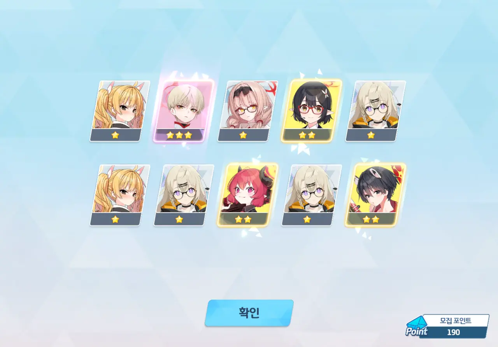
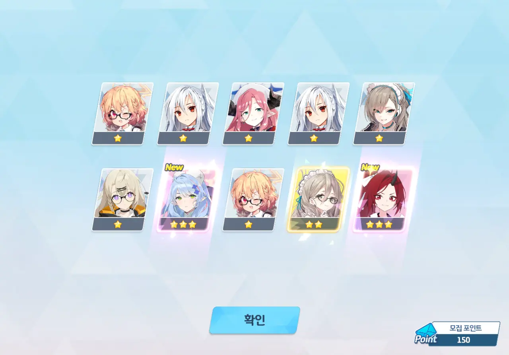
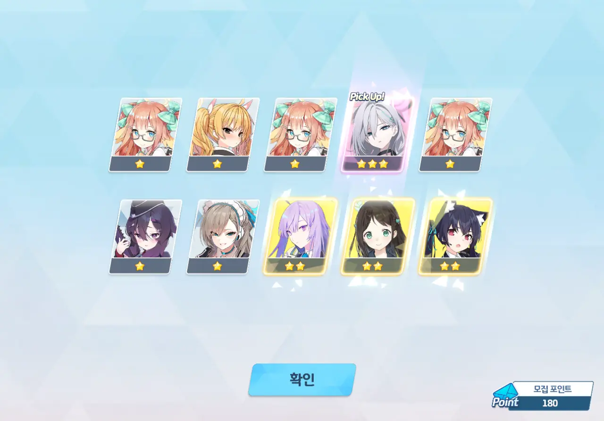
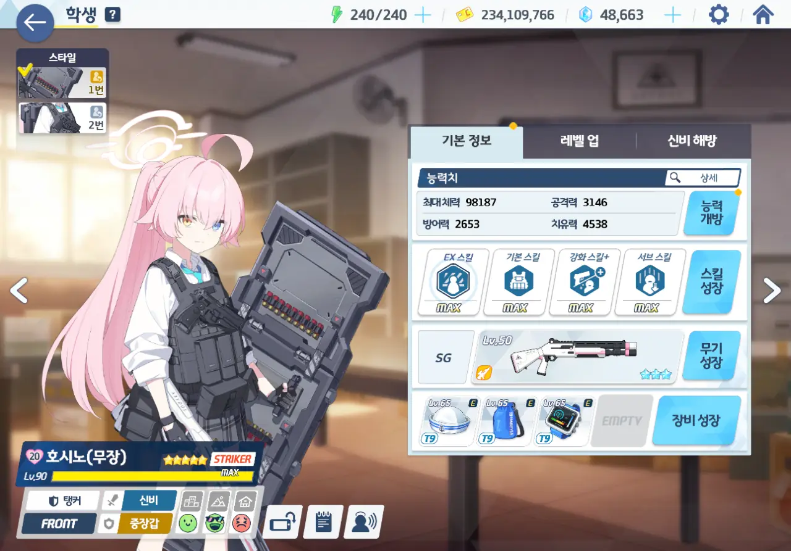

드디어 오늘이 왔다. 사상 최초로 두 명의 캐릭터가 페스로 나오는 더블 페스가...

이번 페스에는 무장 호시노(혹은 임전 호시노)와 시로코 테러(일명 쿠로코)가 나온다. 무장 호시노는 '제7대 총력전을 망친 추녀'라고 불릴 정도로 성능픽이라 알려져 있고, 시로코 테러는 '독보적인 신비 단일 딜러 원탑'이라는 평가를 받고 있다.

당연히 둘 다 뽑아야겠지?

&nbsp;

아, 찾아보니, 역대 총망추는 아래와 같더라.

1. 아코
2. 수영복 호시노
3. 히마리
4. 미카
5. 수영복 하나코
6. 드레스 히나
7. 무장 호시노

보다시피, 호시노 혼자 두 자리를 차지하고 있다. 이 정도는 해야 키보토스 최강의 신비라는 말을 들을 수 있는 건가...

무장 호시노는 호시노의 두 번째 이격(異格) 캐릭터이지만, 두 번째 이격을 가진 건 호시노 혼자가 아니다.

* 시로코: 라이딩 시로코, 수영복 시로코
* 아루: 새해 아루, 드레스 아루
* 카요코: 새해 카요코, 드레스 카요코
* 하루나: 체육복 하루나, 새해 하루나
* 호시노: 수영복 호시노, 무장 호시노
* 히나: 수영복 히나, 드레스 히나

하지만 모든 이격 캐릭터가 총망추 소리를 듣는 건 호시노가 유일하다.

&nbsp;

'이격'하니 생각난 건데, 사실 블루 아카이브에서 이런 종류의 캐릭터를 부르는 공식 용어는 '시즈널'이다. 다만 '시즈널'이 널리 퍼진 용어가 아닌 데다, 개발자들마저 개발자 코멘터리 영상에서 '이격'이라는 말을 꺼내다 말고 "이격이란 표현을 써도 되나?"라고 말할 정도로 '이격'에 익숙한 탓에, 예나 지금이나 '이격'이란 표현이 널리 쓰이고 있다.

이런 부류의 캐릭터를 부르는 용어로, 다른 게임에서 온 '얼터(너티브)', '베리에이션'이나, '옷갈이'같은 중립적 용어 대신 명일방주에서 온 '이격(異格)'이란 표현이 널리 쓰이는 건 분명 그 뜻이 명확하고 단어 길이가 짧아서일 것이다.



드히나 페스를 마지막으로 모든 가챠를 멈추고 이번 더블 페스를 준비했기에, 청휘석과 10 연차 티켓이 어마어마하게 많이 모였다. 아마 이게 여태까지 내가 모은 청휘석 중 가장 많은 양의 청휘석일 것이다.

아직 점검 보상을 받지 않았음에도 청휘석이 87,000개나 있고, 10 연차 티켓은 8장이나 있다.

일단 무장 호시노부터 시작할까.

20 연차. 와카모가 제일 먼저 찾아왔다.



으엣?! 40 연차에서 이치카가 찾아왔다.

옛날 이치카/카스미 픽업 때, 카스미에 모집 포인트를 전부 털어 넣고 나중에 가서야 '그때 모집 포인트로 이치카나 뽑을걸!'이라고 후회했었는데... 이제라도 나와서 다행이네.

100 연차. 무장 호시노가 아니라 그냥 호시노가 나왔다.

그렇게 보고 싶었으면 먼저 말을 하지 그랬니.

130 연차. 메이드 아리스가 나왔다.

어라... 뭔가 3성 등장 확률이 너무 낮은 것 같은데... 왜 저번 드히나 페스 때가 생각나는 걸까?



140 연차. 미유가 찾아왔다.

미야코, 사키, 미유가 있으니, 이제 모에만 나오면 RABBIT 소대 완성이다.



160 연차. 무장 호시노와 아코가 함께 나왔다.

듣기로는 더블 픽업 때에는 다른 쪽 픽업 캐릭터가 나오지 않는 이상 픽업 배너를 바꾸지 않는 것이 더 효율적이라고 한다. 그러니 200 연차까지 계속 무장 호시노로 달린다.

180 연차에서 한 번 더 나온 무장 호시노.

좋아, 계속 이런 식으로만 나와줬으면 좋겠네.

190 연차에서는 마리나가 나왔다.

마지막으로 200 연차에서 3성이 나오길 바랐으나, 어림도 없다는 듯이 1성과 2성만이 날 반겨주었다.

어째 이번 가챠는 2성보다 1성 비율이 더 높은 것 같은데... 이러면 엘리그마를 손해 보게 된다.





모집 포인트는 시로코 테러에 썼다. 앞서 말했던 효율적인 가챠 계획에서 모집 포인트를 어디다 써야 하는지 들은 기억이 없기에, 그냥 현재 미보유 중인 시로코 테러에 쓴 것이다.

다시 10 연차. 드레스 히나와 수영복 하나코가 동시에 나왔다.

둘 다... 페스 캐릭터잖아. 이게 가능한 일이었어? 그런데 둘 다 전무 3성인데...



40 연차. 미나와 함께 시로코 테러가 나왔다.

좋다, 좋아! 이대로만 계속 가자고!



80 연차에서는 새해 아카리가 나왔다.

떡ㅋㅋㅋㅋㅋㅋ

90 연차에는 캠핑 코타마가 나왔다.

중복이긴 해도, 기분 좋은 중복이다.

100 연차에서 또 아코가 나왔다.

내 아코는 이미 전무 3성이라고!

110 연차에서는 코유키와 드레스 히나가 나왔다.

솔직히 말해, '코유키'라는 이름보다 '니하하하하'와 '애애앵(囧)'이 먼저 생각난다.





뭐... 뭣? 150 연차에서 미네와 렌게가 동시에 나왔다.

옛날 미네 픽업 때, 미네의 사용처가 별로 없을 거로 생각해 미네를 걸렀다가 반대로 온갖 곳에서 다 쓰이는 미네를 보며 피눈물을 여러 번 흘렸던 기억이 있는지라, 미네가 몹시 반가웠다.

170 연차. 이로하가 나왔다.

이로하 역시 진작에 전무 3성을 달고 있다.

180 연차. 또다시 시로코 테러가 나왔다.

어째 시로코 테러가 무장 호시노보다 자주 나오는 것 같다?

190 연차. 히요리가 나왔다.

RABBIT 소대와 마찬가지로, 아리우스 스쿼드 전원을 모으는 것 역시 내 목표 중 하나이다.

200 연차. 방금 전 RABBIT 소대 이야기를 꺼냈다고 미야코가 찾아왔다.

미야코, "당신 같은 어른이 제일 싫습니다"라고 말한 주제에, 가챠에서 제일 자주 만나는 RABBIT 소대원이란 말이지...



모집 포인트를 무장 호시노에 투자해, 둘의 엘레프 수량을 동일하게 맞추었다.



무장 호시노와 시로코 테러를 육성하기 위해 학생 창에 들어갔다가, 세나를 뽑을 수 있다는 걸 알게 되었다.
어... 내가 대체 어디서 세나 엘레프를 얻은 거지?



시로코 테러는 풀업이 가능했지만, 무장 호시노는 네브라 디스크가 부족해 풀업을 할 수 없었다.

그래서 영혼까지 끌어와 무장 호시노를 풀업 해주었다.



이치카와 미네에도 투자했다. 다만 강화석이 부족한 탓에, 미네의 장비를 충분히 육성하지 못했다.

틈만 나면 상점에서 강화석을 샀는데, 그래도 부족한 건가...



일부러 아껴둔, 카페 초대권을 이용해 시로코 테러와 무장 호시노를 카페에 초대해 선물을 잔뜩 먹였다. 인연 랭크 20이면 충분하지.

한동안 선물을 쓸 일이 없어 몰랐던 건데, 이제 카페에 있는 학생들의 인연 랭크 수치를 단번에 확인할 수 있다. 이 기능이 언제 추가된 건진 몰라도, 정말 마음에 든다.

원래는 시로코 테러를 데려온다는 명목으로 프레나파테스의 카드를 쓸 생각이었는데, 모아둔 청휘석이 워낙 많았던 관계로 프레나파테스의 카드를 쓰지 않을 수 있었다.
어차피 이거, 써도 청휘석을 고작 1,200개밖에 주지 않는단 말이지...

뭐, 프라나가 좋아하려나.

&nbsp;

갑자기 생각난 건데, 저 아이템의 플레이버 텍스트에서 프롬의 냄새가 난다.

> 프레나파테스가 가지고 있던 <어른의 카드>.
> 외형을 알아볼 수 없을 정도로 그을려 있고, 금방이라도 바스러질 것 같은 상태라서 조심해서 취급하지 않으면 안 된다.
> 이 카드를 사용하면 청휘석을 얻을 수 있지만, 카드는 파괴됩니다.
{.bq}

***

자, 그러면 늘 하던 대로, 이번 페스의 성적을 따져보자. 페스 기간에는 3성 등장 확률이 6%이므로, 이번 페스에서는 3성을 최소 24번 이상 얻었어야 성공적인 페스라고 할 수 있다.

* 렌게: 1회
* 마리나: 1회
* 미나: 1회
* 미네: 1회
* 미야코: 1회
* 미유: 1회
* 시로코(테러): 2회
* 아리스(메이드): 1회
* 아카리(새해): 1회
* 아코: 2회
* 와카모: 1회
* 이로하: 1회
* 이치카: 1회
* 코유키: 1회
* 코타마(캠핑): 1회
* 하나코(수영복): 1회
* 호시노(무장): 2회
* 호시노: 1회
* 히나(드레스): 2회
* 히요리: 1회

3성이 딱 24번 나왔다. 저번 드히나 페스처럼 6%를 빙자한 4%는 아니기에 그럭저럭 만족한다.
