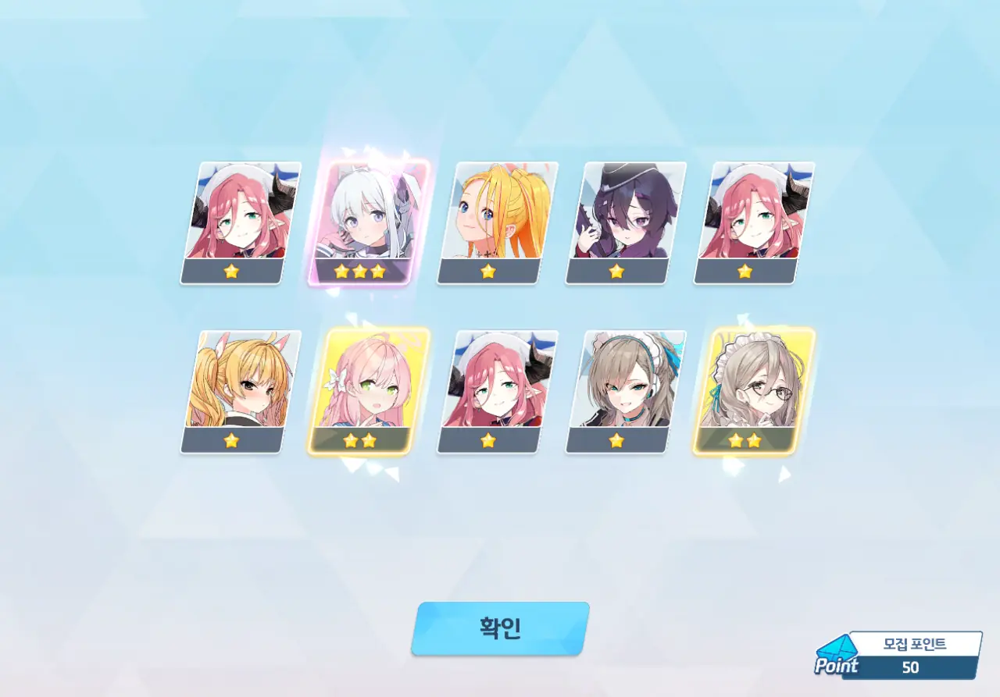

무장 호시노와 시로코 테러 더블 페스가 지나고, 키사키 픽업이 찾아왔다. 대충 여덟 번째 총망추라고 부르는 것 같던데, 이젠 총망추가 정확히 몇 명인지도 잘 기억나지 않는다. 대충 사람들이 좋다고 하니까 그런가 보다 하는 거지.

사실, 지난달에 수영복 사오리 픽업에서 무료로 얻은 100 연차 안에 수영복 사오리를 얻긴 했다. 그런데 그거 글을 쓰는 걸 깜빡해 버렸다. 사진도 이미 지워버렸고.

아무튼, 키사키는 EX 스킬 대미지를 정직하게 80% 올려주는 특성이 있다. 최종 대미지를 계산할 때 곱연산인지 합연산인지 고민할 필요가 아직 없다고 하더라.
... 당연히 뽑아야겠지?



최근 대결전이나 제약해제결전을 전혀 하지 않았기에, 10 연차 티켓이 단 하나밖에 없다.

으음... 슬슬 저 둘도 건드려봐야 하나? 머리 아픈 건 딱 질색인데.

50 연차. 미야코가 나왔다.

저번에도 말했듯이, 스토리에서 "당신 같은 어른이 제일 싫습니다"라고 말한 주제에 픽업에서 다른 RABBIT 소대원보다 더 자주 나오는 녀석이다.



80 연차에서 아즈사가 나오고, 100 연차에서 메구와 바카네가 나왔다. 140 연차에서는 우이와 히나가 나왔고.

미래 픽업 일정을 생각했을 때, 청휘석을 최대한 아껴야 한다.
그래서 100 연차 이내에 키사키가 나오길 바랐는데... 아무래도 과욕이었던 모양이다.



드디어 160 연차만에 키사키가 나왔다.
여기서 청휘석을 생각해 가챠를 멈추기에는 이미 기호지세였기에, 남은 40 연차 역시 망설임 없이 그대로 진행할 예정이다.

🟦 🟦 🟦 🟦 🟦
🟦 🟦 🟦 🟦 🟪

아니 그런데 나머지가 죄다 1성인 건 대체 무슨 생각인 거지?

200 연차. 사키가 나왔다.

아까 RABBIT 소대 이야기를 꺼냈다고 헐레벌떡 나온 건가? 그럴 거면 차라리 모에가 나왔으면 좋았을 텐데. 그러면 RABBIT 소대 전원이 모이는 거 아냐.



모집 포인트를 키사키 엘레프에 투자할지 아니면 레이죠에 투자할지 잠시 고민했다.

하지만 저번 이치카/카스미 픽업에서 카스미에 올인했다가 한동안 이치카가 나오지 않아 후회했던 일이 생각나, 레이죠에 투자했다.
내가 읽은 글에서도 '엘레프는 엘리그마로도 살 수 있지만, 픽업 캐릭터는 오직 픽업으로만 얻을 수 있다'라고 했으니, 현명한 선택일 것이다.

여태껏 키울만한 산해경 캐릭터가 나오지 않았기에, 키사키의 스킬과 장비를 최대한 키울 수 있었다.

키사키의 성급을 올리는 건 최대한 스케줄을 통해 키사키 엘레프를 확보한 후, 카이텐져 총력전 바로 직전에 올리라는 조언을 들었다. 그래야 엘리그마를 조금이나마 아낄 수 있다고 했던가.

***

이번 픽업이 페스인 건 아니지만, 느닷없이 가챠 성과를 확인하고 싶어졌다.

* 메구: 1회
* 미야코: 1회
* 사키: 1회
* 아즈사: 1회
* 아카네(바니걸): 1회
* 우이: 1회
* 키사키: 1회
* 히나: 1회

200번의 가챠에서 3성이 8번 나왔으니, 이번 픽업에서의 3성 등장 빈도는 4%라고 볼 수 있다. 명시된 확률인 3%보다는 높네.

***

PS.



🟦 🟦 🟦 🟦 🟦
🟦 🟦 🟦 🟦 🟨

한 번도 아니고 세 번이나 이러는 건 좀 심한 것 아닐까? 이 똥아로나가!
