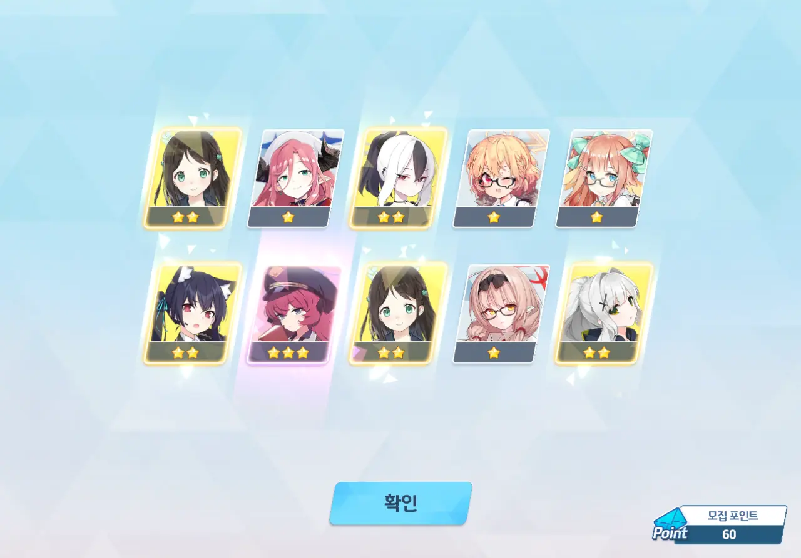
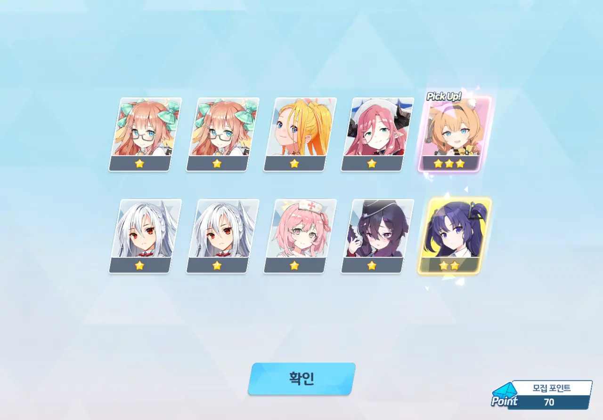
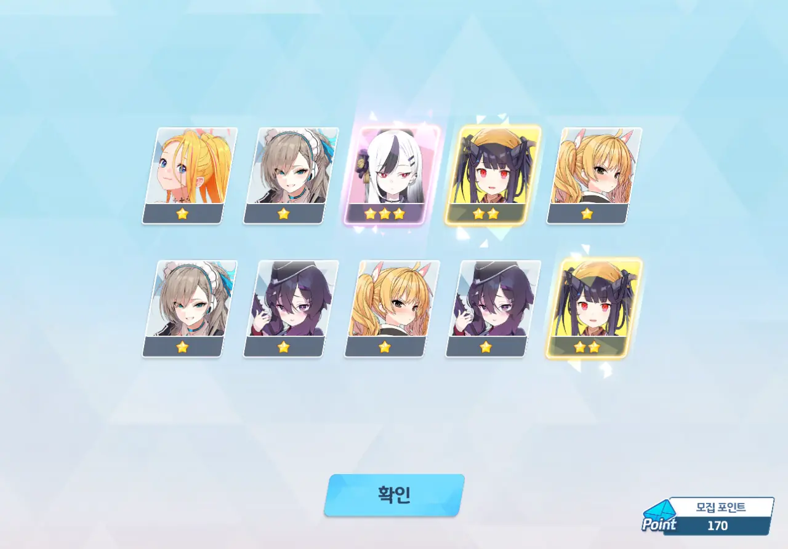
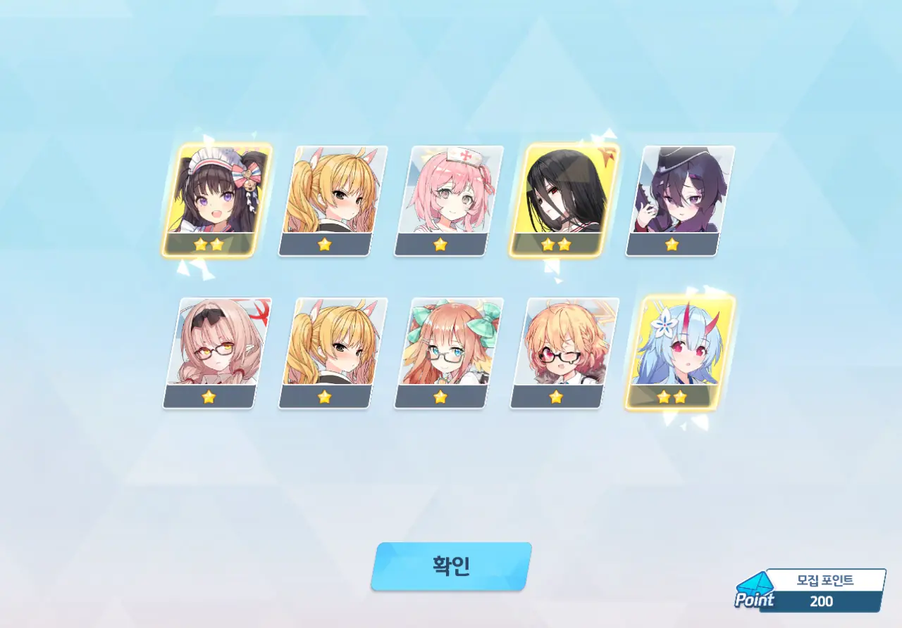

이번 픽업은 아이돌 마리와 아이돌 사쿠라코이다. 아이돌 미네는 배포 캐릭터이고.

아이돌 마리는 '코코나 Mk.2'라는 평가를 받고 있다.
아이돌 사쿠라코는 '스페셜 캐릭터에게 치명 확률과 치명 대미지 증가 버프를 주는' 유일한 캐릭터라 뽑을 가치가 있다고 한다.

그러니까 둘 다 뽑아야 한다는 소리지.

&nbsp;

그런데 다음 픽업 일정이 심상치 않다.

당장 6월에는 파자마 유우카와 파자마 노아 픽업이 있다.
파자마 유우카와 파자마 노아는 자금에 여유가 있으면 뽑는 게 좋다고 들었다.

7월 픽업 일정은 그야말로 미쳤다고 할 수 있다.
4주년 페스 바로 직전에 세이아와 교복 아스나 픽업이 있고, 그다음 주의 4주년 페스에선 교복 네루와 리오가 페스 한정 캐릭터로 나온다.
교복 아스나의 평가는 많이 애매하지만, 세이아는 '우이 상위호환'이라는 이야기를 듣고 있다. 페스 한정 캐릭터로 나오는 교복 네루와 리오는 무슨 일이 있어도 반드시 뽑아야 하고.

반드시 뽑아야 하는 세이아, 교복 네루, 리오를 생각하면 3 × 200 × 120 = 72,000개의 청휘석이 있어야 한다.

아직 픽업 가챠를 시작하기 전인데도 갖고 있는 청휘석이 고작 59,000개밖에 없다.
고작 3개월 만에 13,000개 + 최대 48,000개 이상의 청휘석을 벌 수 있을 것 같지가 않아...

이건 정말 큰일이다.

&nbsp;

아무튼, 중요도가 더 높은 아이돌 마리부터 시작이다.

어디서 나온 건지 잘 기억나지 않지만, 무료 10연차 티켓이 하나 있더라고. 물론 거기서 3성이 나오는 일은 없었다.

20 연차.

🟦 🟦 🟦 🟦 🟦
🟦 🟦 🟦 🟦 🟨

'응, 어림도 없어~'라고 말하려는 걸까.

40 연차에서 정월 세리카가 나왔다. 3성이 나온 건 좋지만...



뭐... 뭣?

아니 고작 50 연차에 아이돌 마리가 뜬다고? 끼얏호우!

60 연차에서는 이로하가 나왔다.

70 연차에서 아이돌 마리가 또 나왔다!

잠깐만, 이거 3성 확률이 너무 좋게 나오고 있는데요? 이거, 분명 나중에 3성 확률을 사정없이 떨어트리겠다는 의미죠?

80 연차에서 히나가 나왔다.

&nbsp;

100 연차까지만 돌리고, 아이돌 사쿠라코 픽업으로 넘어가기로 했다.

안타깝게도, 3성이 더 나오는 일은 없더라고.

남은 청휘석 48,000개. 모집 포인트 100개.

12,000개 안에 아이돌 사쿠라코를 얻어야 한다.



~~20~~140, 150 연차.

🟦 🟦 🟦 🟦 🟦
🟦 🟦 🟦 🟦 🟨

'응, 어림도 없어~'라고 말하려는 걸까.

170 연차에서 정월 카요코가 나왔다.

200 연차. 아이돌 사쿠라코는 결국 코빼기도 보이지 않았다.



... ㅎㅎ...

&nbsp;

아이돌 사쿠라코보다 아이돌 마리의 중요도가 더 크기 때문에, 손해를 본 거냐고 묻는다면 아니라고 말할 수 있다.

그런데 속이 자꾸만 쓰리네. 분명 다음 픽업 일정을 소화하기에는 남은 청휘석의 개수가 턱없이 부족해서일 것이다.

&nbsp;

다음 픽업이 정말 걱정된다.
남은 청휘석이 얼마 없기 때문에 파자마 유우카와 파자마 노아는 무조건 걸러야 한다.
세이아, 교복 네루, 리오를 뽑기 위해선 지금처럼 느긋하게 콘텐츠를 즐기는 게 아니라, 예전에 하던 것처럼 이벤트 챌린지, 대결전, 제약해제결전 등을 악착같이 플레이해 청휘석을 열심히 벌어야 한다.

벌써부터 머리가 아파오기 시작하네...

&nbsp;

오늘의 결론: 아이돌 마리가 귀여웠어요. 내 남은 청휘석은 귀엽지 않아요.

***

이번 픽업에서 3성이 꽤 많이 나온 것 같아, 가챠 성과를 확인하기로 했다.

* 마리(아이돌): 2회
* 세리카(새해): 1회
* 이로하: 1회
* 카요코(새해): 1회
* 히나: 1회

200번의 가챠에서 3성이 6번 나왔으니, 명시된 확률인 3%와 정확히 일치한다.

이걸 평소보다 더 많이 나왔다고 느꼈다는 건, 평소 3성이 매우 짜게 나왔다는 걸 의미하는 게 아닐까? 이거 게임 아냐...
