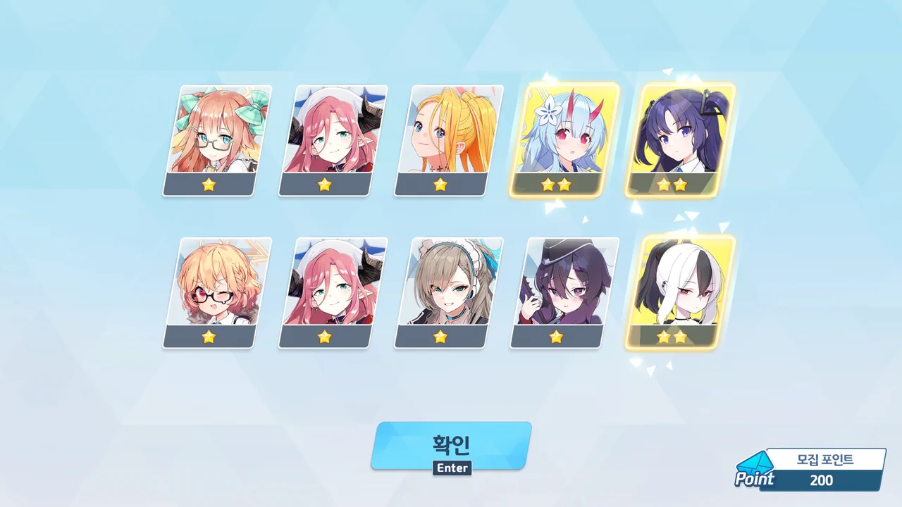

이번 픽업은 세이아와 교복 아스나이다.

세이아는 우이 상위 호환이라는 평가를 받는 캐릭터이기 때문에 반드시 뽑을 생각이다.
교복 아스나는 비록 그레고리오와 게부라 총력전에서만 쓰이는 캐릭터라고는 해도, 내게 대체재가 없기 때문에 가능한 한 얻고 싶다.

이번 픽업에서는 무료로 100 연차를 주기 때문에, 그 무료 100 연차 안에 세이아를 뽑고, 남은 100 연차에서 교복 아스나를 뽑는다는 기대를 했다.
뭔가 가능할 것 같았거든.

&nbsp;

하지만 3%라는 현실의 벽은 높고 가팔랐다.



살짝 마음이 조급해져 이미 갖고 있던 1뽑 티켓을 20장 정도 썼기에, 무료 100 연차가 모두 끝난 후의 모집 포인트는 120이 된다.

60 연차에서 아리스가 나왔다.
80 연차에서 히나타가 나왔다.
110 연차에서 히마리가 나왔다.



140 연차에서 사츠키가 나왔다.

SKIP 버튼을 눌렀을 때 곧바로 결과 화면으로 이동하지 않는 것을 보고 드디어 세이아가 나온 건가 잔뜩 흥분했는데, 정작 게헨나 학원 로고가 나온 것을 보고 뇌가 2초 정도 정지했었지...

사츠키 역시 게부라 총력전 접대 딜러이기 때문에, 나와서 나쁜 건 아니다.
그냥... 기대했던 것과 달라서 실망했을 뿐이야...

그리고 모집 포인트가 200이 될 때까지 3성은 코빼기도 보이지 않았다.



... ㅎㅎㅎㅎㅎㅎ

교복 아스나는 무슨... 세이아마저도 겨우겨우 뽑아가는 게 현실인데.

&nbsp;

9월 말에는 일명 '칙폭가키', 히카리와 노조미 픽업이 기다리고 있기에, 최대한 청휘석을 모아야 한다.
거기에서도 분명 최대 48,000개의 청휘석이 소모될 예정이라, 예산이 빠듯하다.

***

이제는 하지 않으면 조금 섭섭할, 이번 가챠에서의 성과 확인이다.

* 사츠키: 1회
* 아리스: 1회
* 히나타: 1회
* 히마리: 1회

이번 가챠에서는 2%의 확률로 3성 캐릭터를 뽑았다.
