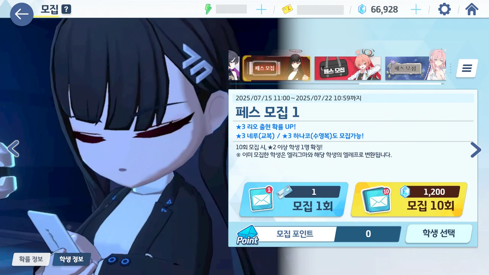
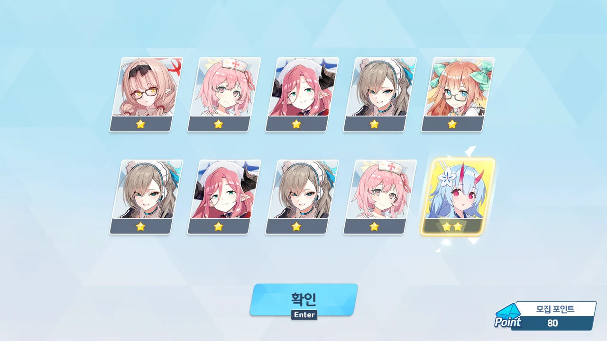
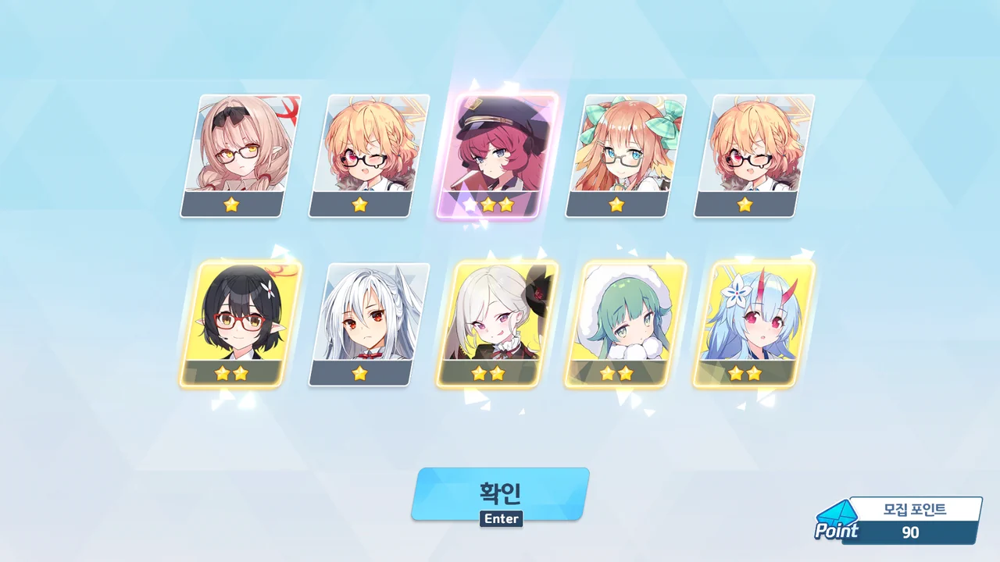
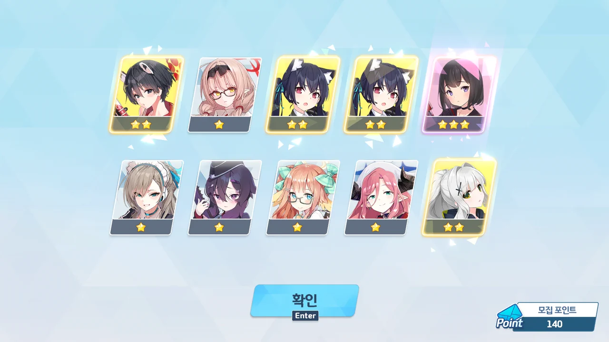
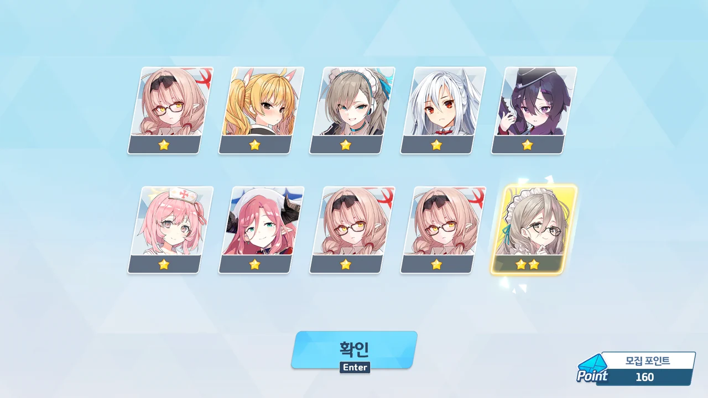
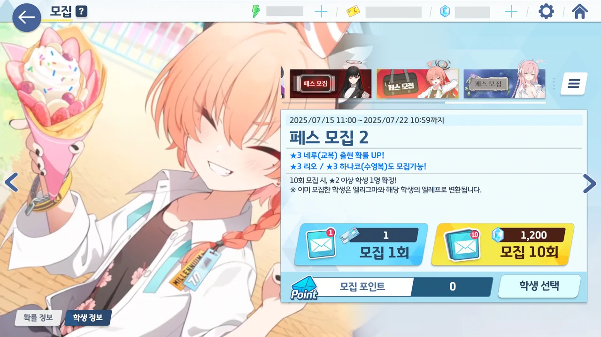

바로 직전의 세이아 픽업에서 천장을 친 터라, 이번 페스에 거는 기대가 조금 크다.
그래봤자 이미 지나간 교복 아스나 한정 픽업은 돌아오지 않겠지만... 어흑, 마이깟...

세이아 픽업과 이번 페스에 필요한 청휘석을 세이아 픽업 직전이 돼서야 겨우 모았음을 생각하면, 앞으로 있을 가챠가 정말 걱정된다.
앞으로 있을 페스는 계속 지금처럼 더블 페스로 쭉 가는 걸까? 청휘석 부담이 엄청날 텐데...
9월 말에 있을 '칙폭가키', 히카리와 노조미 픽업은 페스가 아닌 일반 한정이라 지금보다 더 힘들 것 같은데, 과연 괜찮을까?

정말 고민이 많다.

일단 첫 시작은 리오로 시작한다.
이유는 단순하다. 리오 픽업 배너가 교복 네루 픽업 배너보다 앞에 위치해 있거든.
어차피 둘 다 전무를 2성까지 찍어줘야 해...



... 엣.

고작 20 연차만에 리오가 나왔다!

캠핑 하레가 10 연차만에 나온 이후, 정말 오랜만에 보는 행운이다.



30 연차. 미사키가 나왔다.

40 연차. 리오가 또 나왔다.



50 연차. 리오와 함께 레이사가 나왔다!

레이사가 너무 귀여워서 레이사를 뽑을까 했지만, 남은 청휘석이 별로 없는 데다, 레이사의 활용처가 별로 없다는 점 때문에 아쉬운 마음으로 레이사 픽업을 그냥 넘겼던 기억이 난다.



에... 에에?

70 연차. 사오리가 나왔다.

잠깐만... 그러면 아리우스 스쿼드, 전부 모인 거 아닌가?
혹시 몰라 확인해 보니, 정말이었다.

🟦 🟦 🟦 🟦 🟦
🟦 🟦 🟦 🟦 🟨

음, 정말 오랜만에 보는 거네.

여태껏 3성이 정말 잘 나왔기에, 난수조절이라 생각하기로 했다.

90 연차. 이로하가 나왔다.



110 연차. 드레스 카요코가 나왔다.

... 뭐지? 오늘 왜 이렇게 3성이 잘 나오는 거지? 새로 얻은 캐릭터도 많고!
지금 이렇게 운이 좋다는 건 나중에 어디선가 억까를 당할 거라는 징조라고!



130 연차. 리오와 함께 온천 체리노가 찾아왔다.

처음 T.S.가 나왔을 때 탱크를 보고 '그래! 바로 이게 서포터지!'라며 잔뜩 기대했는데, 생각했던 것만큼 성능이 나오지 않아 조금 실망한 적이 있었다.
그런데 나중에 이로하가 나와서 다 때려 부수더라고. ㅋㅋㅋ...

140 연차. 마시로가 나왔다.



어... 어어어?!

150 연차에서 이번엔 치아키가 나왔다.

잠깐, 이러면 만마전도 다 모인 거 아냐?
뭐지? 오늘 정말 무슨 날인가?

🟦 🟦 🟦 🟦 🟦
🟦 🟦 🟦 🟦 🟨

그래. 난수조절이야.



170 연차에서는 정월 아카리와 유즈가, 200 연차에서는 아츠코와 노아가 나왔다.

200 연차까지 아주 그냥 꽉꽉 찬 가챠였네!



모집 포인트는 교복 네루로 바꿨다.
리오 픽업은 이제 끝내고 교복 네루 픽업으로 넘어갈 예정이라, 교복 네루로 미리 바꿔두는 게 더 이득이다.

자, 그러면 교복 네루 픽업을 시작해 볼까...



10 연차만에 체리노와 수영복 칸나가 나왔다.

게부라 총력전에서 교복 아스나가 없으면 수영복 칸나로 대체가 가능하다고 했었지...



30 연차에서는 교복 네루가, 40 연차에서는 수영복 칸나, 50 연차에서는 리오가 나왔다.

... 나 정말 기분이 이상해... 기분이 엄청 좋은데 너무 불안해...



60 연차에서 나온 건 치파오 마리나였다.

이야... 이게 진짜 페스라는 거구나...
바로 직전의 세이아 픽업에서는 3성 등장 확률이 말라비틀어졌었는데, 지금은 무슨 홍수라도 난 것 같다.







80 연차에서 리오와 바니걸 토키가 나왔다.
100 연차에서 ~~땃쥐~~사야가 나왔다.
110 연차에서 카즈사와 정월 아카리가 나왔다.
120 연차에서 교복 네루가 나왔다.
150 연차에서 ~~니하하~~코유키가 나왔다.
190 연차에서 온천 노도카가 나왔다.
200 연차에서는 ~~햄부기~~이즈미가 나왔다.

'무늬만 3성' 소리를 듣는 사야와 이즈미가 나오긴 했지만, 다른 3성도 많이 나왔잖아? 괜찮아!



교복 네루와 리오 모두를 할 수 있는 데까지 전부 강화했다.
교복 네루는 엘레프가 부족한 바람에 전무 2성까지 다는 데 엘리그마를 쓸 수밖에 없었다.

***

자, 그러면 기다리고 기다리던 성과 확인의 시간이다.

* 네루(교복): 2회
* 노도카(온천): 1회
* 노아: 1회
* 레이사: 1회
* 리오: 6회
* 마리나(치파오): 1회
* 마시로: 1회
* 미사키: 1회
* 사야: 1회
* 사오리: 1회
* 아츠코: 1회
* 아카리(정월): 2회
* 유즈: 1회
* 이로하: 1회
* 이즈미: 1회
* 체리노(온천): 1회
* 체리노: 1회
* 치아키: 1회
* 카요코(드레스): 1회
* 카즈사: 1회
* 칸나(수영복): 2회
* 코유키: 1회
* 토키(바니걸): 1회

이번 페스에서 3성이 총 31번 나왔다. 그러니까 이번 페스에서 3성 등장 확률은 7.75% 였네.
3성이 자주 나온다 싶었는데, 정말 자주 나온 것이었다.
