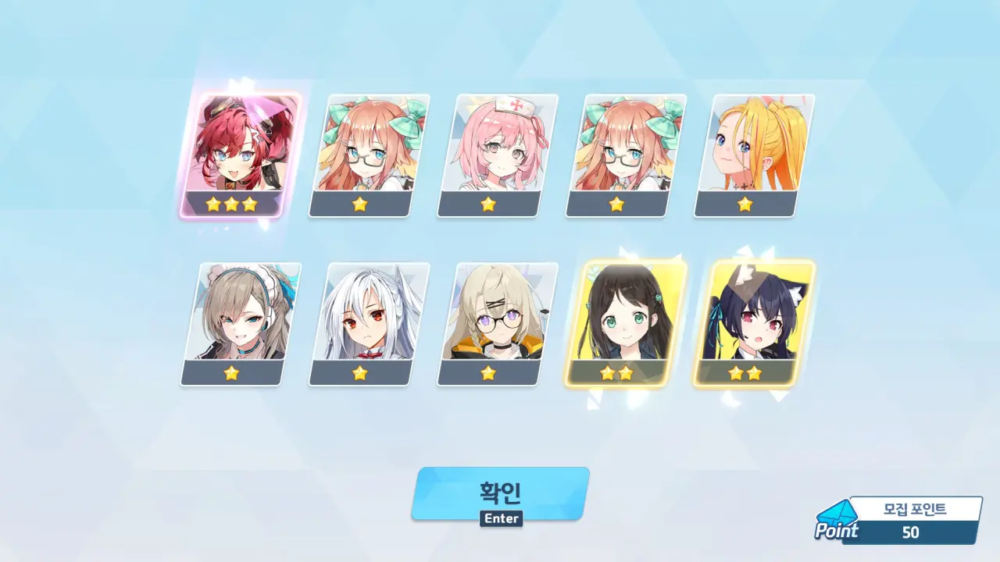
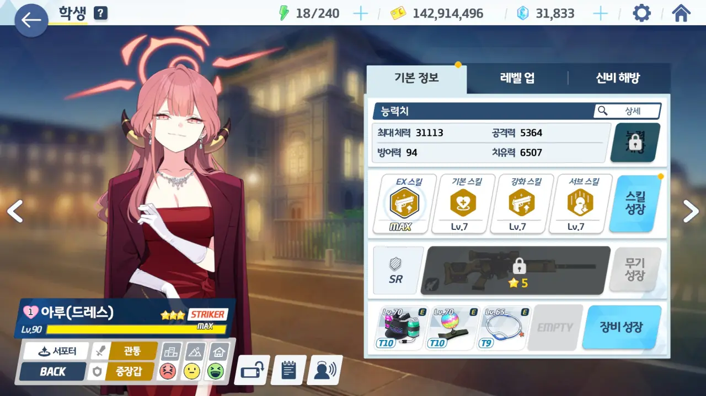

원래 픽업 계획대로라면, 이번 드레스 아루 픽업은 그냥 넘겼어야 했다. 그래야 이번 달 말에 있을 철도가키 픽업을 안전하게 진행할 수 있을 테니까.
지금 갖고 있는 청휘석이 약 46,000개니까, 2,000개만 더 모으면 철도가키 픽업을 안정적으로 돌릴 수 있다.

하지만 커뮤니티에서 본 글 하나가 문제였다.

이번 드레스 아루 픽업은 복각 픽업이다. 처음 나왔을 때에는 매우 중요한 픽업이 얼마 남지 않았을 때이기도 했고, 드레스 아루를 앞으로 쓸 것 같다는 생각이 들지 않았기에 그냥 넘겼다.

하지만 각종 공략에서 드레스 아루를 쓰는 공략이 점점 눈에 들어오기 시작한다. 없어서 아니꼬운 정도는 아니지만, 눈에 밟히는 정도라고 해야 할까.

그리고 내가 본 글에서는 '리오가 나온 이상, 앞으로 드레스 아루가 없으면 아니꼬운 상황이 자주 발생할 거다'라는 문구가 적혀 있었다.

&nbsp;

피곤한 사람은 정상적인 판단을 하기 힘들다. 머릿속에 짙은 안개가 잔뜩 끼어, 제대로 된 판단을 하지 못하는 것이다.

그리고 피곤한 몸을 이끌고 집에 돌아온 나는 '100 연차 안에 드레스 아루를 뽑으면 되는 일 아닌가?'라는 생각을 갖고 호기롭게 드레스 아루 픽업에 달려들었다.

... [저번]()에 그 꼴을 당해놓고... 나란 녀석은 학습 능력이 플라나리아보다 못한 녀석이었던 거냐?

***



정말 호기롭게 드레스 아루 픽업에 들어갔다. 들어갈 때만 해도 '에이, 뭐 100 연차 안에는 나오겠지'라고 생각했다.



드레스 아루는 아니었지만, 20 연차만에 신규 3성이 나온 걸 보면, 내가 그렇게까지 운이 없었던 건 아니었던 모양이다.

~~눌린 뱃살~~

얼마 지나지 않아 50 연차에서 또 3성이 나오기도 했고.

픽업에서 3성이 나올 확률이 3%이고, 50 연차가 될 때까지 3성을 총 두 번 얻었으니, 여태까지의 3성 등장 확률은 명백히 평균 수치보다 높다고 볼 수 있을 것이다.



하, 어림도 없지!

🟦 🟦 🟦 🟦 🟦
🟦 🟦 🟦 🟦 🟨

100 연차 안에 드레스 아루를 얻을 수 있을 것이란 내 기대는 마치 나를 놀리듯이 100 연차에 등장한 '2성 딱 하나!'에 와르르 무너져 내리고 말았다.

심지어 '아직도 정신 못 차렸어? ㅋㅋㅋ'라고 하듯, 140 연차에서 한 번 더 나오기도 했고.



드레스 아루가 나온 건 160 연차에서였다.

... 그래... 천장을 친 건 아니니 청휘석을 4,800개 정도 절약했다고 볼 수... 가 없네. 이래서야는 철도가키 픽업에서 손가락만 쪽쪽 빨게 생겼다.
남은 청휘석이 고작 35,000개 정도밖에 없으니, 둘 중 어느 하나에서 천장이라도 쳤다간 그대로 파산하는 거다.

피곤함 반, 허탈함 반인 상황에서 무지성으로 드레스 아루의 스킬을 M777로 찍었다.

그런데 내가 읽었던 글을 다시 읽어보니, 스킬을 M711로 맞추라고 하더라. 그렇지 않으면 스킬 타이밍이나 대상이 꼬일 수 있다고.

... 아, 몰라. 미래의 내가 어떻게든 해결하겠지. 지금 내게 당장 급한 건 철도가키 픽업에서 천장을 치지 않는 거라고.

***

그리 나쁜 일만 있었던 건 아니었다.
오늘 샬레 카페에 티파티 삼인방이 모두 모였거든. 마지막 한 명은 초대권으로 부른 것이긴 하다만, 그래도 삼인방이 모두 모인 게 어딘가.



이런 날이 오면 아래 영상처럼 영상을 찍어 남기려 했는데, 너무 피곤한 나머지 그럴 여력이 없어 그냥 사진 세 장만 찍고 카페를 나왔다.



***

굳이 꼭 해야 하나 싶은 성과 확인의 시간이다.

* 코토리(응원단): 1회
* 메구: 1회
* 아루(드레스): 1회

160 연차에서 3성을 총 3번 얻었으니, 이번 픽업에서 3성 등장 확률은 1.875%가 된다.
