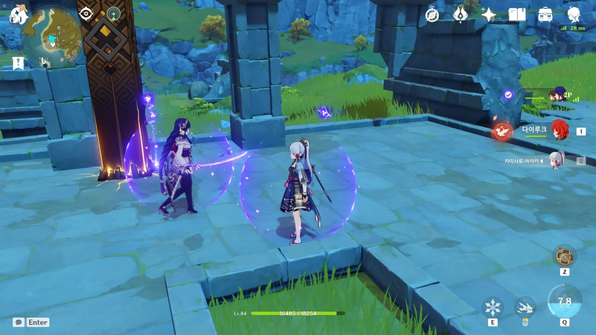
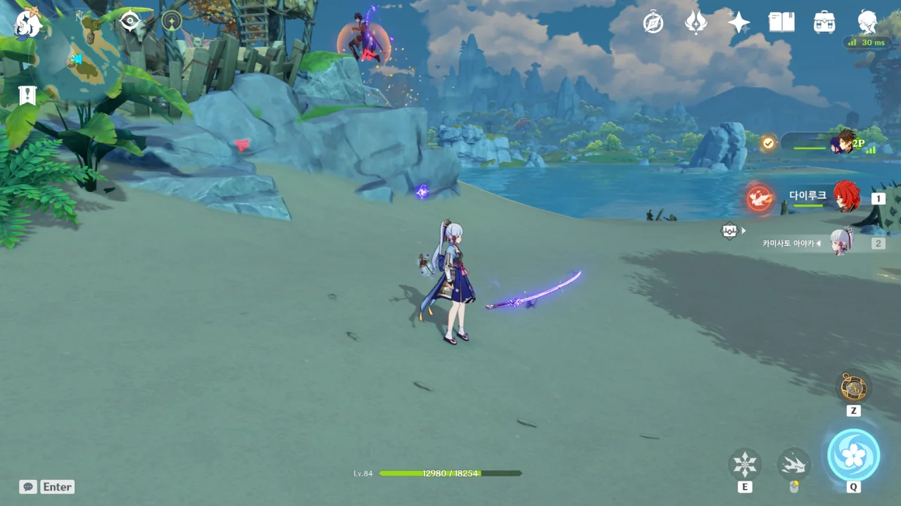

라이덴 쇼군을 얻은 사람이라면 누구나 운명의 자리를 살펴본 후, '아, 2돌까지는 올려보고 싶은데'라고 생각할 것이다.

그야, 2돌 라이덴 쇼군의 궁은 방어력 60%를 무시하니까. 이걸 어떻게 참아?

&nbsp;

하지만 11만 원이라는 *정가*에 라이덴 쇼군을 *구매*한 나에게 더 이상의 지출은 치명적이다. 그래서 그만두었다.

그저 종종 모이는 160개의 원석으로 단차를 돌릴 수밖에...

그래서 나왔다. 설탕이.

&nbsp;

하지만 '중복 캐릭터 전환'이라는 문구에서 유추할 수 있듯이...

내 설탕은 이미 6돌이다.

설탕이 '언럭키 카즈하'라고 불린다던데, 정작 얻어놓고 잘 쓰지도 못하고 있어, 그냥 바람 성유물이 모이는 대로 설탕에게 주고 있다.

설탕을 이용한 격변 딜에 관한 공략 글을 보고는 있는데...

***

라이덴 쇼군을 *정가*에 얻었으니, 전무는 꿈에도 못 꾼다. 그래서 선택한 것이 「어획」이다.

「어획」을 얻긴 얻었다. 재련에 필요한 자원도 모두 얻었다. 이제 남은 건 한 개에 복어 종류별 10마리와 전류나비고기 3마리를 요구하는 재련 재료를 모두 사는 것뿐이다.

&nbsp;

그리고 남은 것은...

뎃? 내 모라는 어디간데수웅? 아니, 분명 140만 모라가 있었던 것 같은데?

라이덴 쇼군의 특성으로 장병기 강화 시 소모되는 모라를 줄였어도 모라가 증발하는 것은 다름이 없었다.

***

지인과 함께 원신을 플레이하며 발견한 것.

라이덴 쇼군의, 몽상의 일심이... 공중에... 떠 있다?

심지어 라이덴 쇼군이 태도를 쥐고 있는 손의 모양도 조금 이상하다. 원래 장병기를 쥐던 캐릭터가 한손검을 들게 되어 생긴 문제인 걸까?

그 이후로도 종종 허공에 둥둥 떠다니는 몽상의 일심을 많이 발견할 수 있었다.
