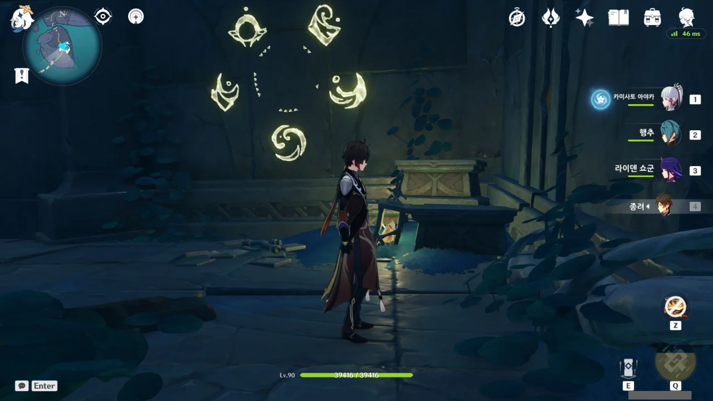

삼계 관문 제향 이벤트도 이제 필드에서 뽑아 먹을 수 있는 건 다 뽑아 먹은 것 같다.

아직 안 한 것이 있나 생각해 봐도, 도전이나 이런 건 전부 다 해버렸으니 남은 게 있을 턱이 없다.

이벤트가 아직 30여 일이나 남아있지만, 끝났다. 끝나버렸다.

그걸 감수하고 달린 것이니 당연한 결말이겠지만...

그렇다고 할 일이 다 끝난 건 아니다.

이번엔 지도에 마커만 찍어두고 잊어버리고 있었던, 연하궁 퍼즐을 풀어보려고 한다.

퍼즐을 풀자마자 유적 가디언 세 마리가 '참 잘했어요' 도장을 찍어주기 위해 달려든다.

이 정도 되는 몹이 나왔으니, 보상도 괜찮게 나올 거로 생각했는데, 별로 좋은 건 안 주더라.

숨겨진 퍼즐 치곤 결말이 허무했다.



그다음 할 일은... 이젠 이름도 까먹은 임무이다. 보우로우 마을의 할머니에게서 매일 점괘를 받아 이것저것 일을 하면 되는 임무이다.

첫째 날의 임무는 보물 사냥단 처치였는데, 거기서 해적왕과 관련된 임무를 시작할 수도 있다고 들었다. 하지만 그 임무를 이미 진작에 끝내서, 관련 대사가 나오진 않더라.



그다음은 미루고 미뤄왔던, 연하궁 건문 봉쇄점 모두 해제하기. 난 건문 봉쇄점을 모두 해제하면 업적이라도 따로 하나 줄 것으로 생각했는데, 아무것도 없었다. 아무것도.

&nbsp;

웃긴 건, 그렇게 건문 봉쇄점을 해제하고 다녔음에도 연하궁 탐사도가 아직 90%밖에 안 된다는 거다. 대체 나머지 10%는 어디서 채워야 할까?

건문 봉쇄점을 해제하고 다니면서 보이는 모든 도전도 했고, 선령도 이끌어줬으며, 상자도 전부 열었는데 말이다.
