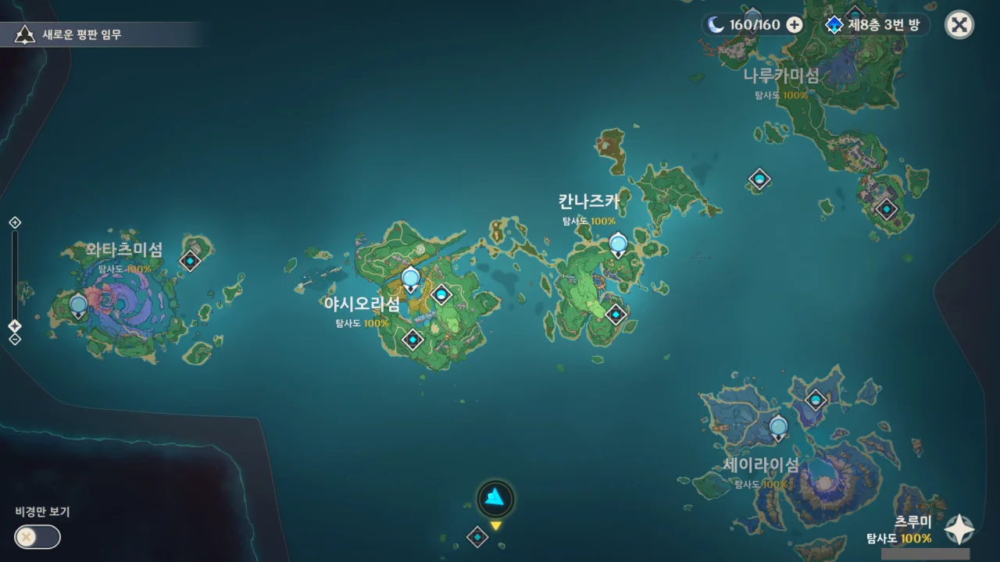

드디어... 이나즈마의 모든 지역 탐사도를 100%로 만들었다.

아래에 있는 츠루미 섬 역시 탐사도가 100%이다.

&nbsp;

생각해 보니 연하궁은 아직 탐사도가 100%가 아니긴 한데, 연하궁은 별개의 지도를 쓰니까 일단은 제외하자.

몬드의 경우, '드래곤 스파인'과 '별이 떨어지는 산골짜기' 두 지역을 제외하면 탐사도 100%를 달성했다.

솔직히 드래곤 스파인 100%는 좀... 추위 게이지 관리하기 매우 귀찮을 것 같다.

리월은 그냥 100%를 찍은 곳이 단 한 곳도 없다.

벽수원 79%, 민림 78%, 경기 들판 77%, 리사교 83%, 운래해 76%. 전반적으로 70%대를 찍고 있다.

&nbsp;

하지만 리월은 너무 넓은걸. 나중에 추가될 층암거연 지역까지 생각하면 정말 역대급으로 넓은 지역이 아닐까, 한다.

그래도 다행스러운 점은 층암거연에서도 리월 보물 나침반이 통한다고 하더라.

하지만 층암거연 심층부는 연하궁처럼 별개의 지도를 쓴다고 한다. 우욱...
