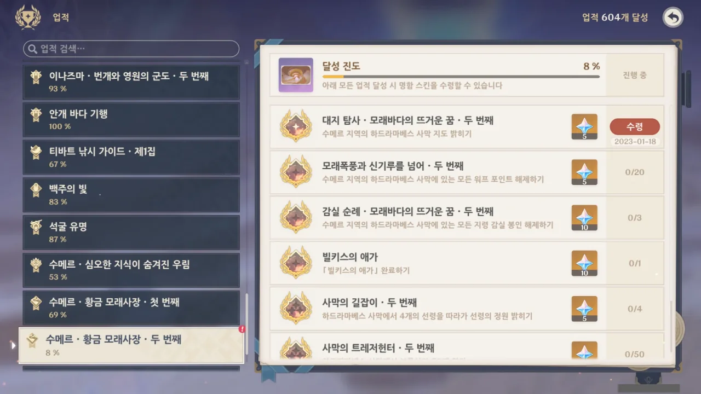
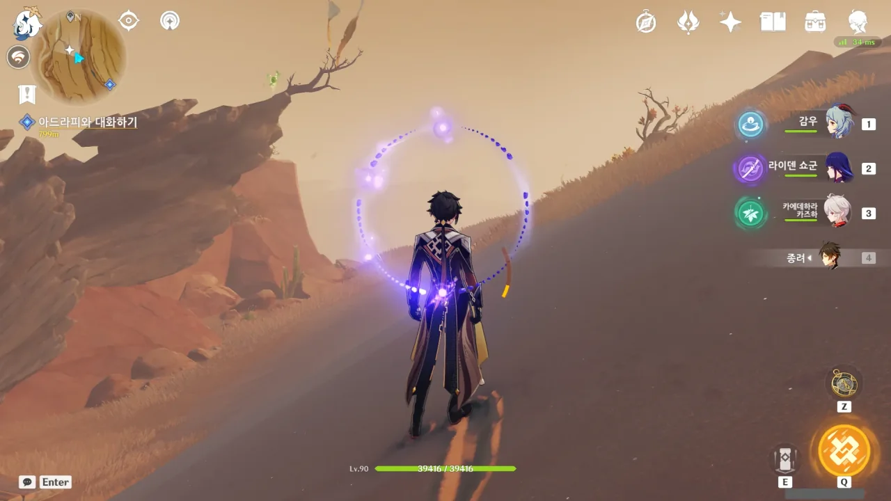
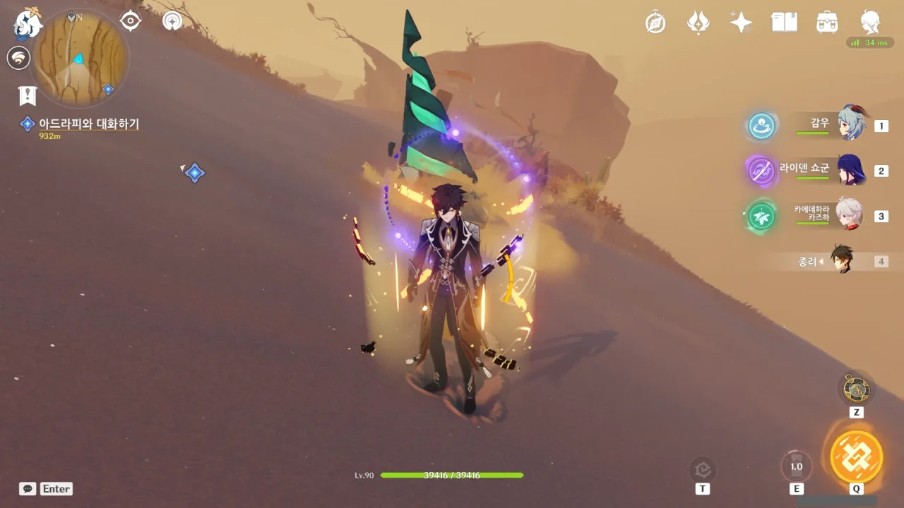
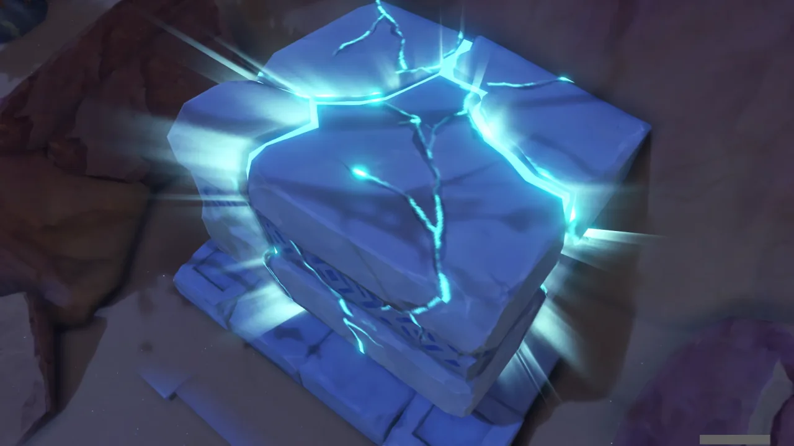
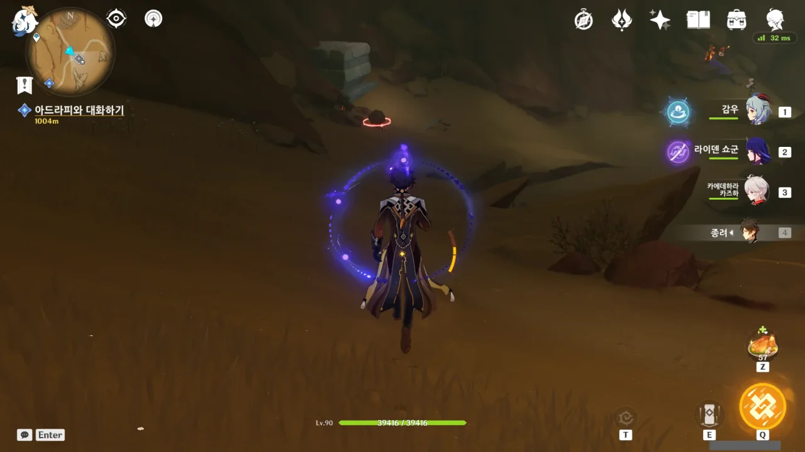
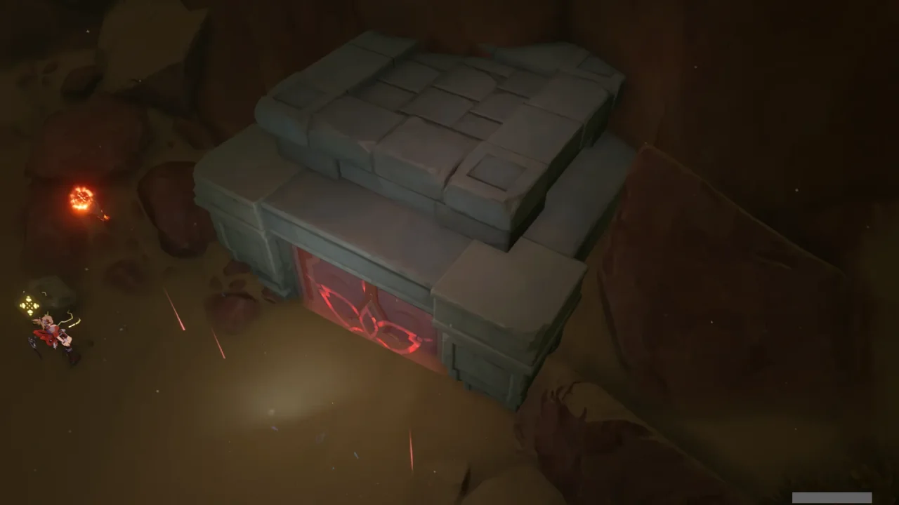
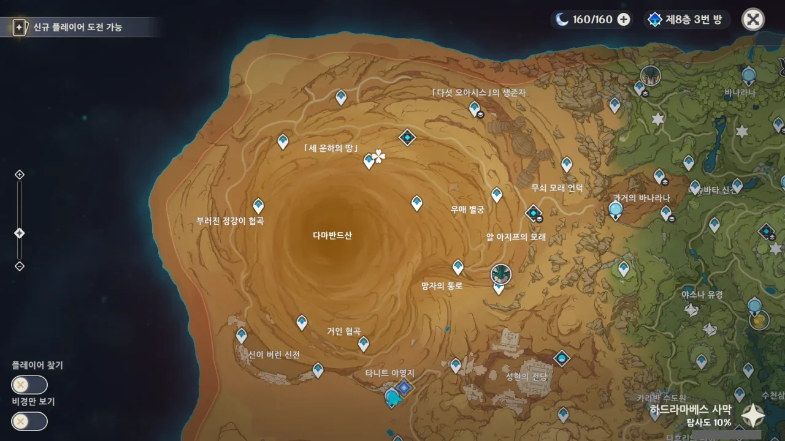

별것은 아니고, 그냥 오늘 새로운 지역이 열렸길래 관련 임무를 진행하기 전에 미리 비경과 워프 포인트를 모두 여는 그런 일이다.

경험상, 이렇게 미리 열어두면 나중에 편하더라고.

대충 지도에 보이는 워프 포인트는 14개, 비경이 2개가 있다. 일부 워프 포인트나 비경이 지하에 있다고 나오는데... 그리 어렵진 않겠지.

신상을 여니까 바로 도전과제가 해금되었다.

그나저나 워프 포인트가 총 20개라고...? 비경까지 센다고 쳐도 4개가 모자란다.

&nbsp;

뭐... 이건 나중에 월드 임무 하면서 열리겠지.

그리고 워프 포인트로 이동하다 발견한 것. 아잇 또 오벨리스크야?

수메르 사막이 처음 나왔을 때 이런 것을 뭣도 모르고 냠냠 맛있게 먹었다가 나중에 오벨리스크를 찾아 헤맬 때 내가 무슨 석판을 먹었는지 기억 못 해서 결국 모든 석판 위치를 한 번 더 돌아다녔던 기억이 아직도 생생하다.

돌아다니다 발견한 새로운 퍼즐 요소. 어... 일단 이것도 당장은 패스. 보통 이런 것을 클리어하면 상자를 주는데, 상자는 당장 급한 것이 아니니까.

물론 신의 눈동자도 패스다. 이걸 언제 일일이 다 기억해?

그나저나 왼쪽 위에 못 보던 아이콘이 있어서 클릭해 봤는데 모래폭풍 현상에 대해 알려준다.

별달리 플레이어에게 대미지를 주거나 이런 건 아니고, 그냥 가시거리를 제한하는 정도에 그쳐서 다행이다. '세찬 모래폭풍 때문에 지속해서 체력이 감소합니다' 이런 기믹이었다고 해봐...

그리고 돌아다니다 종종 발견한 이 드릴. 땅에서 두어 번 튀어나오던데, 저 드릴을 때리려 해도 대미지를 받지 않는 것 같더라. 맞으면 아플 것 같아서 그냥 안 맞으며 돌아다녔지만 저건 대체 뭘까.



그리고 필드에서 조우한 우인단과 전투 중 뜬금없이 해금된 이 업적. 대체 이게 뭔가 싶었는데 아무래도 모래폭풍을 통과하거나 하면 얻는 업적인 것 같다.

저 멀리 또렷하게 보이는 오벨리스크. 지금까지 만났던 석판의 밀도를 생각해 보면 오벨리스크가 이 사막에 최소 서너 개 정도 있을 것이다.



가다가 뭔가 이상한 구체 같은 것을 발견해서 가까이 가보니 대기 소용돌이 뭐라고 한다.

그런데 이렇게 작으면 그냥 피해 가면 되지 않나? 이 정도 크기면 아마 이게 퍼즐 요소를 가로막고 있는 것으로 보인다.

비경이 잠겨있다. 뭐, 비경이 다 그렇지. 절대로 곱게 비경을 찍게 두지 않는다.

일단 선령 두 마리를 잡아다 넣어야 하는 것 같다.

이 선령, 자꾸 표식을 건드려서 기껏 맞춰둔 표식이 다 흐트러졌다. 결국 선령이 이동하는 사이에 재빨리 표식을 맞추는 방식으로 해결했다.

이게 맞는 건가?

아, 이렇게 차라리 몹을 잡는 것이라면 매우 쉽지...

아무튼, 비경 잠금 해제.

이게 아까 그 대기 소용돌이의 큰 버전인가 보다. 저렇게 안에 상자가 갇혀 있네.

돌아다니다 발견한 이상한 것. 설마... 도금 여단이 츄츄족을 훈련하는 건가? 서로 안 싸우고 계속 저러고 있던데.

두 번째로 만났던 그 거상과는 달리 이 거상은 레이저포를 쏘지 않는다.

지하에 있는 비경이라길래 뭐 또 한참 헤매야 하는 건가 싶었는데, 거상의 손 근처에 아래로 내려가는 길이 있어서 편하게 내려왔다.

횃불 4개 밝혀서 비경 잠금 해제.

그래서 일단 보이는 모든 워프 포인트와 비경을 해금했다.

나머지는 뭐... 월드 임무 하면서 해금할 수 있겠지.
