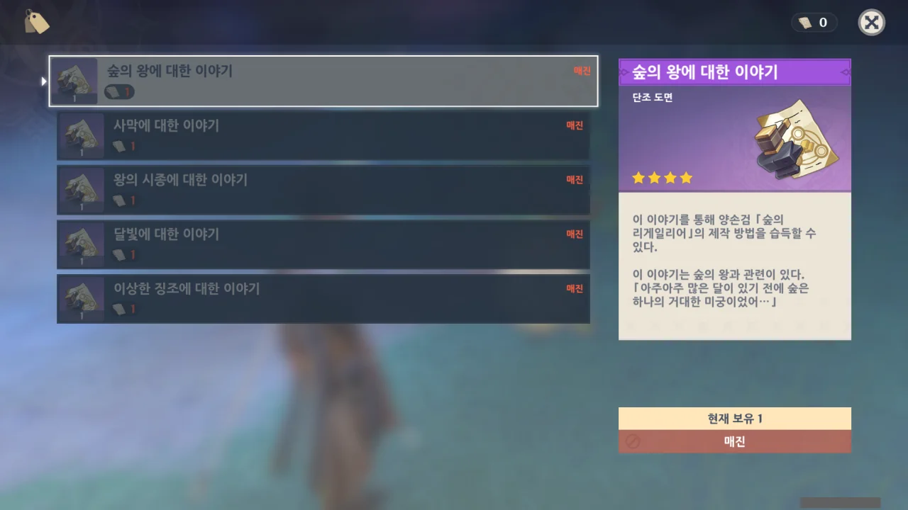

그동안 키우지 않았던 베넷과 향릉을 키우려던 와중, 베넷의 무기로 '원목 검'을 추천하는 글을 읽었다.

예전에 중앙대륙 한손검 원형을 얻어두었던지라, 바로 대장장이에게 가서 원목 검을 만들려고 시도했는데... 없다?

검색을 해보니까 아란나라의 양파 나무 근처에 있는 아란나라가 설계도를 판다고 한다.

정말? 왜 난 그걸 이제 처음 들은 것이지? 양파 나무에 공양을 열댓 번도 넘게 했을 동안 그걸 발견하지 못했다고?

가보니까 정말로 있다.

심지어 내가 예전에 '과연 이 이야기를 누가 사려는 것일까?'라고 생각했던 적이 있었는데, 그 이야기를 재화로 소모하는 것이었다.

당연히 전부 샀다.

전부 다 사니까 업적이 하나 깨지더라.

&nbsp;

아니 난 왜 이걸 지금 알아서...
