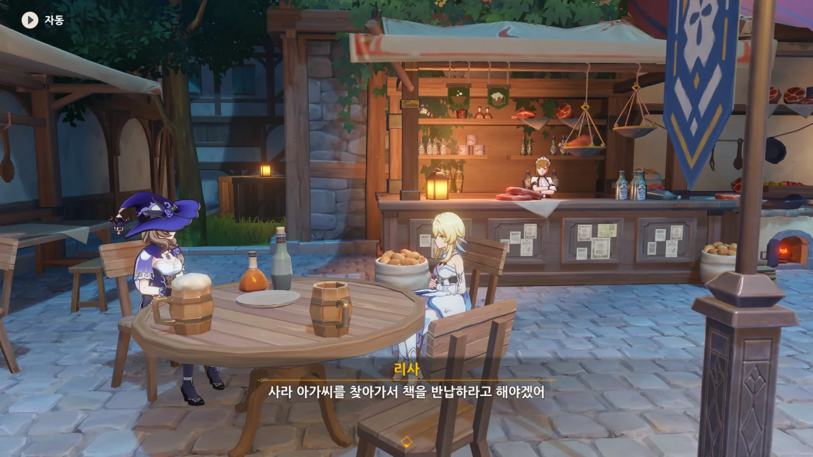

케이아 전설 임무가 모두 끝났으니, 이제 리사 전설 임무를 할 시간이다.

&nbsp;

지금 이 시리즈, 「Re: 제로부터 시작하는 티바트 생활: 몬드편」은 참 애매한 위치에 있다.

원칙적으로 마신 임무나 전설 임무로 분류하는 게 옳겠지만, 이전에 이미 남행자로 진행한 임무 글이 잔뜩 있는지라, 과연 그래도 되나 의문이 들거든.

그렇다고 이대로 기타 카테고리에 계속 글을 쓰려니, 그것도 뭔가 아닌 것 같다.

이건 조금 더 생각을 해봐야겠다.

> 진 말고 또 누가 일을 그렇게 열심히 하겠어.

그렇게 말하니까 진이 너무 불쌍해지잖아요...

리사가 추천해 줄 만한 책은 전부 금서로 지정되어 있어, 대출이 불가능하다고 한다.

에잇, 그러면 왜 추천하는 거야... 애당초 금서를 추천하는 것도 좀 이상하지 않나?



대신 <<티바트 유람 가이드>>를 추천해 주려 했으나, 이미 대출 중인 도서라 여행자에게 보여줄 수 없다.



이외에도 페보니우스 기사단 도서관에는 반납 기한이 한참 지난 책이 여럿 더 있다고 한다.

> 날 화나게 하는군.

이 대사를 할 때 소름이 쫘악 돋았다.

그야, 리사가 저런 말을 하는 건 정말로 화가 났다는 뜻이니까.

번개 신의 눈 사용자가 화나면 주변의 번개 원소 농도가 올라가는구나.



리사의 협박 아닌 협박에, 책 회수에 동참하게 되었다.

아마 저기서 리사의 말을 거절했다간, 리사의 번개 맛을 보았을 수도 있다.



우리 분명 마죠리 씨의 미반납 책을 돌려받으려 온 거 아니었어요?

능청스럽게 "이런 기념할 만한 날에는 기념품을 고르는 게 당연하다"고 하는 리사를 곯려줄 목적으로 "첫... 데이터의 기념으로?"라는 선택지를 골랐다.

그리고 곧바로 "네 나이대엔 이런저런 환상을 가지고 있는 법이니까"라며 보기 좋게 턱을 얻어맞았다.

이... 이게 어른의 연륜?



그러더니 갑자기 여행자가 리사에게 줄 선물을 고르는 모양새가 되어버렸다.

여러 선택지를 전부 다 살펴봤는데, '파손된 그림'이 제일 나을 것 같았다.





리사의 마음에 쏙 든 모양이다.

모르는 사람 눈에는 그저 파손된 그림으로 보일 뿐이지만, 사실 잃어버린 <<북쪽에서 불어온 바람 탐구>> 제3권이라고 한다. 고대 사람들의 원소에 대한 이해를 연구할 수 있는 중요한 자료라고.

이제 마죠리에게 빌려간 <<바네사 전기>>를 되돌려달라고 하자.



마죠리는 잔뜩 신나서 바네사에 대한 상품 이야기를 주절주절 늘어놓기 시작한다.

아니, 그게 아니라 빌려 간 책 말하는 건데요.



마죠리는 바네사를 굉장히 좋아하는 모양인지, 바네사 이야기를 듣자마자 흥분해서 바네사 관련 상품 이야기를 꺼낸 것이었다.



바네사를 존경하는 걸 봐서 넘어가 주겠다는 리사.



다음은 「디어 헌터」의 사라에게 빌려준 책을 회수할 시간이다.

리사는 책 먼저 찾다간 음식 맛이 변하겠다며, 먼저 음식을 먹고 책을 회수하겠다고 한다.

이쯤 되면 책 회수가 아니라 그냥 주변을 돌아다니는 게 주목표가 아닐지 하는 생각조차 든다.



사라에게 리사가 주로 먹는 음식에 관해 물어보자, 주로 채소류 음식을 주문했다고 말해주는 사라.

그렇다면 내 선택은 무 수프다.



이번에도 리사가 매우 흡족해한다.

책 반납을 독촉할 시간이 돌아왔다.





사라 역시 자신이 <<멧돼지 공주>>를 빌린 걸 완전히 잊고 있었던 모양이다.

물론 리사는 이번에도 조용히 화를 삭이고 있다.



사라는 책을 빌린 후, 가게가 바빠져 책을 빌린 사실을 완전히 잊어버린 모양이다.



퇴근 후, 직접 도서관으로 책을 반납하러 가겠다는 사라의 말에 곱게 넘어가는 리사.



이젠 척하면 척이다. 대체 나에게 왜 이러는 건진 잘 모르겠지만.



리사 모자에 달린 꽃이 장미라는 말을 듣고 곧바로 장미를 선택했다.





이번에도 리사의 마음에 꼭 들은 선물이다.





도나 역시 <<하얀 공주와 여섯 난쟁이>>를 빌린 사실을 까맣게 잊고 있었던 모양이다.



그런데 도나가 이전의 다른 사람들과는 다르게, 잔뜩 긴장했다.





평소 침대 머리맡에 빌린 책을 두었지만, 막상 책을 반납하려 했을 때는 책이 감쪽같이 사라졌다고 한다.



페이몬이 "리사가 무서운 짓을 하지 않을까?"라고 했는데, 그게 리사에게 다 들렸다.

이걸 앞담이라고 할 수 있을진 모르겠지만, 그래도 이건 실례니까.



누군진 몰라도, 정말 누군가가 책을 훔쳐 갔다면 3배, 아니 10배의 대가를 치르게 될 것이라고 말하는 리사.

> 그럼 책을, 훔친 사람이, 책임을 져야겠지...

저렇게 하나하나 끊어서 말하는 걸 보면, 정말 화가 많이 난 모양이다.



하지만 도둑맞은 책을 무슨 수로 찾는단 말인가?

그에 대비해, 리사는 모든 책에 특정한 원소 표기를 남겨두어, 책이 도둑맞더라도 추적하기 쉽게 했다고 한다.

그런 준비까지 미리 해둔 걸 보면, 리사는 말로만 느긋하게 지내고, 사실은 심계가 깊은 사람 아닐까?

한때 아카데미아 학생이었을 만큼 머리가 좋으니, 분명 그럴 것이다.



리사가 남긴 원소 표기는 원소 시야로 확인할 수 있다.





도나 말대로, 정말로 도나가 빌린 책을 누군가가 훔쳐 간 모양이다. 그 흔적은 성 바깥으로 이어져 있다.
