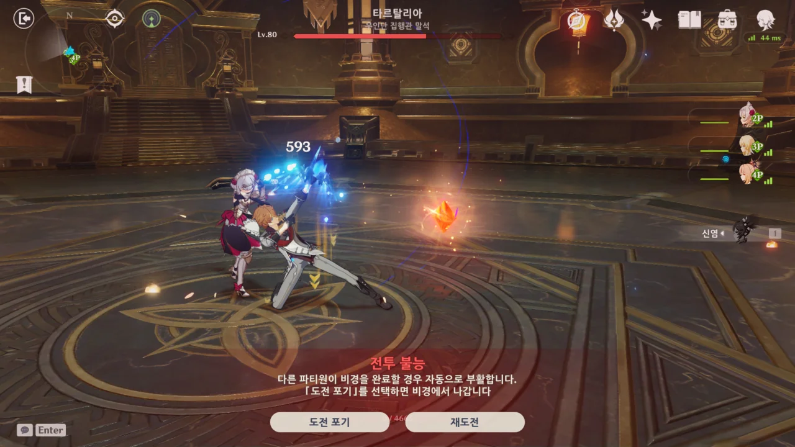

디스코드 채팅방에서 '님들 심심한데 타르탈리아 한 번 가보실?'이라는 말에서 시작된 이야기이다.

&nbsp;

분명 처음에는 '님들 우리 한 번 막장 픽 하나씩 골라봅시다'라고 했을 뿐인데, 다들 어째서인지 하나같이 로리 캐릭터를 골랐다.

그걸 보고 다들 한바탕 대폭소가 터졌고, 웃음이 채 가시기 전에 '님들, 콜? 콜!'을 외치며 그대로 타르탈리에게 돌진했다.

아, 이건 못 참지.



그래서 그 결과가 어떻게 되었냐고?

사유는 궁을 남기고 장렬히 먼저 산화했으며, 디오나 역시 궁을 남기고 그 뒤를 따랐다. 치치와 함께 분투했지만, 그래도 안 되는 것은 안 되더라.

그래도 타르탈리아 2페이즈까지 진입했으니 나름 선방한 것 아닐까?

&nbsp;

전멸 후 같이하던 사람 중 한 명이 자신의 실친에게 이 사진을 보여주었더니 되돌아온 말이 '타르탈리아 유치원'이었다.

틀린 말이 전혀 아니네 ㅋㅋㅋㅋㅋㅋ

***

그다음 우리가 뽑은 막장 픽은 더 가관이었다. 캐릭터의 레벨이 터무니없이 낮은 것은 물론이요, 팀에 힐러조차 존재하지 않았다.

힐을 할 수 있는 것이 내 노엘밖에 없었으니, 파티가 이전보다 더 빠르게 터졌다.

여행자를 고른 사람이 "오, 여행자만 힐을 오지게 받네"라고 말하자마자 여행자가 한 줌 재가 되어버렸고, 착용하고 있던 성유물 상태가 좋지 않은 내 노엘 역시 이윽고 그 뒤를 따랐다.

아마 기억이 맞는다면, 요이미야가 가장 육성 상태가 좋았을 것이다.

&nbsp;

그래도 꽤 재미있었다. 유튜브에서 왜 고인물들이 온갖 변태 세팅을 들고 보스에게 도전하는지 알 것 같더라.
