나는 뭔가 리와인드처럼 '되돌아보는 것'을 굉장히 좋아한다. 단순히 수치 놀음이라고 할 수도 있지만, 보다 보면 기분이 좋거든.

예전에 유플레이가 유비소프트 커넥트로 이름을 바꾸면서 사용자들에게 자신의 유플레이 기록을 영상과 이미지로 쫘아악 보여준 적이 있었는데, 다운로드가 불가능한 그 영상을 기어코 내려받아 소장할 정도이다.

그 영상은 아직도 내 클라우드에 고이 저장되어 있고.

이번에 원신이 1주년을 맞아 플레이어들의 추억을 되살릴 수 있는 이벤트를 기획했다. 이런 게 있을 것이라고는 추호도 기대하지 않았는데.

***

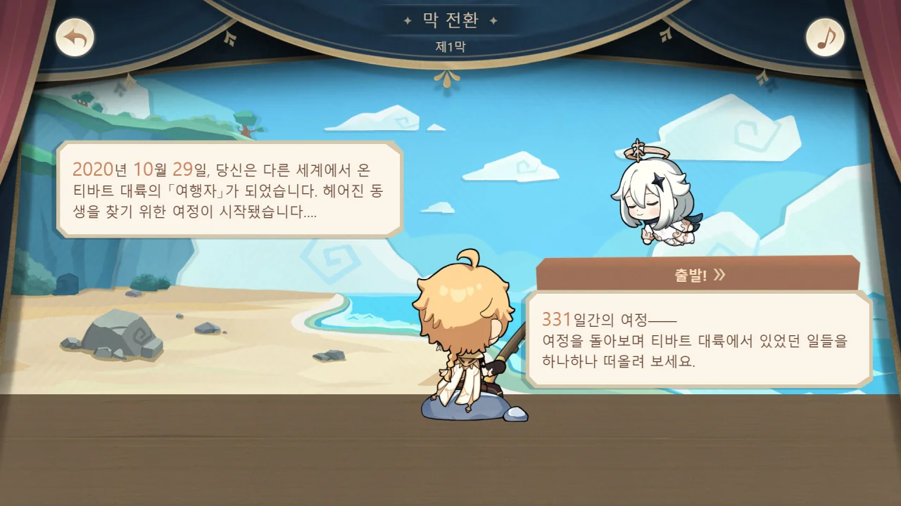

내가 아직도 후회하는 것 중 하나가 남행자를 고른 것이다.

마신 임무나 컷신 등에서 나오는 것은 괜찮지만, 낚시할 때 남행자가 내는 '이이익', '으으윽' 같은 신음이 정말 듣기 싫기 때문이다.

뭐... 이제 와서는 조금 정든 것 같기도 하다.

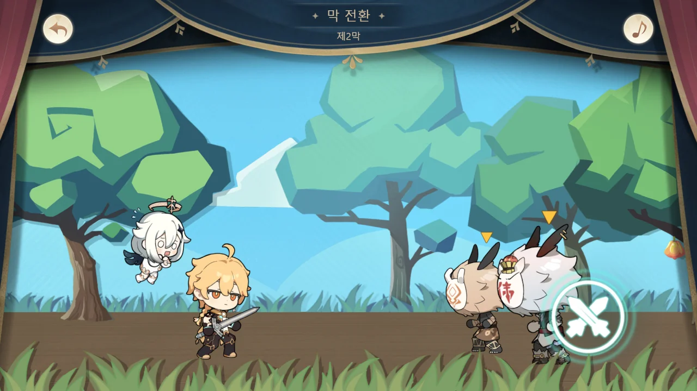

흰색 츄츄족은 류웨이를 상징하는 몹이라고 들었다.

흰색 츄츄족의 가면에 쓰인 한자를 읽으면 '웨이'가 되고, 흰색 츄츄족의 이명 역시 '별장의 재앙'이다.

왜 '별장의 재앙'이냐면, 류웨이가 붕괴 - 정확한 게임 이름은 기억나지 않지만 - 를 서비스할 때 치명적인 실수를 했고, 이를 보상하기 위해 자신의 별장을 팔아치워야 했기 때문이다.

그리고 그걸 셀프 패러디한 것이 바로 저 흰색 츄츄족인 것이다.

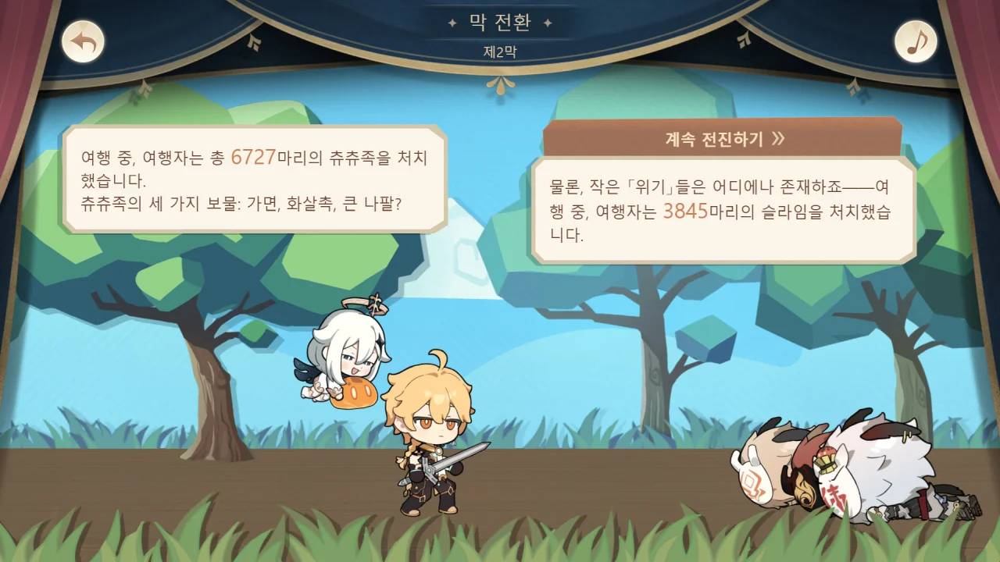

가면, 화살촉, 큰 나팔은 모두 츄츄족을 처치하면 얻을 수 있는 전리품이다.

아, 그게 츄츄족의 보물이었어?

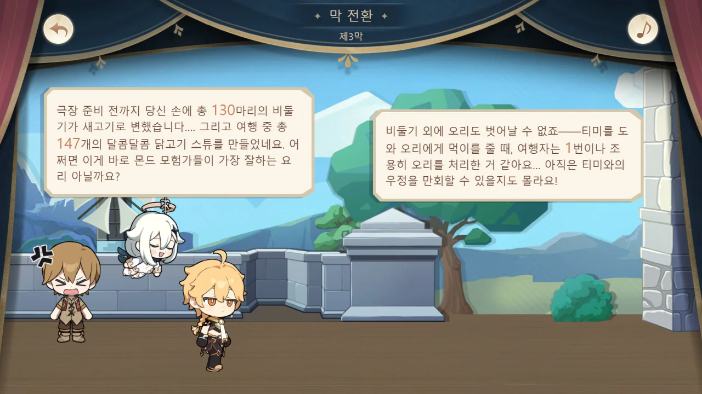

비둘기가 날아갔다고 빼애액대는 티미. 오리를 네 번 죽였을 때부터는 '이미 돌이킬 수 없을지도'라는 말이 나온다고 한다.

고작 오리 네 마리로? 이런 속 좁은 녀석.

&nbsp;

달콤달콤 닭고기 스튜는 쉽게 구할 수 있는 재료로 만들 수 있는 요리였기 때문에, 원신 초반에 내 캐릭터들의 체력을 책임진 음식이었다. 재료는 싼데 채워주는 체력은 많았거든...



디오나가 언짢아하는 이유가 참 재미있다.

디오나가 술을 만들면 아무리 이상한 재료를 넣어도 술이 맛있어진다. 여기까지만 보면 참 축복받은 재능인 것 같지만, 정작 디오나의 목표는 몬드의 주류업 파괴이다.

그러니 영원히 이룰 수 없는 목적을 가진 셈이다.

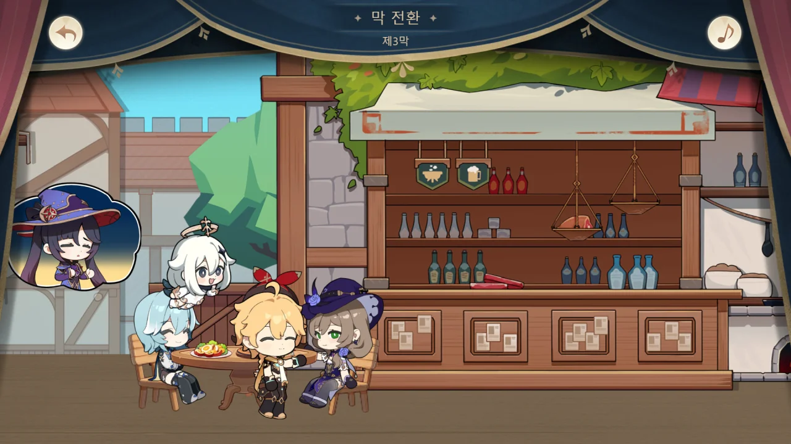

유라, 엠버, 리사가 맛있게 식사하고 있을 때, 모나는 돈이 없어 한숨을 폭폭 내쉬는 것이 얼마나 귀여운지 모른다.

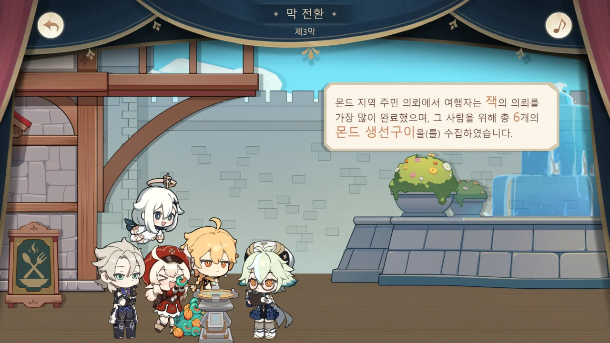

음... 도마뱀 꼬리와 화염꽃 꽃술을 조합하면 아마 폭탄이 되었던 것 같은데.

예전에 금사과 제도 이벤트에서 저 두 재료로 폭탄을 만든 적이 있었는데, 그 효과가 매우 절륜했었다. 아니, 몹이 폭탄을 맞고 증발해 버린다니까?

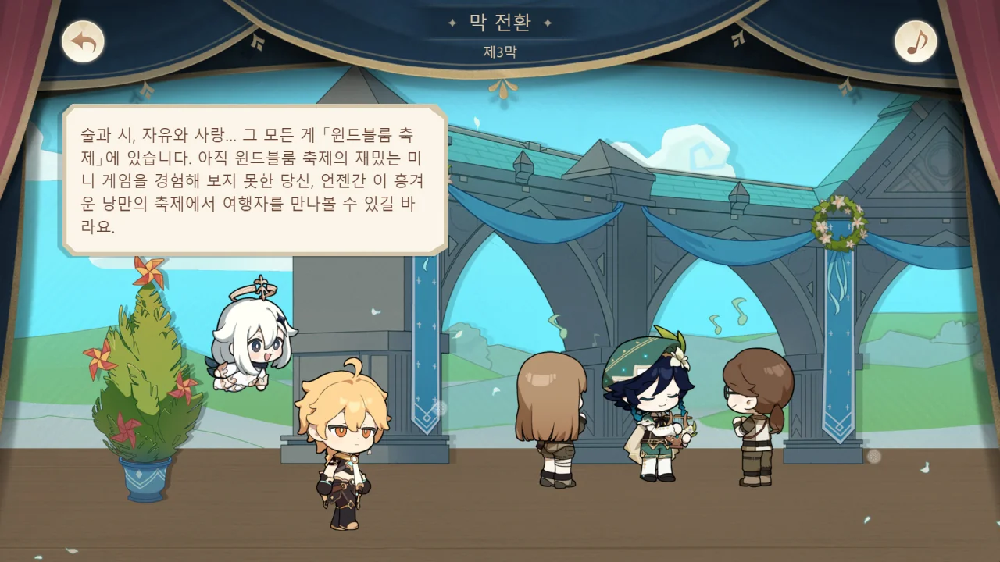

원신을 접은 사이 윈드블룸 축제가 있었던 모양이다.

&nbsp;

내가 제대로 기억하고 있다면, 윈드블룸 축제에서 음식 배달 임무가 엄청난 욕을 먹었던 것으로 기억한다.

음식을 배달할 때, 워프 포인트를 이용해서는 안 되는 것은 물론이요, 뛰어도 안 되고 몹에게 공격받아서도 안 되고, 몹을 공격해도 안 된다.

무조건 걸어서 목적지까지 제한 시간 안에 도달해야 하는, 미친 난이도를 가진 임무였던 거로 기억한다.

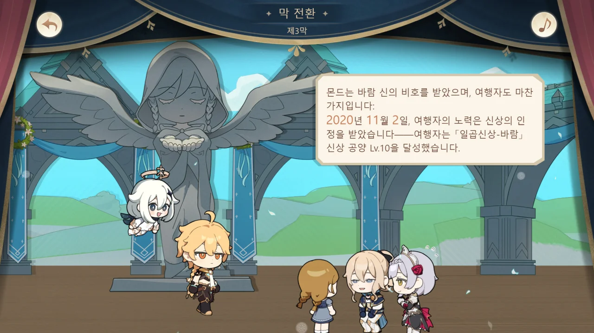

신상을 모두 뚫는 데에는 고작 하루면 충분했다. 하루 날 잡아서 모든 신상을 여니까 되더라고.

다만 중간에 스태미나가 좀 부족해서 애를 먹긴 했었다.

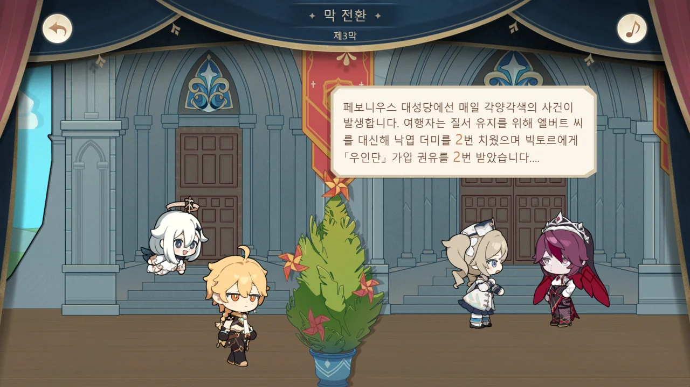

이야, 진짜 SD 캐릭터 하나하나가 다 귀엽다.

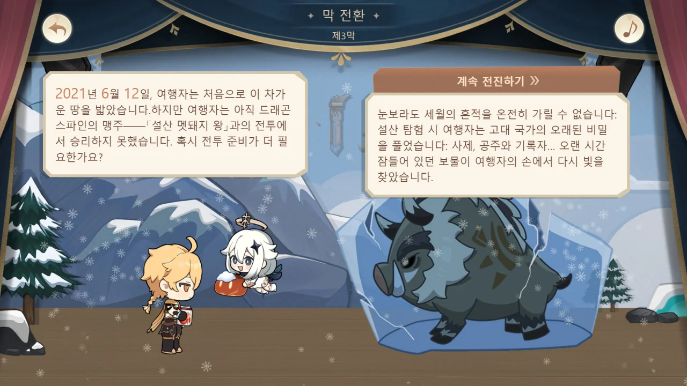

응? 분명 설산 멧돼지 왕을 몇 번 잡았던 것 같은데... 혹시 그게 전부 다른 사람의 세션에서 잡았던 것일까?

나중에 생각나면 설산 멧돼지 왕을 내 세션에서 한번 잡아야겠다.

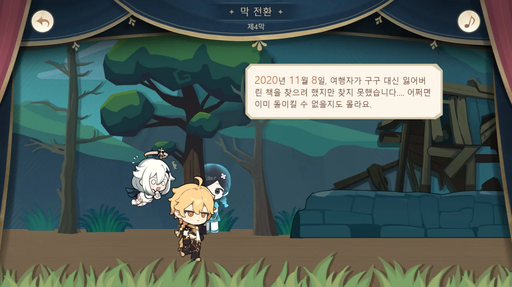

여행자가 구구 대신 잃어버린 책을 찾으려 했다가 찾지 못했다고? 이게 대체 무슨 소리지?

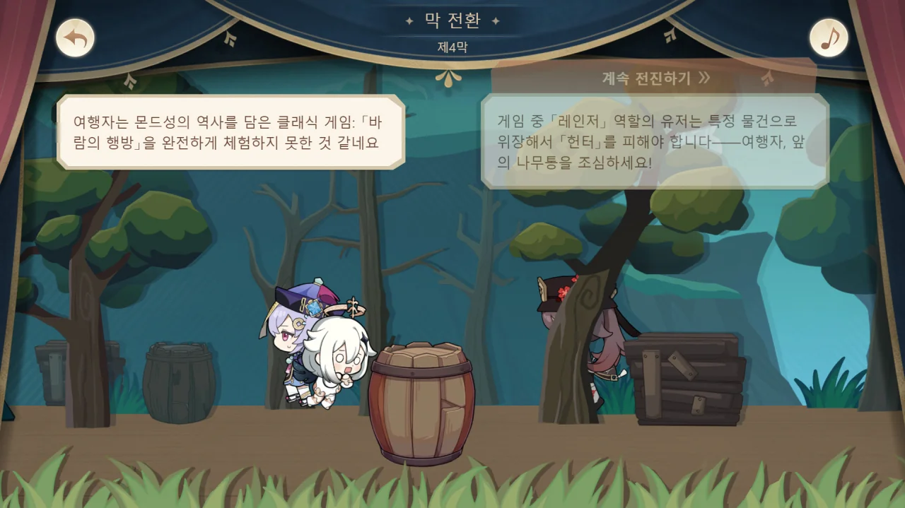

원신판 숨바꼭질인 「바람의 행방」은 내가 원신을 접었을 때 있었던 이벤트라 별로 할 말이 없다.

&nbsp;

치치를 묻으려고 치치를 쫓아가는 호두가 귀엽다. 치치도 귀엽고.

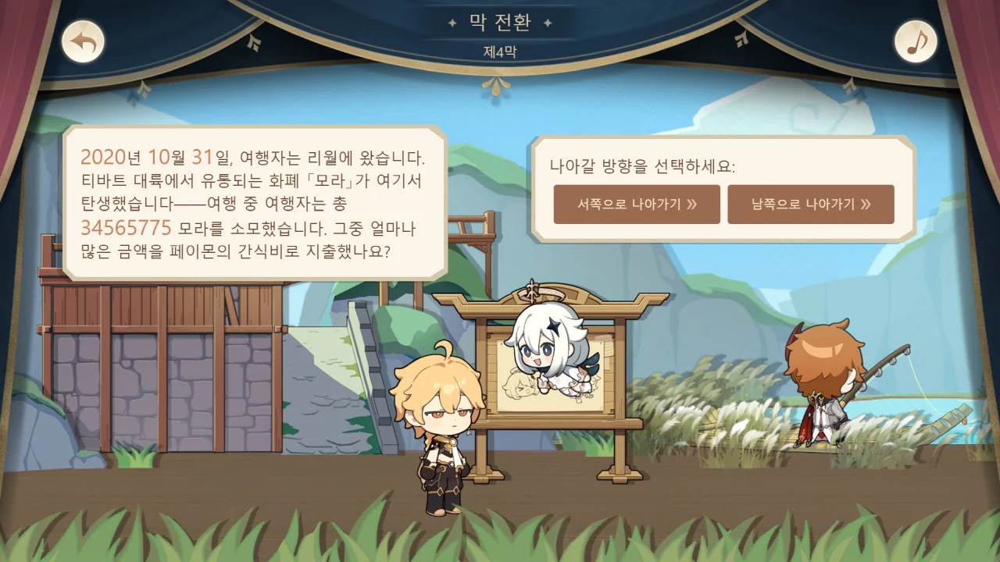

지금까지 3,400만 모라를 썼다고 하는데, 지금 내가 갖고 있는 모라는 고작 60만 모라이다. 모라가 너무 부족해...

그런데 타르탈리아는 왜 여기서 낚시하는 걸까?



해등절 역시 내가 원신을 접었을 때 있었던 이벤트라, 직접 해보지는 않았다.

여행자가 띄워 올린 저 소등이 기관 디펜스를 할 때 필요하다고는 들었다. 물론 그냥 바깥에서 땅바닥에 설치할 수도 있다고 하더라.

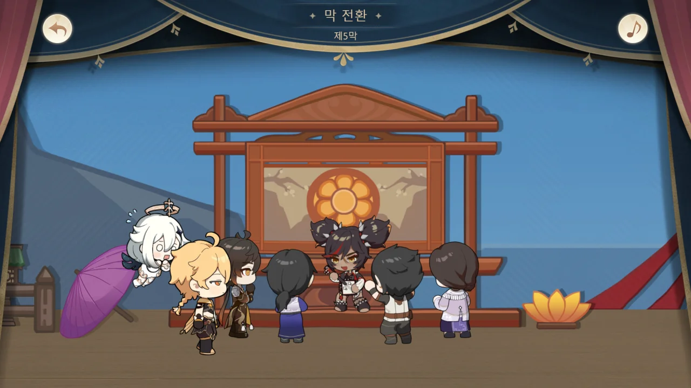

신염의 화끈한 음악 ㅋㅋㅋ

신염은 그 머리 장식 때문에 사람들에게 구라구라꽃이라고 불리곤 한다.

저 머리만 풀면 신염도 나름 이쁠 것 같은데...

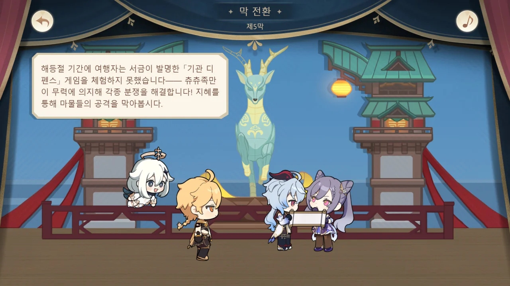

리월의 기관 디펜스는 해본 적이 없지만, 이나즈마의 기관 디펜스는 해본 적이 있다.

친구가 없으면 매우 힘들겠던데?

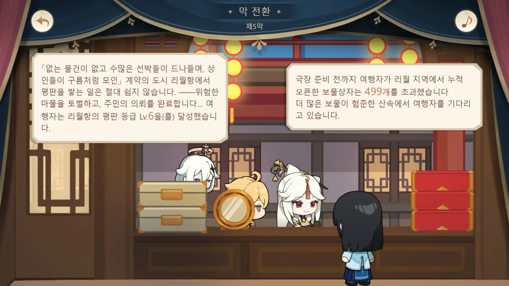

몬드나 리월이나 평판작을 할 때 필요한 아이템을 보상으로 줄 때까지만 평판 등급을 올리고 다른 지역으로 넘어간 터라, 각 지역의 평판 등급이 낮다.

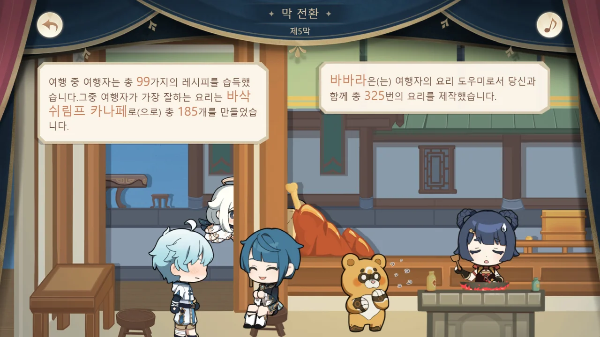

원신 초반에 달콤달콤 닭고기 스튜가 내 팀의 체력을 책임졌다면, 지금은 바삭 쉬림프 카나페가 내 팀의 체력을 책임진다.

닭고기 스튜에 비교할 때 포만도가 올라가는 것에 비해 체력이 덜 차는 것 같지만, 재료를 더 쉽게 구할 수 있어 선택한 음식이다.

어차피 내가 만드는 음식은 회복류 음식이 90% 이상을 차지하니까...

&nbsp;

행추가 생글생글 웃고 중운이 얼굴을 붉히는 걸 보면, 아무래도 행추가 또 중운을 골탕 먹였나 보다.

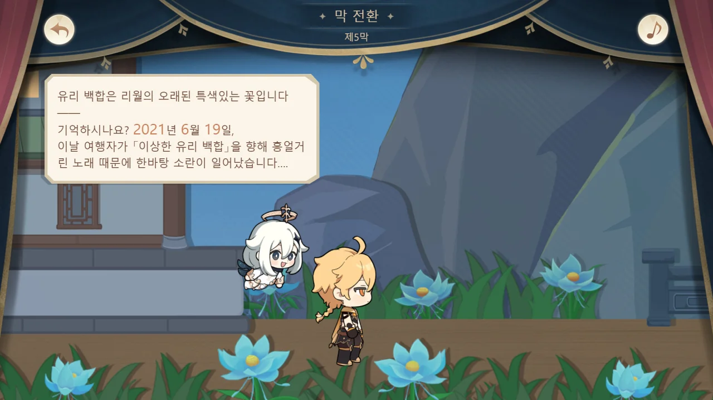

그래, 저 '이상한 유리 백합'. 저 때가 내가 원신에서 남행자를 고른 것을 처음으로 후회한 때였다. 저것 말고도 아야카 전설 임무에서도 비슷한 경험이 있었고.

제발, 노래와 신음은 내지 말아 줘.

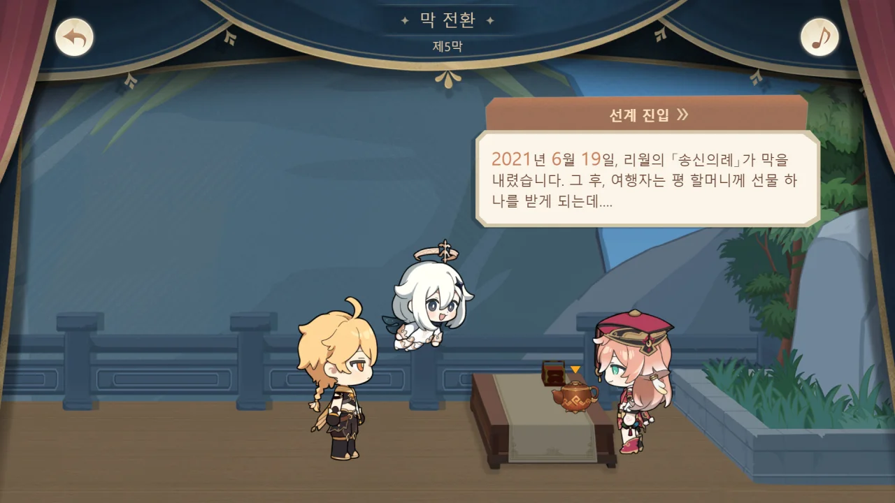

평 할머니 대신 연비가 속세의 주전자를 주네...

나만 그렇게 생각하는 것일지도 모르지만, 연비와 평 할머니를 보면 연비가 평 할머니의 손녀처럼 보인다.

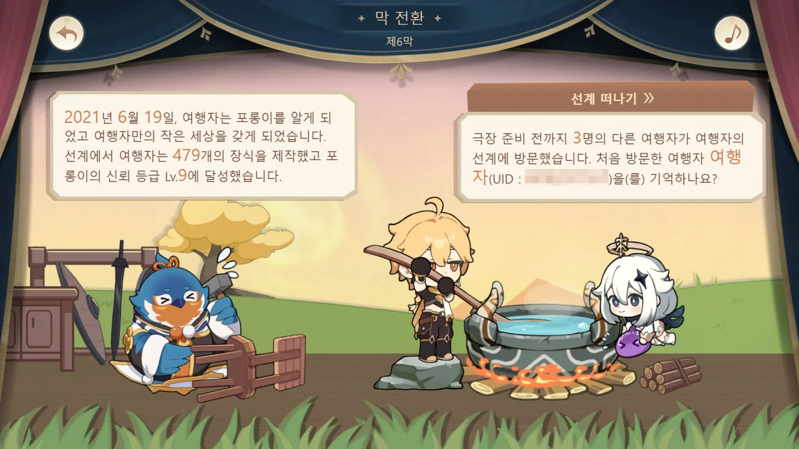

와, 내 속세의 주전자를 처음 방문한 사람도 기록이 되어 있다고?

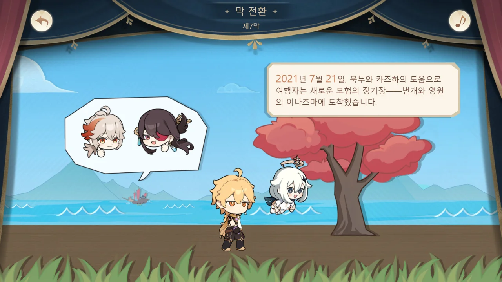

7월 21일이 아마 이나즈마가 처음 업데이트된 날이었을 것이다. 이나즈마가 업데이트되자마자 곧바로 이나즈마로 향했거든.

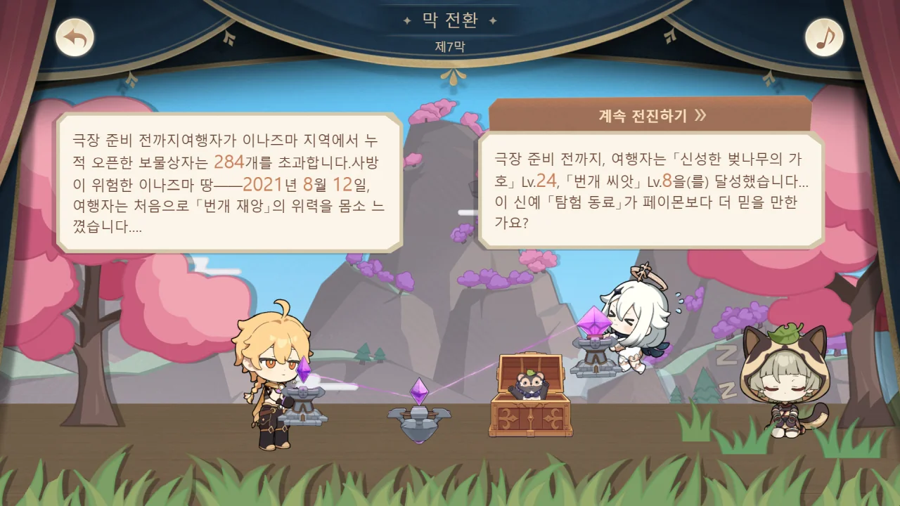

오른쪽에는 원래 달마 인형이 있었는데, 그걸 자꾸 클릭하자 달마 인형 안에서 사유가 튀어나오더니 곧바로 마저 잠들어 버린다.

아, 귀여워라.

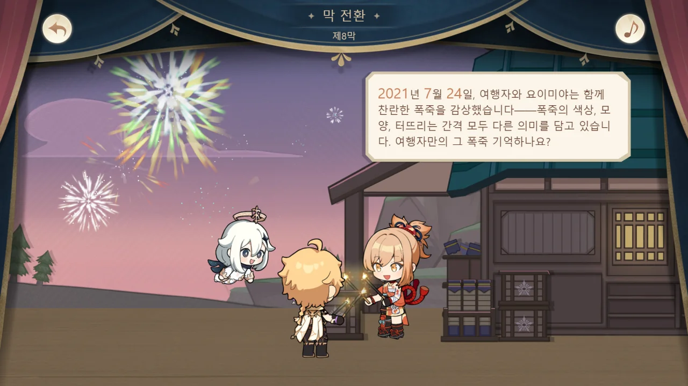

요이미야 옆의 상자를 클릭하면 폭죽이 하늘로 날아올라가 터진다.

그런데 저 '여행자만의 그 폭죽'은 나 말고 모든 원신 플레이어가 다 보지 않았을까?

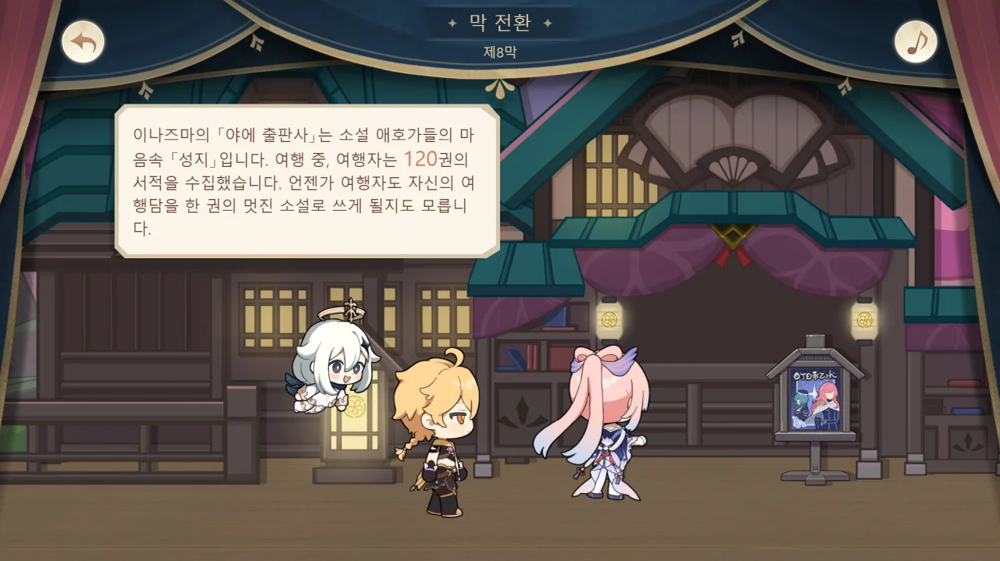

코코미 옆의 간판에는 행추의 소설, '침추습검록' 삽화가 그려져 있다. ㅋㅋㅋㅋㅋㅋ

저 소설의 삽화를 알베도가 맡은 덕인지, 다른 책에 비해 삽화가 매우 화려하다고 하더라.

&nbsp;

책 수집하니까 기억난 건데, 군옥각에서만 구할 수 있는 책이 있다고 한다.

하지만 난 군옥각에서 그 책을 얻지 않은 채 군옥각을 날려버렸고, 그래서 책 수집 100%는 영원히 물 건너가게 되었다.

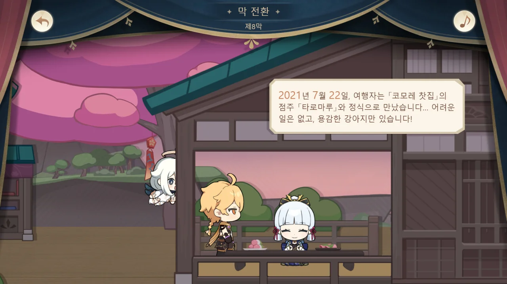

벚꽃 모찌와 삼색 경단은 나도 실제로 한번 먹어보고 싶은 요리이다. 과연 어떤 맛일까?

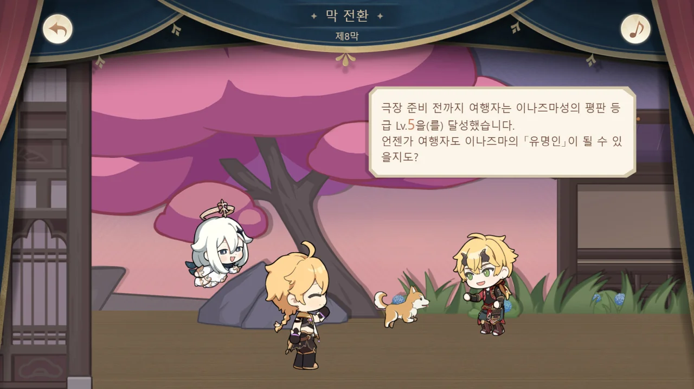

토마가 곧 플레이어블 캐릭터로 나온다고 하던데, 미리 해본 사람 말에 따르면 불 속성 행추라고 하더라.



아니, 왜 라이덴이랑 사라는 얼굴을 안 보여주는데! ㅋㅋㅋㅋㅋㅋ

지금 내가 놓친 번개 신의 눈동자가 2개인데, 어디서 놓친 건지 기억이 도통 나질 않는다. 큰일 났다.

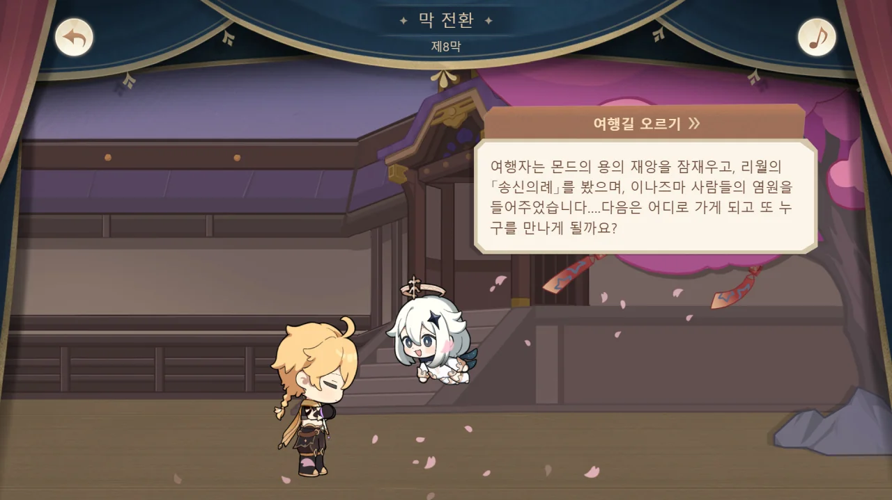

1년 동안 꽤 원신을 즐겁게 했다.

접은 기간 이벤트를 놓친 것이 좀 있지만, 그건 어쩔 수 없는 일이니까.

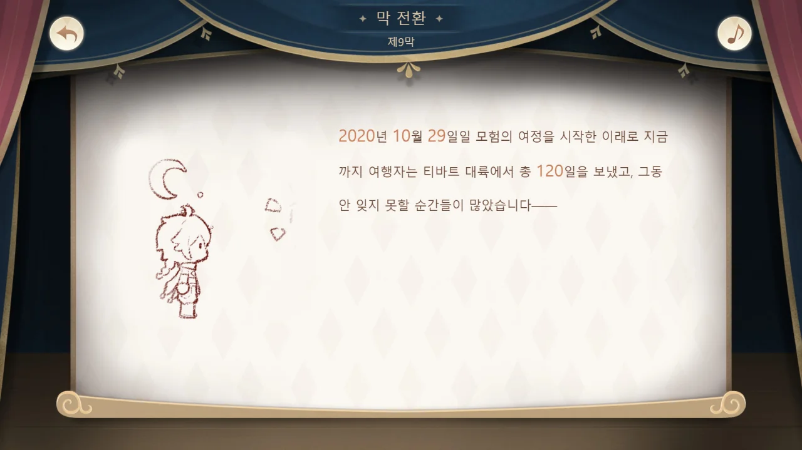

335일 중 120일만 원신을 했으니, 원신을 한 날보다 원신을 안 한 날이 더 많았던 셈이다.

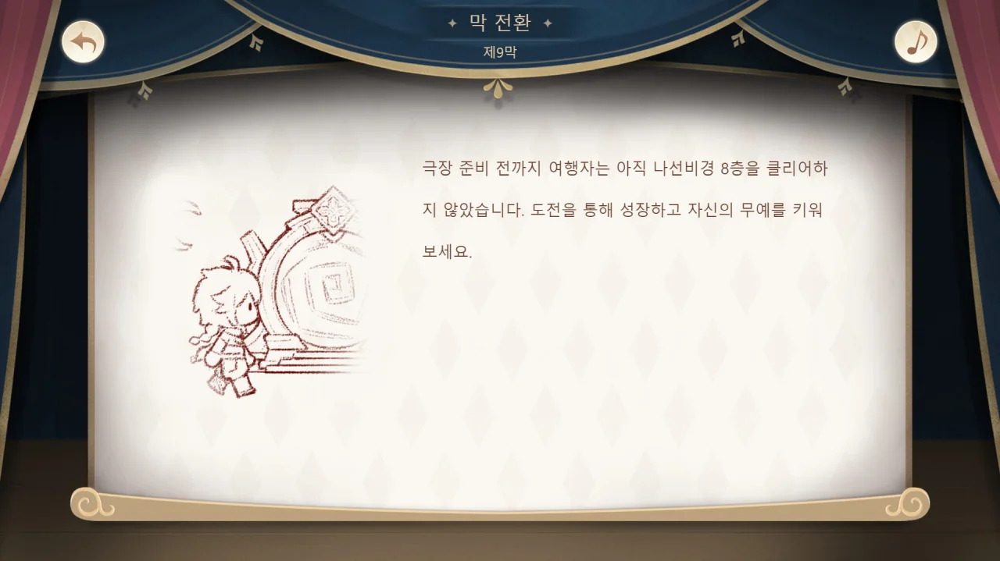

하지만 나선 비경은 두려운걸...



내 기억이 맞는다면, 다이루크가 내 첫 5성 캐릭터였다. 남행자 빼고!

딜이 낭창낭창 시원하게 들어가는 다이루크였던지라, 열심히 키웠고 지금도 잘 쓰고 있다.

&nbsp;

나중에 호두가 복각하면 호두를 뽑고 호두를 쓸 생각이지만. 아마 그렇게 된다면 다이루크는 두 번째 파티로 갈 것 같다.

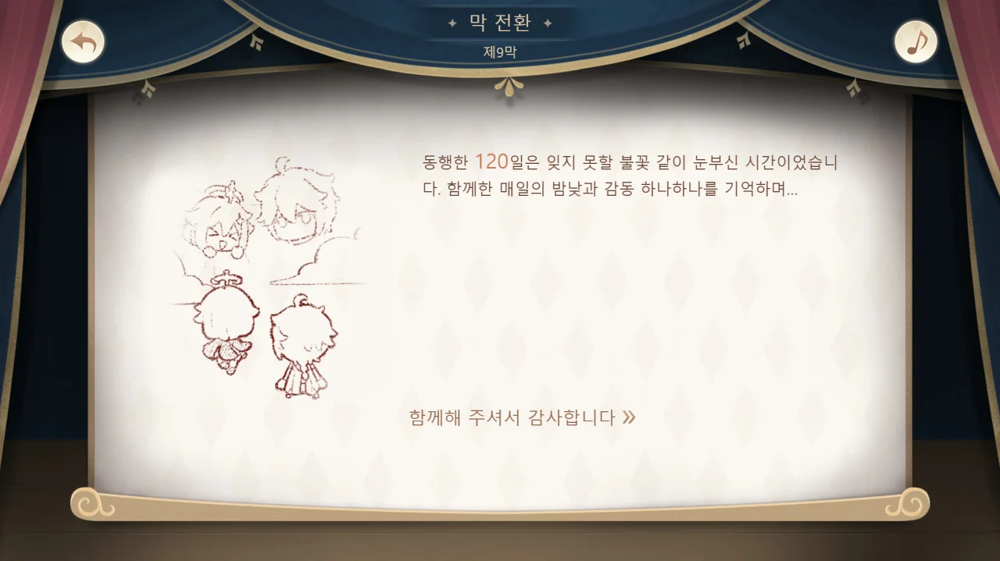

끝.
