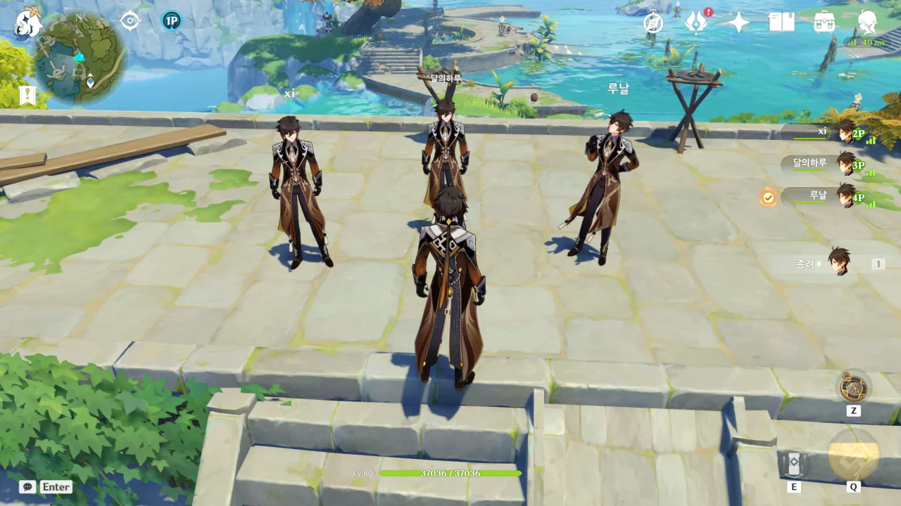
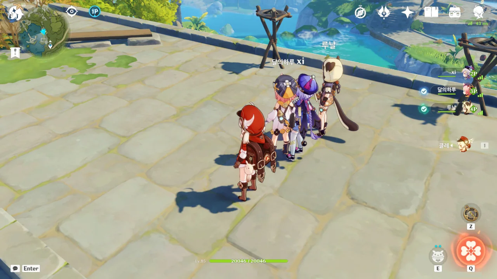
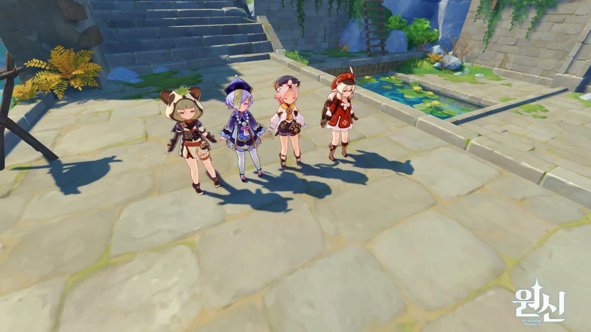
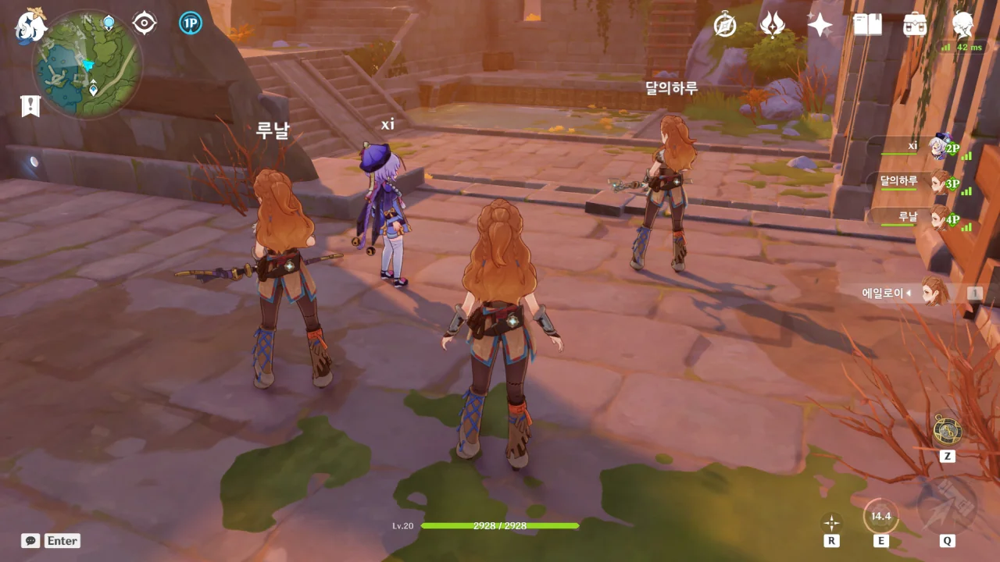

원래 계획은 '달의하루'님과 단둘이서 필드를 돌아다니며 몹도 잡고 광질도 할 생각이었다.

그런데 갑자기 파티에 두 명이 추가되었다. 오히려 좋아.

누군가 "4종려 파티 가볼래요?"라고 말하자, 다들 말없이 종려를 꺼내 들었다.

뭐요? 관홍의 창? 내가 5성 무기를 뽑을 리가 없지 않은가. 난 그런 거 이미 포기한 지 오래라고.

&nbsp;

뭔가 컨셉을 잡고 사진을 찍으려면 오래 걸릴 것 같아, 그냥 대충 찍었다.

[예전]()에도 한 번 했었던 4로리 파티. 클레, 디오나, 치치, 사유 이렇게 넷으로 돌아다니면 훌륭한 4로리 파티가 된다.

그런데 이 파티도 나름대로 실용성이 있지 않을까? 클레가 딜러를 맡고, 치치가 힐러를 맡는다. 디오나는 실드를 걸어줄 수 있으며, 사유 역시 서브 딜러 겸 서브 힐러를 맡을 수 있다.

꽤 괜찮은 것 같은데, 언제 한번 진지하게 이 파티를 실전에서 써보는 걸 고려해 봐야겠다.

대충 찍었다.

***

그리고 대망의...

&nbsp;

&nbsp;

&nbsp;

&nbsp;

공포의 에일로이 파티.

진지하게 에일로이를 키워 본 사람의 말에 따르면, 4.5성 정도의 성능을 갖고 있다고 하더라. 하지만 굳이 감우가 있는데 에일로이를 키워야 할 이유가 있을까?
