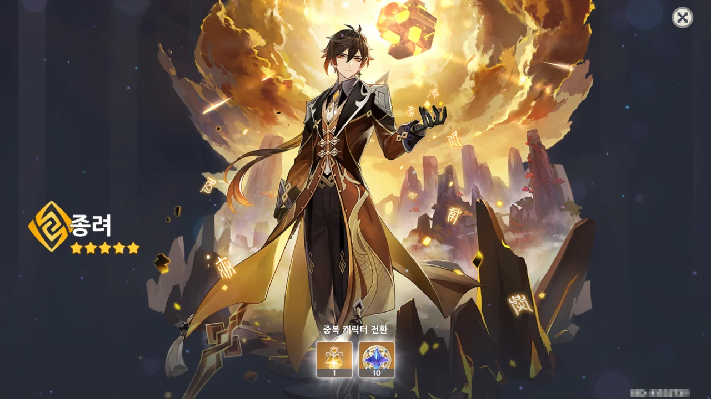

슬슬 천장을 칠 때가 다 되었는데 계속 종려가 나오지 않아 전전긍긍하고 있었다. 드디어 나와주었구나.

이제 남은 원석과 인연은 야에 미코를 위해 남겨두어야만 한다. 다음 픽업에 카즈하도 나온다고 하던데, 야에 미코가 너무 이쁘니 야에 미코를 뽑을 생각이다.



아무 생각 없이 벚나무에 갔다가 번개의 인장이 한참 쌓인 것을 발견했다. 그걸 전부 벚나무에 바치니, 번개 씨앗 레벨이 13이나 올랐다. 그리고 인연도 꽤 많이 받았다.

하지만 벚나무가 준 인연에서는 전부 3성 무기만 떴다.

슬슬 상시 픽업에서도 천장을 칠 때가 다 되지 않았나?

상시 픽업 천장에서 늑대의 말로가 나온 적이 있어 기대하지 않을 수가 없다.

&nbsp;

치치? 나오면 오히려 좋다. '유치원 파티' 혹은 '로리 사인방'이라고 부를 수 있는 '클레 + 디오나 + 치치 + 사유' 파티를 꾸릴 수 있으니. 나머지는 다 있는데 치치만 없다.

&nbsp;

저번에 내가 이야길 했나 모르겠지만, 단순하게 생각해 보면 저 파티 역시 나름 잘 써먹을 수 있는 파티가 아닐까 한다.

클레가 불 속성 딜러를 맡고, 치치가 힐러를 맡는다. 디오나가 실드를 맡고 사유가 서브딜 및 서브힐을 맡는다.

디오나와 치치 둘 모두가 얼음 속성이니, 치명타 수치도 보정을 더 받을 것이다.

&nbsp;

이건 언제 치치가 나오면 진지하게 날 잡아서 조합을 연구해 봐야겠지만, 치치가 없다.
