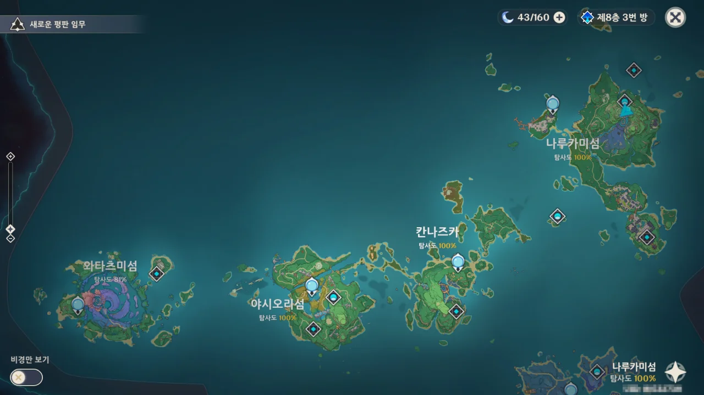

내 기억이 맞는다면, 신성한 벚나무의 가호 최대 레벨이 50일 것이다.

지금 가호가 44레벨이니, 고작 6레벨밖에 남지 않았다. 번개의 인장으로 따지면 약 150개 정도가 남았다.

원래라면 리월의 탐사도를 먼저 채웠어야 했지만, 리월이 너무 넓었기에 그냥 쉬워 보이는 이나즈마 먼저 탐사도를 채우기로 했다.

&nbsp;

그래서 나루카미 섬, 칸나즈카, 야시오리 섬 세 곳의 탐사도를 100%로 채웠다.

와타츠미 섬은 지금 탐사도를 채우고는 있지만, 평소에 무슨 상자를 열었고 무슨 퍼즐을 풀었는지 체크해 두지 않아 기록에 난항을 겪고 있다.

&nbsp;

원신을 거의 1년 정도 했으면서도 이제서야 알게 된 것이 하나 있다.

빠르고 정신없이 돌아다니는 번개 선령을 놓쳤다면 그냥 그 자리에서 로그아웃했다가 다시 돌아오면 번개 선령이 맨 처음 위치로 돌아가 있다.

&nbsp;

번개 선령 하나가 와타츠미 섬 내부를 한 바퀴 빙 돌기에 무슨 이런 거지 같은 퍼즐이 있나 속으로 욕을 한 바가지 쏟아부었는데, 마지막에 상자를 세 개나 주더라.

그걸 보고 '아, 그럴 수도 있지.'라고 생각해 버렸다.

&nbsp;

돌이켜 생각해 보자니, 이렇게 탐사도를 올리는 건 원래 할 것이 더럽게 없을 때나 할 생각으로 아껴둔 것이었다.

하지만 상자를 열면 주는 원석을 아득바득 모아 야에 미코를 뽑을 정도의 원석을 모아야 한다.

지금까지 탐사도를 열심히 올려 10 연차 분량의 원석을 모았는데, 야에 미코를 뽑기 위해선 최소한 70에서 80 연차를 할 수 있을 만큼의 원석을 모아야 한다.

으... 내가 과연 야에 미코를 얻을 수 있을까?
