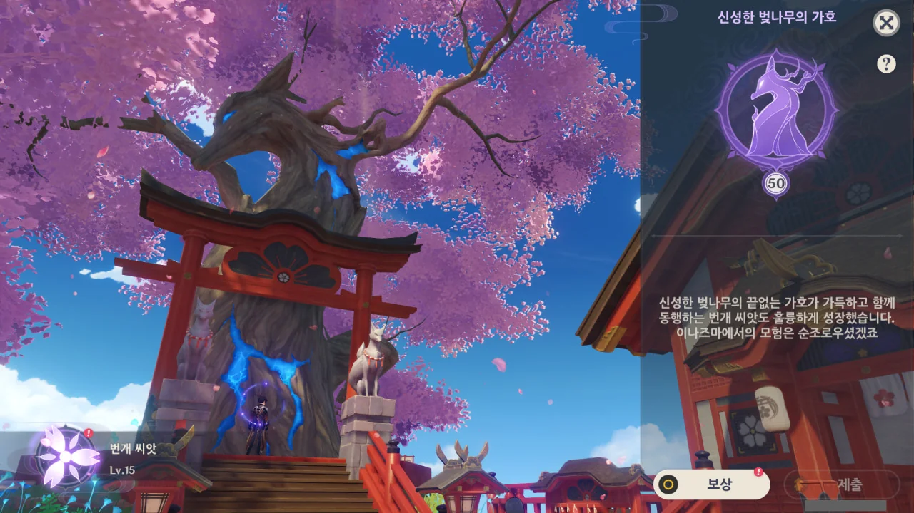
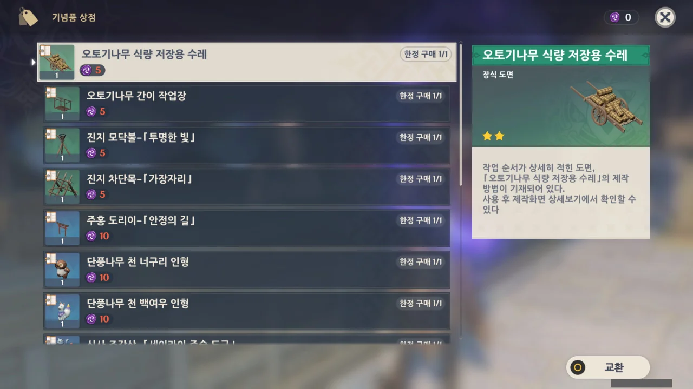

드디어 신성한 벚나무의 가호 만렙을 찍었다.

사실 벚나무의 가호 만렙은 이나즈마 탐사도를 올리다가 덩달아 달성한 것에 가깝다.

상자를 열면 탐사도가 오르고, 번개의 인장도 나온다.

그게 하나둘 쌓이고 쌓여서 50레벨이 된 것이지.



업적도 하나 깼고, 새로운 상점도 열었다.

이나즈마에 기념품 상점이 없었다는 걸 왜 이제야 안 것일까?

다만 기념품 상점에서 파는 건 그렇게 좋아 보이지 않는다. 선계 꾸미는 용도로 장식 도면을 팔긴 하지만, 탁월하게 이쁜 건 없는 것 같다.

하기야 몬드나 리월도 기념품 상점에서 무기 원형 같은 귀중품을 사고 나면 나머지 항목은 '굳이 이걸 사야 하나?' 싶은 물건들밖에 없긴 하지.

