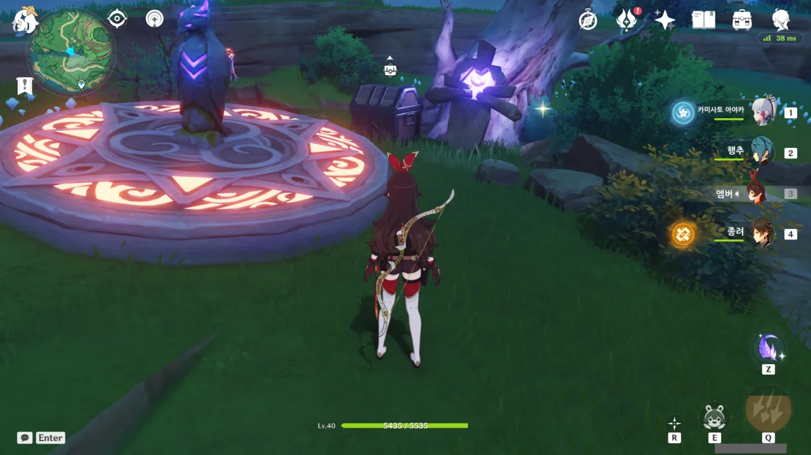

원래 사진을 찍을 생각이 전혀 없었지만, 어쩌다 보니 이나즈마의 섬 중 탐사도가 100%가 아닌 섬이 츠루미 섬 하나밖에 남지 않게 되었다.

기왕 하는 거, 사진도 좀 찍으면 나쁘지 않을 것 같아 사진을 찍었다.

&nbsp;

다만 츠루미 섬은 아주 예전에 섬을 돌아다니며 별생각 없이 월드 임무를 조금씩 진행해 둔 탓에, 옛날에 어디까지 했는지를 기억하는 건 매우 어려울 것 같다.

바로 이 두 꼬맹이처럼 말이다.

처음 나온다는 장소에 없어, 다음 장소에 갔더니 거기에도 없더라. 그래서 그다음 장소에 갔더니 거기에 이 녀석들이 있다.

이걸 공략 없이 했다면 대체 얼마나 헤맸을까?

그만 싸돌아다녀!

심지어 이 두 유령이 있는 곳은 츄츄족이 야영 중인 곳이다.

뇌조가 있을 때는 츄츄족이 여기 살지 않았던 건가? 그래서 겁도 없이 이런 곳에 오는 건가?



다행스럽게도 여기가 마지막이었던 모양이다. '우나 할머니'에게 드리라며 무슨 아이템을 준다.

마침 다음으로 찾아갈 유령이 '우나'였기 때문에, 곧바로 우나에게 향했다.





우나 할머니와 이야기하자 벚꽃 수구를 3개 준다. 아마... 이게 저 두 꼬맹이 유령과 놀아줄 때 썼던 벚꽃 수구의 개수와 동일할 것이다. 아니더라도 별 상관은 없지만.

&nbsp;

하지만 이 유령, 하루만으로는 만족하지 못하는 것 같다. 공략을 찾아보니 5일 동안 매일 찾아가야 한다고 되어 있다.

뭐요?



다음은 보물 지도와 관련한 유령.

인벤토리에 이미 임무 아이템이 있기에, 첫 번째 장소의 소라는 이미 먹은 것으로 생각했다.

그런데 두 번째 장소에도 소라가 없다. 아니, 인벤토리에 있는 보물지도 조각은 그럼 뭔데?

세 번째 장소에 가니 소라가 있다. 이 소라를 보고서야 난 내가 첫 번째 장소를 덜 상세히 살펴봤음을 깨달았다.

'나 여기 있소'라고 반짝반짝 빛나는 것도 아니고, 그냥 푸른색 형광으로 빛나기만 하는데, 내가 그걸 보고 '아, 이건 먹을 수 있는 거구나'라고 어떻게 아냐?

그래도 한두 번 찾으니 요령이 생겨, 세 번째와 네 번째 조각도 모두 찾아냈다.





시토키에게 모든 지도 조각을 건네주자, 완전한 보물 지도를 주고는 사라졌다.

지도에 표시된 곳에 가보니 보물상자가 있다.



이다음은 숨바꼭질의 달인, 논노를 보내기로 했다.

이 녀석 역시 처음 있던 장소에 있는 것이 아니라, 서너 번째 장소에 있어 찾는데 한참 곤욕을 치렀다.



이름을 보자마자 흠칫했던 '치세'.



치세는 뇌석을 모두 켜야만 성불시킬 수 있다.

분명 모든 뇌석을 다 켠 것 같은데, 무슨 뇌석이 아직 켜지지 않은 것인지에 대한 힌트가 아무것도 없어 결국 지도 사이트를 열어 뇌석을 하나하나 체크해 가며 아직 하지 않은 뇌석을 골라내야만 했다.



뇌석을 찾던 도중 발견한 도전. 이건 못 참지.

번개 란란루도 도중에 좀 잡았다.



뇌조 석상에 깃털을 쓰니 뭔가가 나타났다. 주위를 둘러보니 불 받침대가 있어 곧바로 앰버로 불을 붙였다.

상자는 언제나 옳다!

뇌조 석상에 깃털을 쓰니 나타난 뇌석과 번개 씨앗 나무.

활성화한 뇌석의 수가 모자라면 이렇게 "남은 시간이 별로 없다"라며 중얼거리는 것이 고작이다.

분명 모든 뇌석을 다 찾은 것 같은데, 저 대사를 자꾸만 해대니 돌아버릴 것만 같다.

심지어 게임을 껐다 켜도 그대로이다.

&nbsp;

한참 동안 뇌석만 찾다 보니 저절로 머릿속에 한 짤이 떠오르더라.



치세가 날 엿먹이는 것이 분명했다.

&nbsp;

그런데 지도 사이트에 한 번 더 뇌석을 하나하나 체크해 보니, 정말로 하나를 놓친 것이 맞았다.

인간의 기억력은 믿을 것이 못 된다.



뇌석을 찾던 중, 이상한 현상을 발견했다.

분명 보이지 않던 사물들이 조금만 앞으로 가면 뿅 나타난다.

LOD 설정을 잘못한 것 같다.

아무튼, ~~구름 쫒는~~  치세를 성불시키는 데 성공했다.

나는 뇌석을 다 활성화할 때 업적이 깨지는 건 줄로 알고 있었는데, 치세에게 말을 걸어야 깨지더라.

61개인지 71개인지 모를 수많은 뇌석을 전부 활성화하는 데 성공했다.

일부 뇌석은 수풀 속에 몰래 숨겨놓는 등, 찾기 어렵게 만들어 두었는데, 진정한 인간의 악의가 무엇인지 맛볼 수 있었다.

다음 유령은 낚시를 해야만 나온다고 한다. 일단 낚시를 조금 해보자.

첫 낚시에서 찢어진 책의 페이지를 건져 올렸다.

일부 책의 페이지는 이렇게 낚시를 해야만 나오기 때문에, '모아야지 모아야지' 생각만 하다가 결국 안 하게 되었다.

낚시터의 모든 물고기를 낚았음에도 유령이 나타나지 않자, '뭔가 이상한데'라고 생각하며 낚시 모드를 종료했더니 그제야 유령이 "아직 부족하군"이라며 나타난다.

뭐요? 낚시터의 모든 물고기를 낚았는데도 아직 부족하다고?



뭐라고? 낚시로 잃어버린 물건을 찾자고?

그거 정말 바보 같은 생각이네. 당장 하자.

지도 사이트의 공략에 따르면 저곳이 낚시터가 될 예정이라고 한다. 그런데 몹이 좀 많네.

어쩔 수 없지. 청소하는 수밖에.

&nbsp;

청소라고 말하니 갑자기 노엘이 생각났지만, 노엘은 원신 극초창기에나 쓰고 잊힌 캐릭터이기 때문에 여기서 노엘을 꺼냈다간 노엘이 몹에게 맞고 비명횡사할 것 같아 그만두었다.

응? 내가 여기엔 온 적이 없었던가? 선령을 잔뜩 위협하는 츄츄족 두 마리가 있다.

내가 여기에 예전에 왔었더라면 분명 저 츄츄족들을 쓸어버리고 선령을 졸래졸래 따라갔을 텐데...

아무래도 여긴 정말 처음 오는 것인가보다.

그렇게 뒤따라간 선령은 평범한 보물상자만 줬다. 뭐, 선령을 따라 이동한 거리가 짧으니 그럴 수는 있지.

확실한 건 아니지만, 선령을 오래 따라가거나 복잡하게 따라갈수록 나오는 보상의 품질이 올라가는 것 같다.

겸사겸사 옆에 있던 나침반 퍼즐도 풀어버렸다.

몸에 번개 원소를 묻히기 위해 번개 광맥에 몸을 좀 비볐더니 대미지가 꽤 아프게 들어오더라.

아마 틱당 1,000씩 들어왔을 것이다.

남은 츄츄족을 모두 제거한 후, 상자를 획득했다.

뇌조 석상을 활성화하니 낚시터가 나타난다.

낚시를 본격적으로 시작하기 전에, 주변을 정리할 목적으로 모라가 든 상자 같은 아이템을 먹는 중인데... 이게 뭐야, 새고기?

설마 이거, 새가 물에 잘못 착지해서 그대로 새고기가 되어버린 건가? 이유는 몰라도 그런 일이 자주 있더라고.

낚시 단 한 번 만에 임무 아이템 획득 완료.

이제 이페도 뱃사공에게 보낼 수 있다.

&nbsp;

&nbsp;

이제 다음 유령이 마지막일 텐데...







이 사람은 운이 정말로 없다. 이 정도면 살아있는 게 용하다고 할 정도인데?

아, 이미 죽었지, 참.



하지만 그 모든 불운이 저 말 한마디로 인해 정당화된다.

뭐요? 외부인은 현지 영혼들의 분노를 안 살 것 같으니 대신 무덤을 파달라고?

무덤의 위치는 여기다.

외부인은 저주를 안 받기는 개뿔이. 하필이면 제일 상대하기 귀찮은 번개 츄츄왕이다.



기껏 일을 대신 해결해 줬더니 비웃는 인성.

제발, 제발 한 대만 패게 해줘.



이 썩을 놈이. 알고 보니 이 모든 게 다 거짓말이었다고 한다.

그냥 이 녀석은 먼지 나도록 패서 영멸시키면 안 될까?

심지어 미안하다고 상자를 주긴 줬는데, 그마저도 비어있었다.

이런 개 $%#@&#$%@

아무래도 우나 할머니를 보내야만 뱃사공의 대사가 바뀔 것 같다.

그러면 5일 동안 할머니만 보면 되는 건가?
