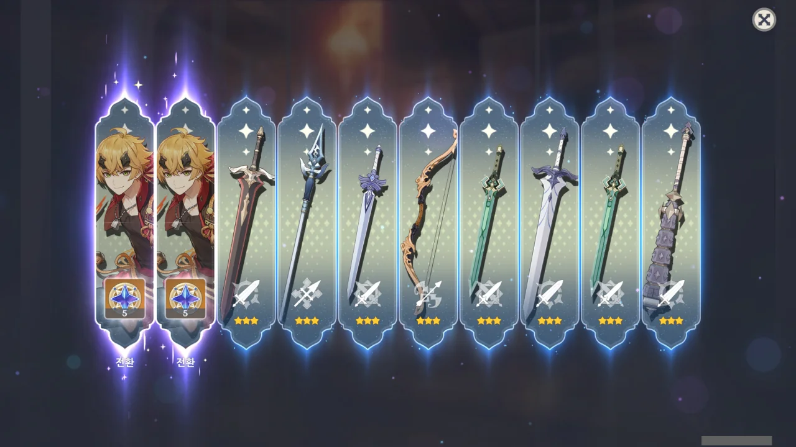
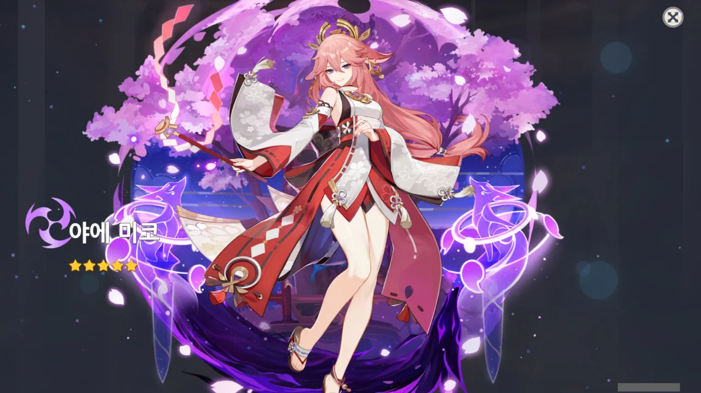

말해 무엇하랴. 더 이상 참지 못하고 또 가챠를 돌렸다.

그리고 그 결과, 내 통장이 녹았다.

안녕, 카페인.

&nbsp;

사실 20연차만 더 하면 70연차가 되고, 그러면 일반적으로 5성이 나온다. 시기가 적절했다.

&nbsp;

모나가 나오기 전까진 말이다.



이런 개 @%&@#%&@#@#$&$%%@$#%$#@&%!@&\*%$&\*$#@&\*$@

&nbsp;

이번 가챠를 통해 여러 캐릭터가 6돌이 되었다. 물론, 내가 원한 결과는 절대로 아니었다. 절대로.



피슬과 토마가 6돌이 되었다. 이번 가챠에서만 말이다!

특히 토마 이놈이 제일 악질이다, 악질!

대체 난 이 화면을 몇 번이나 봐야 했던 것일까? 안 돼요 싫어요 나오지 말아요 @#$&@#$&$

&nbsp;

그래, 좋게 말해 토마도 나쁘진 않다.

&nbsp;

종려만 없었다면 말이지. 다른 캐릭터를 육성하느라 바빴을 때, 다른 사람들이 토마를 써보고 하는 말이 하나같이 "전반적으로 종려 하위 호환 캐릭터"였다.

이미 종려가 있는데 왜 또 토마를 키우겠는가? 냉큼 육성 우선순위 리스트에서 토마를 빼버렸다.

필요하면 나중에 키우면 되니까.

&nbsp;

뭐, 피슬도 자주 나오긴 했지만, 피슬은 단차에서 많이 나온 터라 토마처럼 충격이 강하진 않았다. 게다가 나온 빈도도 토마가 더 압도적으로 많았고.

토마 중복에서 나온 스타라이트로만 10연차를 돌렸다고!

&nbsp;

&nbsp;

&nbsp;

&nbsp;

&nbsp;

&nbsp;

&nbsp;

최근 들어 꼬움 수치가 급격히 상승하고 있다.

내 통장이 멸망하는 게 빠를까, 내가 꼬움을 참지 못하고 원신을 접는 게 빠를까?

안 그래도 약 반년 동안 원신을 접은 경험이 있거든. 한 번이 어렵지, 두 번이 어려울까?

&nbsp;

그래도 이번 가챠와, 멸망한 내 통장에 아무런 의미가 없는 건 아니었다. 이번만큼은 말이다.

뽑았거든.
