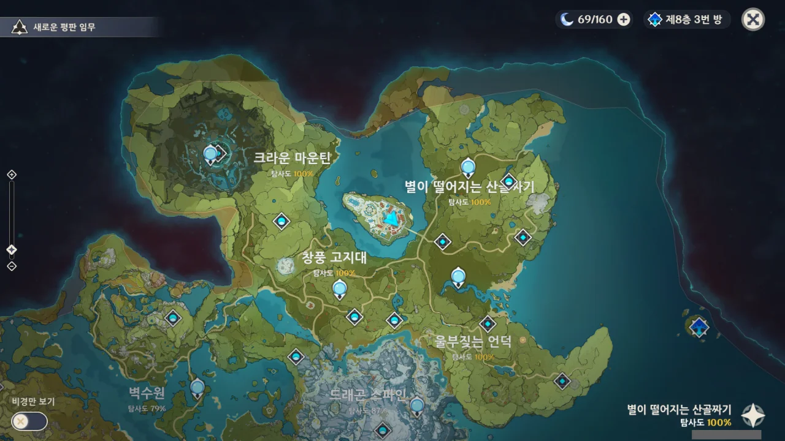

드디어 몬드 탐사도 100%를 찍었다.

드래곤 스파인 탐사도는 제외 하자. 이전에 이나즈마 탐사도를 100%라고 했을 때도 연하궁은 제외하지 않았는가?



별이 떨어지는 산골짜기 탐사도를 100% 채우기가 더럽게 어려워서 검색을 해보았더니, 어떤 고마운 사람이 [잘 정리](https://arca.live/b/genshin/25005074)를 해주었다.

덕분에 다시 갈 것이라고는 생각조차 못 한 이 섬에 다시 가게 되었다. 부채를 쓰고 활공했는데도 스태미나가 모자라더라.

심지어 사진에서 볼 수 있듯, 익사하기 일보 직전까지 갔다.

비행 중 스태미나를 채우는 음식을 먹었기 때문에, 2분 정도를 저렇게 물에 둥둥 뜬 채 기다렸다가 스태미나를 채우는 다른 음식을 먹고서야 섬에 상륙할 수 있었다.

그리하여 거짓말처럼 몬드 탐사도 100%를 달성했다.

드래곤 스파인은 일단 외곽부터 천천히 상자를 체크해 가며 하나씩 먹고 있다. 그런데 실제 먹은 상자의 개수가 약 140개 정도임에도 불구하고 지도 사이트에 먹은 것으로 기록한 상자 개수가 10개가 채 되지 않는 상황이다.

벌써 머리가 어질어질하다.
