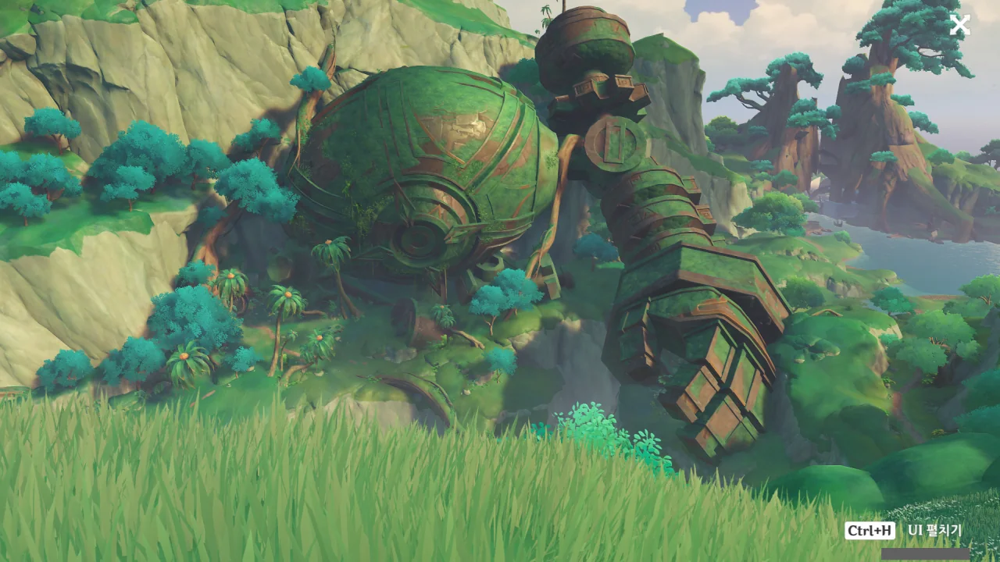
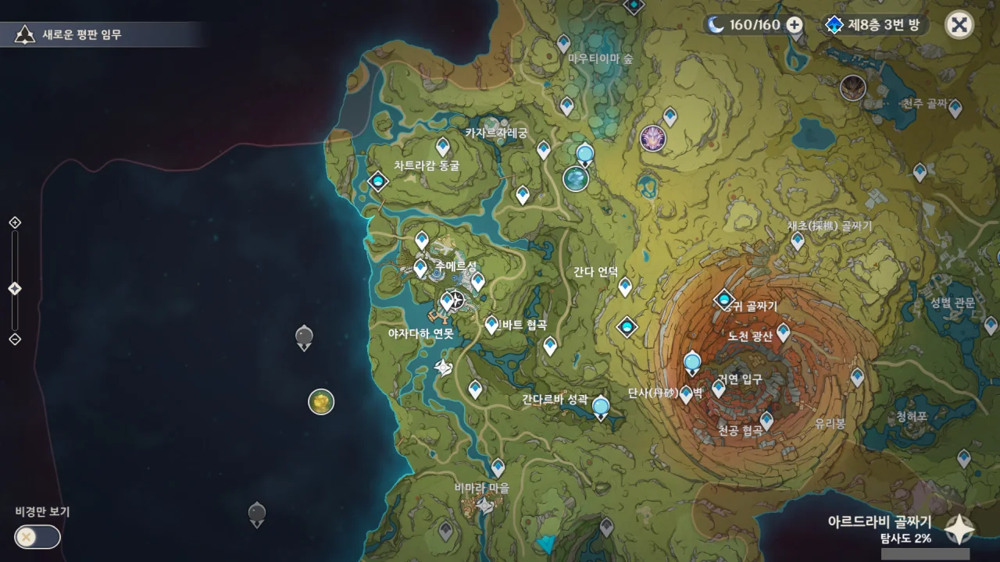

오늘 정오에 수메르가 열리긴 했는데, 내가 원신을 켜서 제일 먼저 한 일은 마신 임무가 아니라 맵 밝히기였다.

금사과 때도 그렇지만, 미리 맵을 밝혀서 워프 포인트를 활성화해 두면 시간 절약에 굉장한 도움이 된다는 것을 깨달아버렸기 때문이다.

길 가다가 발견한 거상의 잔해. 나중에 워프 포인트 찍으려고 저 머리 위를 내가 달리게 될 줄은 몰랐지.

신상 두 개만 밝힌 후, 보이는 워프 포인트나 비경을 전부 밝혔다. 그다음은 밑의 신상, 그리고 왼쪽의 두 신상...



그리고 드디어... 드디어... 모든 워프 포인트와 비경을 밝혔다.

&nbsp;

응? 안 밝힌 비경이 하나 보인다고? 거기 못 들어가겠던데.

파도 배 워프 포인트 두 개 역시 아무리 수를 써도 못 들어가는 구역에 있길래 그냥 버렸다.

&nbsp;

이제 마신 임무 할 수 있다... 드디어... 젠장맞을.
