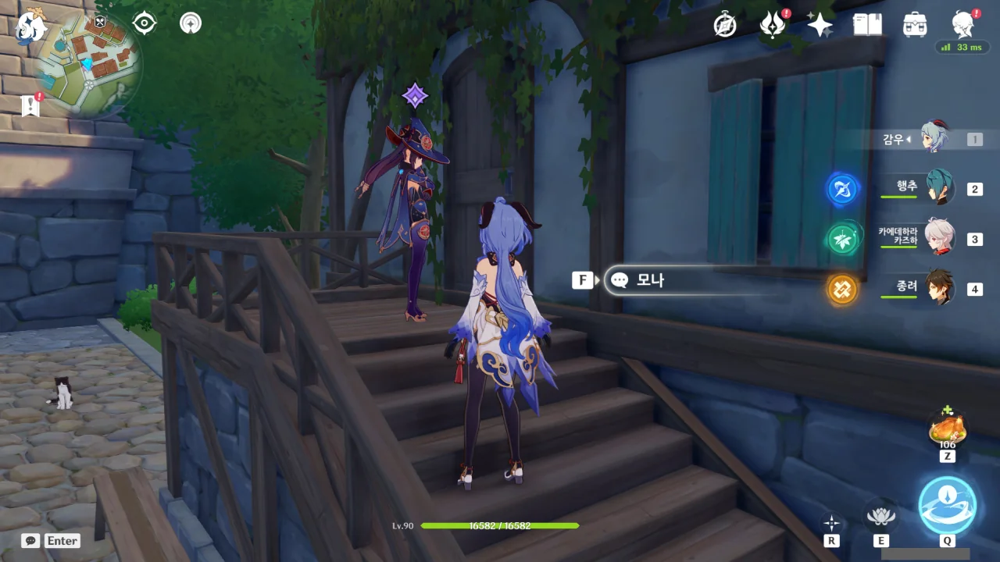
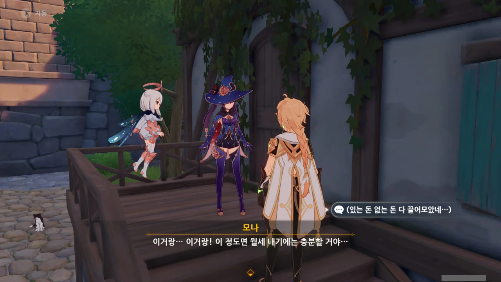

몬드 일일 임무 중에는 고트 영감에게 목재를 조금 가져다준 후, 모나를 찾아가는 임무가 있다.

아마 이름이 『지불해야 할 건 지불하자』였던가, 『갚아야 할 건 갚자』였던가...

&nbsp;

지금까지 매번 모나가 집에 없어서 허탕만 쳤는데, 이번에야 드디어 모나를 만났다.

뭐, 정확히는 수메르 열리기 직전에 찾은 것이긴 한데...

잡았다, 요놈!

모험가 길드의 캐서린에게도 모나의 행방을 물어봤고, 디어 헌터의 사라에게도 물어봤다. 또 누구에게 모나의 행방을 물어봤더라...?

아무튼 매번 허탕만 치다가 모나를 보니 정말 여러모로 *반갑다*.



모나는 《스팀버드》지에 보낼 원고를 작성 중이었다고 한다.

그러고 보면 저번에 전도 원판? 아무튼 기어 맞추는 퍼즐에서도 저 신문이 언급되었던 것 같은데. 그 외에도 이나즈마 스토리에서도 종종 저 이름을 들은 것 같다.

&nbsp;

평소 모나 이미지가 '엄마 쟤 흙 먹어' 수준의 가난뱅이라서 이번에도 어디 가서 풀 뜯어 먹는 줄 알았는데...

아니라고? 하지만 모나, 매번 나올 때마다 가난뱅이 캐릭터였잖아.



뭔가 불안한데.

분명 몬드에 처음 살게 되었을 때도 점술에 필요한 도구를 산다고 전 재산을 탕진해서 살 곳을 찾지 못하다가 고트 영감의 호의로 이곳에 살게 된 것 아니었어?

&nbsp;

월세 낼 돈은 있지? 그치?



어휴... 그럼 그렇지...

지갑을 탈탈 털어 월세를 어떻게든 만들어 내는 모나.



&nbsp;



그... 모나 양이 신형 천문 관측기를 산다고 돈을 탕진하지만 않았어도 월세를 낼 돈은 충분하지 않았을까요?

결국 오늘도 모나는 가난뱅이 밈을 벗어내지 못했다.

&nbsp;

이제 수메르에서 한동안 살 예정이라, 몬드에는 거의 방문하지 않을 것 같다. 당장 일일 임무 지역도 수메르로 변경했고, 수메르 평판도 올려야 한다. 월드 임무는 당연한 이야기이고.

&nbsp;

아무튼, 몬드는 이걸 마지막으로 당분간 작별이다.
